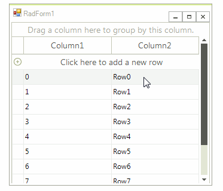

# RadGridViewDragDropService

**RadGridView** handles the whole drag and drop operation by its **RadGridViewDragDropService**. It exposes the following public properties:

* **GridViewElement**: Gets the **RadGridViewElement**.

* **Behavior**: Gets the respective **IGridDragDropBehavior** according to the drop target. It is used for preparing the drag hint. The available behaviors are:

|Target Element|GridDragDropBehavior|
|----|----|
|**GridHeaderCellElement**|GridColumnDragDropBehvavior|
|**GridDataRowElement**|GridRowDragDropBehavior|

* **AllowAutoScrollRowsWhileDragging**: Gets or set a value indicating whether rows scrolling is enabled  while dragging.

* **AllowAutoScrollColumnsWhileDragging**: Gets or set a value indicating whether columns scrolling is enabled  while dragging.

## Drag and Drop in Unbound Mode

By default, **RadGridView** supports rows drag and drop functionality in unbound mode out of the box. It is necessary to set the RadGridView.**AllowRowReorder** property to *true* and start reordering the rows. 

>caption Figure 1: Drag and drop in bound mode




## Drag and Drop in Bound Mode

When **RadGridView** is in bound mode, drag and drop functionality is not supported out of the box because of the specificity of the **DataSource** collection of the source and target grid. However, such a functionality can be easily achieved by the **RadGridViewDragDropService**.

As a descendant of [RadDragDropService](), **RadGridViewDragDropService** handles the whole drag and drop operation. The **PreviewDragOver** event allows you to control on what targets the row being dragged can be dropped on. The **PreviewDragDrop** event allows you to get a handle on all the aspects of the drag and drop operation, the source (drag) grid, the destination (target) control, as well as the row being dragged. This is where we will initiate the actual physical move of the row(s) from one grid to the target control. A sample implementation is demonstrated in the [Rows >> Drag and drop]() help article.

## Register a custom RadGridViewDragDropService

**RadGridView** provides a convenient API to replace the default **RadGridViewDragDropService** instance with your custom one in case you need to introduce some custom logic. 

1\. Create a class that inherits **RadGridViewDragDropService** and override its **Name** property:

{{source=..\SamplesCS\GridView\Rows\DragAndDropRadGrid.cs region=CustomService}} 
{{source=..\SamplesVB\GridView\Rows\DragAndDropRadGrid.vb region=CustomService}} 

````C#
````
````VB.NET
````

{{endregion}} 

2\. After you have already overridden the desired methods in order to achieve the expected behavior register the custom service to **RadGridView**:

{{source=..\SamplesCS\GridView\Rows\DragAndDropRadGrid.cs region=RegisterService}} 
{{source=..\SamplesVB\GridView\Rows\DragAndDropRadGrid.vb region=RegisterService}} 

````C#
````
````VB.NET
````

{{endregion}} 

# See Also

* [RadDragDropService]()	
* [Rows >> Drag and Drop]()	
