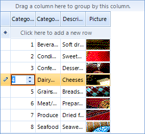

# Customizing editor behavior

The look and behavior of grid editors can be changed programmatically. This can be done either in __CellBeginEdit__ or in __CellEditorInitialized__ events. 

* __CellBeginEdit:__ Fired when the editor is created.

* __CellEditorInitialized:__ Fired when the editor is created and initialized with a predefined set of properties.

The following sample demonstrates how to change the default ForeColor of __GridSpinEditor__:

{{source=..\SamplesCS\GridView\Editors\CustomizingEditorBehavior.cs region=customizingEditors}} 
{{source=..\SamplesVB\GridView\Editors\CustomizingEditorBehavior.vb region=customizingEditors}} 

````C#
void radGridView1_CellBeginEdit(object sender, Telerik.WinControls.UI.GridViewCellCancelEventArgs e)
{
    GridSpinEditor editor = this.radGridView1.ActiveEditor as GridSpinEditor;
    if (editor != null)
    {
        ((BorderPrimitive)editor.EditorElement.Children[1]).ForeColor = Color.Black;
        
    }
}

````
````VB.NET
Private Sub RadGridView1_CellBeginEdit(ByVal sender As Object, ByVal e As Telerik.WinControls.UI.GridViewCellCancelEventArgs) Handles RadGridView1.CellBeginEdit
    Dim editor As GridSpinEditor = TryCast(Me.RadGridView1.ActiveEditor, GridSpinEditor)
    If editor IsNot Nothing Then
        DirectCast(editor.EditorElement.Children(1), BorderPrimitive).ForeColor = Color.Black
    End If
End Sub

````

{{endregion}} 

>caption Figure 1: Accessing the editor element.


# See Also
* [API]({[%slug winforms/gridview/editors/api%]}

* [Data validation]({[%slug winforms/gridview/editors/data-validation%]}

* [Overview]({[%slug winforms/gridview/editors/editors%]}

* [Events]({[%slug winforms/gridview/editors/events%]}

* [Handling Editors' events]({[%slug winforms/gridview/editors/handling-editors'-events%]}

* [Using custom editors]({[%slug winforms/gridview/editors/using-custom-editors%]}

