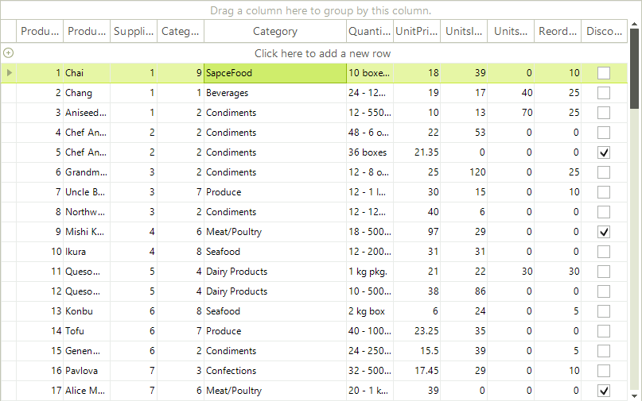

# Allow end-users to add items to DropDownListEditor

The purpose of this article is to demonstrate how you can implement a scenario
        in which the end-users are able not only to choose from a predefined list of values
        represented by RadDropDownListEditor, but to add their own values to that list.
      

In order to achieve this goal, you need to add the value typed by the end-user to the
        datasource of the GridViewComboBoxColumn. This will allow the end-user to use the typed
        value in his/her further operations with the RadComboBoxEditor of the GridViewComboBoxColumn.
      

## Implementing a custom RadDropDownListEditor

For the purposes for the example, we will build our custom RadComboBoxEditor in the context
          of a sample scenario where RadGridView is bound to the Products table of the popular Northwind
          database and where we have a GridViewComboBoxColumn bound to the Categories table of the same database.
        

Let's assume that:

* The name of the form on which the RadGridView instance lies is AllowEnd-usersAddItemsComboBoxEditor.

* The appropriate instances of the DataSet, BindingSources and TableAdapters are created.

* RadGridView is bound to the binding source of the Products table.

* The AutoIncrementStep of the CategoryID of the Category table is set to one.

1. First, we need to create a GridViewComboBoxColumn that will later display our custom editor.
              This column should be bound to the binding source of the Categories table. For additional information about GridViewComboBoxColumn
              and its specifics, you can read [this article](). The result of adding the GridViewComboBoxColumn should lead to the
              result shown below:
            

#### __[C#]__

{{source=..\SamplesCS\GridView\Editors\How-To\AllowEnd-usersAddItemsComboBoxEditor.cs region=comboColumn}}
	            GridViewComboBoxColumn categoriesColumn = new GridViewComboBoxColumn();
	            categoriesColumn.DisplayMember = "CategoryName";
	            categoriesColumn.ValueMember = "CategoryID";
	            categoriesColumn.FieldName = "CategoryID";
	            categoriesColumn.HeaderText = "Category";
	            categoriesColumn.DataSource = this.categoriesBindingSource;
	            categoriesColumn.DropDownStyle = Telerik.WinControls.RadDropDownStyle.DropDown;
	            categoriesColumn.Width = 150;
	            this.radGridView1.Columns.Insert(4, categoriesColumn);
	{{endregion}}

#### __[VB.NET]__

{{source=..\SamplesVB\GridView\Editors\How-To\AllowEnd-usersAddItemsComboBoxEditor.vb region=comboColumn}}
	        Dim categoriesColumn As New GridViewComboBoxColumn()
	        categoriesColumn.DisplayMember = "CategoryName"
	        categoriesColumn.ValueMember = "CategoryID"
	        categoriesColumn.FieldName = "CategoryID"
	        categoriesColumn.HeaderText = "Category"
	        categoriesColumn.DataSource = Me.CategoriesBindingSource
	        categoriesColumn.DropDownStyle = Telerik.WinControls.RadDropDownStyle.DropDown
	        categoriesColumn.Width = 150
	        Me.RadGridView1.Columns.Insert(4, categoriesColumn)
	        '#End Region
	
	        AddHandler RadGridView1.EditorRequired, AddressOf radGridView1_EditorRequired
	        AddHandler RadGridView1.CellEndEdit, AddressOf radGridView1_CellEndEdit
	    End Sub
	
	    Private Sub AllowEnd_usersAddItemsComboBoxEditor_Load(ByVal sender As Object, ByVal e As EventArgs)
	        ' TODO: This line of code loads data into the 'nwindDataSet.Categories' table. You can move, or remove it, as needed.
	        Me.CategoriesTableAdapter.Fill(Me.NwindDataSet.Categories)
	        ' TODO: This line of code loads data into the 'nwindDataSet.Products' table. You can move, or remove it, as needed.
	        Me.ProductsTableAdapter.Fill(Me.NwindDataSet.Products)
	
	    End Sub
	
	    '#Region "properties"
	    Public ReadOnly Property DataSet() As NwindDataSet
	        Get
	            Return Me.NwindDataSet
	        End Get
	    End Property
	
	    Public ReadOnly Property CategoriesTA() As CategoriesTableAdapter
	        Get
	            Return Me.CategoriesTableAdapter
	        End Get
	    End Property
	    '#End Region
	
	    '#Region "editorRequired"
	    Private Sub radGridView1_EditorRequired(ByVal sender As Object, ByVal e As EditorRequiredEventArgs)
	        If e.EditorType Is GetType(RadDropDownListEditor) Then
	            e.Editor = New CustomDropDownEditor()
	        End If
	    End Sub
	    '#End Region
	
	    '#Region "cellEndEdit"
	    Private Sub radGridView1_CellEndEdit(ByVal sender As Object, ByVal e As GridViewCellEventArgs)
	        If Me.RadGridView1.CurrentCell.Tag IsNot Nothing Then
	            Me.RadGridView1.CurrentCell.Value = Me.RadGridView1.CurrentCell.Tag
	            Me.RadGridView1.CurrentCell.Tag = Nothing
	        End If
	    End Sub
	    '#End Region
	
	    Private Sub AllowEnd_usersAddItemsComboBoxEditor_Load_1(ByVal sender As System.Object, ByVal e As System.EventArgs) Handles MyBase.Load
	        'TODO: This line of code loads data into the 'NwindDataSet.Products' table. You can move, or remove it, as needed.
	        Me.ProductsTableAdapter.Fill(Me.NwindDataSet.Products)
	        'TODO: This line of code loads data into the 'NwindDataSet.Categories' table. You can move, or remove it, as needed.
	        Me.CategoriesTableAdapter.Fill(Me.NwindDataSet.Categories)
	
	    End Sub
	End Class

1. Since we will need to get the instances of the DataSet and the TableAdapters of the Category table outside the context
              of the main form, let's expose two properties in the body of the form:
            

#### __[C#]__

{{source=..\SamplesCS\GridView\Editors\How-To\AllowEnd-usersAddItemsComboBoxEditor.cs region=properties}}
	        public NwindDataSet DataSet
	        {
	            get
	            {
	                return this.nwindDataSet;
	            }
	        }
	
	        public CategoriesTableAdapter CategoriesTA
	        {
	            get
	            {
	                return this.categoriesTableAdapter;
	            }
	        }
	{{endregion}}

#### __[VB.NET]__

{{source=..\SamplesVB\GridView\Editors\How-To\AllowEnd-usersAddItemsComboBoxEditor.vb region=properties}}
	    Public ReadOnly Property DataSet() As NwindDataSet
	        Get
	            Return Me.NwindDataSet
	        End Get
	    End Property
	
	    Public ReadOnly Property CategoriesTA() As CategoriesTableAdapter
	        Get
	            Return Me.CategoriesTableAdapter
	        End Get
	    End Property
	    '#End Region
	
	    '#Region "editorRequired"
	    Private Sub radGridView1_EditorRequired(ByVal sender As Object, ByVal e As EditorRequiredEventArgs)
	        If e.EditorType Is GetType(RadDropDownListEditor) Then
	            e.Editor = New CustomDropDownEditor()
	        End If
	    End Sub
	    '#End Region
	
	    '#Region "cellEndEdit"
	    Private Sub radGridView1_CellEndEdit(ByVal sender As Object, ByVal e As GridViewCellEventArgs)
	        If Me.RadGridView1.CurrentCell.Tag IsNot Nothing Then
	            Me.RadGridView1.CurrentCell.Value = Me.RadGridView1.CurrentCell.Tag
	            Me.RadGridView1.CurrentCell.Tag = Nothing
	        End If
	    End Sub
	    '#End Region
	
	    Private Sub AllowEnd_usersAddItemsComboBoxEditor_Load_1(ByVal sender As System.Object, ByVal e As System.EventArgs) Handles MyBase.Load
	        'TODO: This line of code loads data into the 'NwindDataSet.Products' table. You can move, or remove it, as needed.
	        Me.ProductsTableAdapter.Fill(Me.NwindDataSet.Products)
	        'TODO: This line of code loads data into the 'NwindDataSet.Categories' table. You can move, or remove it, as needed.
	        Me.CategoriesTableAdapter.Fill(Me.NwindDataSet.Categories)
	
	    End Sub
	End Class

1. Now it is time to create our custom editor. For the purposes of our goal, we need to
              create a class that derives from __RadDropDownListEditor__ and override the __EndEdit__ method.
              #__

	

#__

	

We are going to replace the "TO DO" comment with the code snippets provided at 4) and 5).
            

1. In the EndEdit method, we first need to check whether the value typed by the user exists or not in the datasource of the GridViewComboBoxColumn.
              If it exists, we should terminate the execution of the EndEdit method:
            

#### __[C#]__

{{source=..\SamplesCS\GridView\Editors\How-To\CustomDropDownEditor.cs region=checkValue}}
	            GridComboBoxCellElement cellElement = this.OwnerElement as GridComboBoxCellElement;
	
	            RadGridView grid = cellElement.GridControl;
	            AllowEnd_usersAddItemsComboBoxEditor f = (AllowEnd_usersAddItemsComboBoxEditor)grid.FindForm();
	
	            // Checking if the typed value exists in the datasource of the column.
	            NwindDataSet.CategoriesDataTable dt = f.DataSet.Categories;
	            for (int i = 0; i < dt.Rows.Count; i++)
	            {
	                if (dt.Rows[i]["CategoryName"].ToString() == ((RadDropDownListEditorElement)this.EditorElement).Text)
	                {
	                    return base.EndEdit();
	                }
	            }
	{{endregion}}

#### __[VB.NET]__

{{source=..\SamplesVB\GridView\Editors\How-To\CustomDropDownEditor.vb region=checkValue}}
	        Dim cellElement As GridComboBoxCellElement = TryCast(Me.OwnerElement, GridComboBoxCellElement)
	
	        Dim grid As RadGridView = cellElement.GridControl
	        Dim f As AllowEnd_usersAddItemsComboBoxEditor = CType(grid.FindForm(), AllowEnd_usersAddItemsComboBoxEditor)
	
	        ' Checking if the typed value exists in the datasource of the column.
	        Dim dt As NwindDataSet.CategoriesDataTable = f.DataSet.Categories
	        For i As Integer = 0 To dt.Rows.Count - 1
	            If dt.Rows(i)("CategoryName").ToString() = (CType(Me.EditorElement, RadDropDownListEditorElement)).Text Then
	                Return MyBase.EndEdit()
	            End If
	        Next i
	        '#End Region
	
	        '#Region "addValue"
	        ' An example of what we can do when we enter the custom text.
	        ' In this case we are adding a new data row in the underlying datasource of 
	        ' the combobox column and then in the CellEndEdit we are setting
	        ' the ID value of the newly created row to RadGridView.
	        Dim newCategoriesRow As NwindDataSet.CategoriesRow = dt.NewCategoriesRow()
	        newCategoriesRow.CategoryName = (CType(Me.EditorElement, RadDropDownListEditorElement)).Text
	        f.DataSet.Categories.Rows.Add(newCategoriesRow)
	
	        ' Updating the database. You can do it here at another place
	        ' you find suitable for this purpose, for example, on FormClosing.
	        f.CategoriesTA.Update(f.DataSet.Categories)
	
	        cellElement.Tag = newCategoriesRow.CategoryID
	
	        Return MyBase.EndEdit()
	        '#End Region
	    End Function
	End Class
	'#End Region
	
	Namespace SamplesCS.GridView.Editors.How_To1
	    '#region customEditorClass1
	    Public Class CustomDropDownEditor
	        Inherits RadDropDownListEditor
	
	        Public Overrides Function EndEdit() As Boolean
	{{endregion}}

1. If the typed value is not found in the datasource, we continue with the execution of our code in the EndEdit method.
              Since the typed value does not exist, we should add it to the data source. Here you can add it to the database as well:
            

#### __[C#]__

{{source=..\SamplesCS\GridView\Editors\How-To\CustomDropDownEditor.cs region=addValue}}
	            // An example of what we can do when we enter the custom text.
	            // In this case we are adding a new data row in the underlying datasource of 
	            // the combobox column and then in the CellEndEdit we are setting
	            // the ID value of the newly created row to RadGridView.
	            NwindDataSet.CategoriesRow newCategoriesRow = dt.NewCategoriesRow();
	            newCategoriesRow.CategoryName = ((RadDropDownListEditorElement)this.EditorElement).Text;
	            f.DataSet.Categories.Rows.Add(newCategoriesRow);
	
	            // Updating the database. You can do it here at another place
	            // you find suitable for this purpose, for example, on FormClosing.
	            f.CategoriesTA.Update(f.DataSet.Categories);
	
	            cellElement.Tag = newCategoriesRow.CategoryID;
	
	            return base.EndEdit();
	{{endregion}}

#### __[VB.NET]__

{{source=..\SamplesVB\GridView\Editors\How-To\CustomDropDownEditor.vb region=addValue}}
	        ' An example of what we can do when we enter the custom text.
	        ' In this case we are adding a new data row in the underlying datasource of 
	        ' the combobox column and then in the CellEndEdit we are setting
	        ' the ID value of the newly created row to RadGridView.
	        Dim newCategoriesRow As NwindDataSet.CategoriesRow = dt.NewCategoriesRow()
	        newCategoriesRow.CategoryName = (CType(Me.EditorElement, RadDropDownListEditorElement)).Text
	        f.DataSet.Categories.Rows.Add(newCategoriesRow)
	
	        ' Updating the database. You can do it here at another place
	        ' you find suitable for this purpose, for example, on FormClosing.
	        f.CategoriesTA.Update(f.DataSet.Categories)
	
	        cellElement.Tag = newCategoriesRow.CategoryID
	
	        Return MyBase.EndEdit()
	        '#End Region
	    End Function
	End Class
	'#End Region
	
	Namespace SamplesCS.GridView.Editors.How_To1
	    '#region customEditorClass1
	    Public Class CustomDropDownEditor
	        Inherits RadDropDownListEditor
	
	        Public Overrides Function EndEdit() As Boolean
	{{endregion}}

1. The Tag value saved in the previous code snippet is used in the CellEndEdit event handler of RadGridView. It helps us
              to set the ID of the newly created record to the cell that the end-user has just edited. As a consequence, the
              correct string value is displayed in the cell of RadGridView.
               

#### __[C#]__

{{source=..\SamplesCS\GridView\Editors\How-To\AllowEnd-usersAddItemsComboBoxEditor.cs region=cellEndEdit}}
	        void radGridView1_CellEndEdit(object sender, GridViewCellEventArgs e)
	        {
	            if (this.radGridView1.CurrentCell.Tag != null)
	            {
	                this.radGridView1.CurrentCell.Value = this.radGridView1.CurrentCell.Tag;
	                this.radGridView1.CurrentCell.Tag = null;
	            }
	        }
	{{endregion}}

#### __[VB.NET]__

{{source=..\SamplesVB\GridView\Editors\How-To\AllowEnd-usersAddItemsComboBoxEditor.vb region=cellEndEdit}}
	    Private Sub radGridView1_CellEndEdit(ByVal sender As Object, ByVal e As GridViewCellEventArgs)
	        If Me.RadGridView1.CurrentCell.Tag IsNot Nothing Then
	            Me.RadGridView1.CurrentCell.Value = Me.RadGridView1.CurrentCell.Tag
	            Me.RadGridView1.CurrentCell.Tag = Nothing
	        End If
	    End Sub
	    '#End Region
	
	    Private Sub AllowEnd_usersAddItemsComboBoxEditor_Load_1(ByVal sender As System.Object, ByVal e As System.EventArgs) Handles MyBase.Load
	        'TODO: This line of code loads data into the 'NwindDataSet.Products' table. You can move, or remove it, as needed.
	        Me.ProductsTableAdapter.Fill(Me.NwindDataSet.Products)
	        'TODO: This line of code loads data into the 'NwindDataSet.Categories' table. You can move, or remove it, as needed.
	        Me.CategoriesTableAdapter.Fill(Me.NwindDataSet.Categories)
	
	    End Sub
	End Class

1. Finally, we need to attach the custom editor to RadGridView. This is done in the EditorRequired event handler. Let's assume that
              the class of our custom editor is called CustomDropDownEditor:
               

#### __[C#]__

{{source=..\SamplesCS\GridView\Editors\How-To\AllowEnd-usersAddItemsComboBoxEditor.cs region=editorRequired}}
	        void radGridView1_EditorRequired(object sender, EditorRequiredEventArgs e)
	        {
	            if (e.EditorType == typeof(RadDropDownListEditor))
	            {
	                e.Editor = new CustomDropDownEditor();
	            }
	        }
	{{endregion}}

#### __[VB.NET]__

{{source=..\SamplesVB\GridView\Editors\How-To\AllowEnd-usersAddItemsComboBoxEditor.vb region=editorRequired}}
	    Private Sub radGridView1_EditorRequired(ByVal sender As Object, ByVal e As EditorRequiredEventArgs)
	        If e.EditorType Is GetType(RadDropDownListEditor) Then
	            e.Editor = New CustomDropDownEditor()
	        End If
	    End Sub
	    '#End Region
	
	    '#Region "cellEndEdit"
	    Private Sub radGridView1_CellEndEdit(ByVal sender As Object, ByVal e As GridViewCellEventArgs)
	        If Me.RadGridView1.CurrentCell.Tag IsNot Nothing Then
	            Me.RadGridView1.CurrentCell.Value = Me.RadGridView1.CurrentCell.Tag
	            Me.RadGridView1.CurrentCell.Tag = Nothing
	        End If
	    End Sub
	    '#End Region
	
	    Private Sub AllowEnd_usersAddItemsComboBoxEditor_Load_1(ByVal sender As System.Object, ByVal e As System.EventArgs) Handles MyBase.Load
	        'TODO: This line of code loads data into the 'NwindDataSet.Products' table. You can move, or remove it, as needed.
	        Me.ProductsTableAdapter.Fill(Me.NwindDataSet.Products)
	        'TODO: This line of code loads data into the 'NwindDataSet.Categories' table. You can move, or remove it, as needed.
	        Me.CategoriesTableAdapter.Fill(Me.NwindDataSet.Categories)
	
	    End Sub
	End Class

## End-user experience

So, how should this implementation work? Let's say that we have a list of categories available at each product
          in RadGridView. However, we decide that this list does not cover the range of products, so
          we have to add the category 'SpaceFood'. We should just start editing the appropriate cell in the GridViewComboBoxColumn
          and type 'SpaceFood'. Then we can press Enter or we have press Tab to go to the next cell and the 'SpaceFood' value will be added.
          As you can see in the screenshot below, the record 'SpaceFood' receives a new CategoryID 9, which is saved in the appropriate
          RadGridView cell under the CategoryID column:
        
