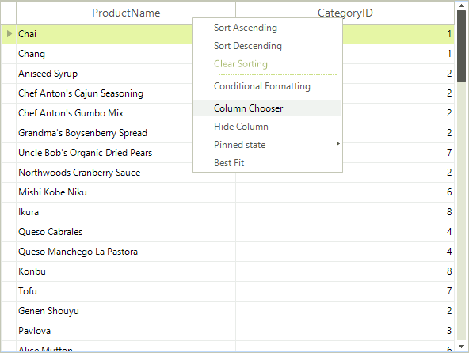

# Column Chooser

The visibility of all columns can be managed by the end-user at runtime using __Column Chooser__ window. To display the __Column Chooser__, the user right-clicks the grid and selects __Column Chooser__ from the context menu:

The user can then drag column headings to the __Column Chooser__ window and drop them there. This will remove the column from RadGridView and will place it in the __Column Chooser Window__. Columns can be dragged back to RadGridView:

| | |
| ------ | ------ |
|  |  |
