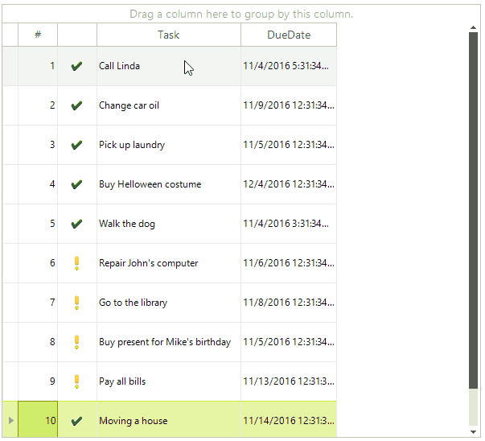

# Reordering Rows

RadGridView supports row reordering and it can be done by the user at runtime. The user just has to drag the desired row at the desired position between two other rows and drop it there. In the RadGridView control, the RadGridView.AllowRowReorder property value determines whether users can move rows to different positions.
      
>important 
* Row reordering is only available for grids in unbound mode.
* After row reordering is enabled any sorting, grouping and filtering operations will be cleared and will not be available

