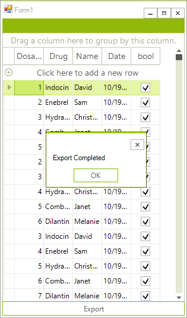

# RadSpreadStreamProcessing Export 

The __GridViewSpreadStreamExport__ uses the [__RadSpreadStreamProcessing__](http://docs.telerik.com/devtools/document-processing/libraries/radspreadstreamprocessing/overview) library which allows you to create big documents (without loading the entire document in the memory) and export them to the most common formats. 

>caption Figure 1: Exporting RadGridView.


>note The spread export functionality is located in the __TelerikExport.dll__ assembly. You need to include the following namespace in order to access the types contained in TelerikExport:
* Telerik.WinControls.Export
>

>important Since this functionality is using the __RadSpreadStreamProcessing__ library you need to reference the following assembly as well:
* Telerik.Documents.SpreadsheetStreaming

The __TelerikExport.dll__ must be the same version as the rest of the Assemblies. `<Progress installation folder>\Bin` folder holds the assemblies targetting .NET 2.0, while the ones in `<Progress installation folder>\Bin40` are for .NET 4.0.
>

# Exporting

To use the spread export functionality create an instance of the __GridViewSpreadStreamExport__ object. Pass as parameter the __RadGridView__ instance to export. Afterwards, the __RunExport__ method will trigger the export process. The latter method accepts as parameter the filename of the file to be exported and a [SpreadStreamExportRenderer](%slug winforms/telerik-presentation-framework/export-renderers/spreadstreamexportrenderer%) instance. 

#### Exporting the grid. 

{{source=..\SamplesCS\GridView\ExportingData\SpreadStreamExportCode.cs region=SyncPort}} 
{{source=..\SamplesVB\GridView\ExportingData\SpreadStreamExportCode.vb region=SyncPort}}
````C#
GridViewSpreadStreamExport spreadStreamExport = new GridViewSpreadStreamExport(this.radGridView1);
spreadStreamExport.ExportVisualSettings = true;
spreadStreamExport.RunExport(@"D:\StreamExport.xlsx", new SpreadStreamExportRenderer());

````
````VB.NET
Dim spreadStreamExport As New GridViewSpreadStreamExport(Me.radGridView1)
spreadStreamExport.ExportVisualSettings = True
spreadStreamExport.RunExport("D:\StreamExport.xlsx", New SpreadStreamExportRenderer())

````

{{endregion}} 

## Properties

|Property|Description|
|---|---|
|__ExportHierarchy__|Set it to true if you want to export the child templates/rows.|
|__ExportVisualSettings__|Gets or sets a value indicating whether the visual settings should be exported.|
|__SheetName__|Gets or sets the name of the sheet.|
|__SheetMaxRows__| Gets or sets the maximum number of rows per sheet.|
|__SummariesExportOption__|Gets or sets a value indicating how summary rows are exported.|
|__HiddenColumnOption__|Gets or sets a value indicating how hidden columns are exported.|
|__HiddenRowOption__|Gets or sets a value indicating how hidden rows are exported.|
|__PagingExportOption__|Gets or sets a value indicating how the export behaves when paging is enabled.|
|__ChildViewExportMode__|Defines which child view of a hierarchy row to be exported. Available modes are: - *ExportFirstView*: The exporter exports the first view. - *ExportCurrentlyActiveView*: The exporter exports the view that is actived in the grid. - *SelectViewToExport*: In this mode the __ChildViewExporing__ event is fired. The event allows to choose the view to export in row by row basis. - *ExportAllViews*: In this mode all child views are exported. Available in GridViewSpreadExport and GridViewPdfExport.    |
|__RadGridViewToExport__|Gets or sets the RadGridView to export.|
|__ExportFormat__|Gets or sets the format of the exported file - XLSX or CSV.|
|__ExportGroupedColumns__|Gets or sets a value indicating whether to export grouped columns.|
|__FreezeHeaderRow__|Gets or sets a value indicating whether to freeze the header row in the exported file.|
|__FreezePinnedRows__|Gets or sets a value indicating whether to freeze pinned rows.|
|__FreezePinnedColumns__|Gets or sets a value indicating whether to freeze pinned columns.|
|__ExportChildRowsGrouped__|Gets or sets a value indicating whether to export hierarchy and group child rows grouped.|
|__ExportViewDefinition__|Gets or sets a value indicating whether to export [view definition]() |
|__FileExportMode__ |This property determines whether the data will be exported into an existing or a new file. Available options are: __NewSheetInExistingFile__(this option will create a new sheet in an already existing file) and __CreateOrOverrideFile__ which creates new or overrides the existing file.|

>important
Each column in RadGridView has __ExcelExportType__ property which can be used for explicitly setting the data type of the cells in the exported document. In order to change the format of the exported data, you can set the __ExcelExportType__ property of the specific column to *Custom* and specify the __ExcelExportFormatString__ property with the desired format. Examples of such formats are available here: <https://support.office.com/en-us/article/Format-a-date-the-way-you-want-8e10019e-d5d8-47a1-ba95-db95123d273e?ui=en-US&rs=en-US&ad=US>

## Events

### CellFormatting

This event occurs for every cell that is being exported. It can be used for styling the cells or applying custom format to the cells values.

#### Using the CellFormatting event

{{source=..\SamplesCS\GridView\ExportingData\SpreadStreamExportCode.cs region=CellFormatting}} 
{{source=..\SamplesVB\GridView\ExportingData\SpreadStreamExportCode.vb region=CellFormatting}}
````C#
private void SpreadStreamExport_CellFormatting(object sender, SpreadStreamCellFormattingEventArgs e)
{
    e.CellStyleInfo.BackColor = Color.Green;
    e.CellStyleInfo.ForeColor = Color.Red;
    e.CellStyleInfo.BottomBorder = new SpreadBorder(SpreadBorderStyle.Double, SpreadThemableColor.FromRgb(100, 100, 100));
    e.CellStyleInfo.TopBorder = Color.Black;
}

````
````VB.NET
Private Sub SpreadStreamExport_CellFormatting(ByVal sender As Object, ByVal e As SpreadStreamCellFormattingEventArgs)
    e.CellStyleInfo.BackColor = Color.Green
    e.CellStyleInfo.ForeColor = Color.Red
    e.CellStyleInfo.BottomBorder = New SpreadBorder(SpreadBorderStyle.Double, SpreadThemableColor.FromRgb(100, 100, 100))
    e.CellStyleInfo.TopBorder = Color.Black
End Sub

```` 


{{endregion}} 

### RowCreated

Occurs when a new row is created in current worksheet. This is suitable place to set any row properties (like height) and/or add indent cells.

#### Using RowCreated to set the rows height.

{{source=..\SamplesCS\GridView\ExportingData\SpreadStreamExportCode.cs region=RowCreated}} 
{{source=..\SamplesVB\GridView\ExportingData\SpreadStreamExportCode.vb region=RowCreated}}
````C#
private void SpreadStreamExport_RowCreated(object sender, SpreadStreamRowEventArgs e)
{
    if (e.GridRowInfoType == typeof(GridViewTableHeaderRowInfo))
    {
        var row = e.Row as Telerik.Documents.SpreadsheetStreaming.IRowExporter;
        row.SetHeightInPixels(50);
    }
}

````
````VB.NET
Private Sub SpreadStreamExport_RowCreated(ByVal sender As Object, ByVal e As SpreadStreamRowEventArgs)
    If e.GridRowInfoType Is GetType(GridViewTableHeaderRowInfo) Then
        Dim row = TryCast(e.Row, Telerik.Documents.SpreadsheetStreaming.IRowExporter)
        row.SetHeightInPixels(50)
    End If
End Sub

```` 


{{endregion}} 


### RowExporting 

Occurs before every spread row is exported. This is suitable place to add any additional cells at the end of the row.


{{source=..\SamplesCS\GridView\ExportingData\SpreadStreamExportCode.cs region=RowExporting}} 
{{source=..\SamplesVB\GridView\ExportingData\SpreadStreamExportCode.vb region=RowExporting}}
````C#
private void SpreadStreamExport_RowExporting(object sender, SpreadStreamRowEventArgs e)
{
    if (e.GridRowIndex % 2 == 0)
    {
        var row = e.Row as IRowExporter;
        using (ICellExporter cell = row.CreateCellExporter())
        {
            SpreadCellFormat format = new SpreadCellFormat()
            {
                Fill = SpreadPatternFill.CreateSolidFill(new SpreadColor(100, 100, 100))
            };
            cell.SetValue("---");
            format.HorizontalAlignment = SpreadHorizontalAlignment.Center;
            format.VerticalAlignment = SpreadVerticalAlignment.Center;
            format.LeftBorder = new SpreadBorder(SpreadBorderStyle.Double, SpreadThemableColor.FromRgb(100, 100, 100));
            format.RightBorder = new SpreadBorder(SpreadBorderStyle.Double, SpreadThemableColor.FromRgb(100, 100, 100));
            cell.SetFormat(format);
        }
    }
}

````
````VB.NET
Private Sub SpreadStreamExport_RowExporting(ByVal sender As Object, ByVal e As SpreadStreamRowEventArgs)
    If e.GridRowIndex Mod 2 = 0 Then
        Dim row = TryCast(e.Row, IRowExporter)
        Using cell As ICellExporter = row.CreateCellExporter()
            Dim format As New SpreadCellFormat() With {.Fill = SpreadPatternFill.CreateSolidFill(New SpreadColor(100, 100, 100))}
            cell.SetValue("---")
            format.HorizontalAlignment = SpreadHorizontalAlignment.Center
            format.VerticalAlignment = SpreadVerticalAlignment.Center
            format.LeftBorder = New SpreadBorder(SpreadBorderStyle.Double, SpreadThemableColor.FromRgb(100, 100, 100))
            format.RightBorder = New SpreadBorder(SpreadBorderStyle.Double, SpreadThemableColor.FromRgb(100, 100, 100))
            cell.SetFormat(format)
        End Using
    End If
End Sub

```` 


{{endregion}} 


### ExportCompleted

Occurs when the export process completes. This event is suitable for notifying the user that the exported operation is now completed.

# Asynchronous Export

This feature can be utilized by calling the __RunExportAsync__ method on the __GridViewSpreadStreamExport__ object. In addition there are two events that fire when this export method is used:
* __AsyncExportCompleted:__ Fires when the export operation is completed.
* __AsyncExportProgressChanged:__ Fires repeatedly and passes the current export progress.

>note When you are exporting with visual settings the UI would be friezed for some time. This is necessary because the exporter need to retrieve all grid styles and this operation is executed on the UI thread. 
>

>caption Figure 2: The asynchronous export.



#### Exporting asynchronously and reporting the progress.  

{{source=..\SamplesCS\GridView\ExportingData\SpreadStreamExportCode.cs region=AsyncRun}} 
{{source=..\SamplesVB\GridView\ExportingData\SpreadStreamExportCode.vb region=AsyncRun}}
````C#
private void RadButton1_Click(object sender, EventArgs e)
{
    GridViewSpreadStreamExport spreadStreamExport = new GridViewSpreadStreamExport(this.radGridView1);
    spreadStreamExport.AsyncExportProgressChanged += SpreadStreamExport_AsyncExportProgressChanged;
    spreadStreamExport.AsyncExportCompleted += SpreadStreamExport_AsyncExportCompleted;
    spreadStreamExport.RunExportAsync(@"D:\StreamExport.xlsx", new SpreadStreamExportRenderer());
}
private void SpreadStreamExport_AsyncExportCompleted(object sender, AsyncCompletedEventArgs e)
{
    RadMessageBox.Show("Export Completed");
}
private void SpreadStreamExport_AsyncExportProgressChanged(object sender, ProgressChangedEventArgs e)
{
    radProgressBar1.Value1 = e.ProgressPercentage;
}

````
````VB.NET
Private Sub RadButton1_Click(ByVal sender As Object, ByVal e As EventArgs)
    Dim spreadStreamExport As New GridViewSpreadStreamExport(Me.radGridView1)
    AddHandler spreadStreamExport.AsyncExportProgressChanged, AddressOf SpreadStreamExport_AsyncExportProgressChanged
    AddHandler spreadStreamExport.AsyncExportCompleted, AddressOf SpreadStreamExport_AsyncExportCompleted
    spreadStreamExport.RunExportAsync("D:\StreamExport.xlsx", New SpreadStreamExportRenderer())
End Sub
Private Sub SpreadStreamExport_AsyncExportCompleted(ByVal sender As Object, ByVal e As AsyncCompletedEventArgs)
    RadMessageBox.Show("Export Completed")
End Sub
Private Sub SpreadStreamExport_AsyncExportProgressChanged(ByVal sender As Object, ByVal e As ProgressChangedEventArgs)
    radProgressBar1.Value1 = e.ProgressPercentage
End Sub

```` 


{{endregion}} 

# See Also

* [SpreadStreamExportRenderer]() 
