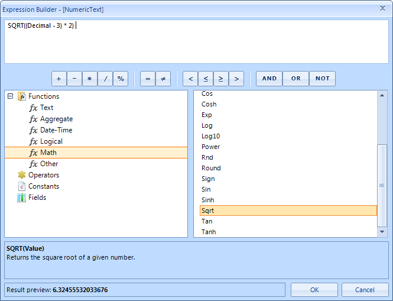

# Expression Editor

RadExpressionEditor is a powerful editor that allows you to build complex expressions using a simple Domain Specific Language, reminiscent of formulas in many popular spreadsheet applications. It provides easy access to a set of predefined functions, operators, constants. You can also access all RadGridView fields.

Expressions consist of functions, operators, constants, and identifiers (for example, the names of fields, tables, forms, and queries). The Expression Builder enables you to easily look up and insert these components, and thereby enter expressions more quickly and accurately. Expression editor can be started from the context menu of the particular column, or it can be initialized and shown from code. RadExpressionEditor also can be used in design time.

Once shown, RadExpressionEditor automatically loads all available functions, operators and current grid’s fields (columns). In addition, every entered expression is parsed and evaluated. A preview of the result is shown (for the current row of the grid) and the confirmation button is enabled only if there is a valid expression. Please note that the preview is shown only if there is at least one row at run time. 

## Anatomy of RadExpressionEditor

1. __Expression Box__. Type your expression here, or add expression elements by double-clicking or dragging items in the element lists below;

1. __Common Expression Operators__. Use buttons as ast shortcuts to add the required operator;

1. __Expression Elements Tree__. Navigate through the available categories of expression elements;

1. __Expression Values List__. Scroll through the available expression functions, operators, constants or fields. Double-Click or drag-and-drop to add a chosen value into the expression box;

1. __Help and information about the selected expression value__. If available, here you will see the description and the syntax of the chosen expression value;

1. __Result Preview__. A preview of the calculated result of the entered expression will be shown. The preview is evaluated as you type, and is shown only if there is a valid expression. The result is calculated for the current row in the DataView.
            
