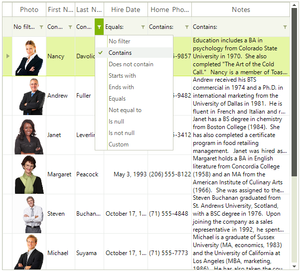

# Basic Filtering

| RELATED VIDEOS |  |
| ------ | ------ |
|[Filtering and Expressions in RadGridView for WinForms](http://www.telerik.com/videos/winforms/filtering-and-expressions-in-radgridview-for-winforms)<br>In this video, you will learn how to enable three different types of filtering on RadGridView for WinForms.||

User filtering in RadGridView is enabled by the __EnableFiltering__ property. By default, filtering is disabled at all levels.

#### Enable filtering

{{source=..\SamplesCS\GridView\Filtering\Filtering.cs region=enableFiltering}} 
{{source=..\SamplesVB\GridView\Filtering\Filtering.vb region=enableFiltering}} 

````C#
this.radGridView1.EnableFiltering = true;
this.radGridView1.MasterTemplate.EnableFiltering = true;

````
````VB.NET
Me.RadGridView1.EnableFiltering = True
Me.RadGridView1.MasterTemplate.EnableFiltering = True

````

{{endregion}} 

__GridViewDataColumn__

When filtering is enabled, each __GridViewDataColumn__ column displays a filter box beneath the corresponding header.



See [End-User capabilities - Filtering]() for more information about how the end-user experiences filtering.
