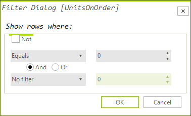

## Customizing composite filter dialog

When you select an item from the "Available Filter" menu, a __CompositeFilterForm__ is displayed. The __CreateCompositeFilterDialog__ event is fired before the __CompositeFilterForm__ is created. It allows you to create the default dialog and customize it or initialize your own implementation of the composite filter dialog.

# See Also
* [Basic Filtering]({[%slug winforms/gridview/filtering/basic-filtering%]}

* [Custom Filtering]({[%slug winforms/gridview/filtering/custom-filtering%]}

* [Events]({[%slug winforms/gridview/filtering/events%]}

* [Excel-like filtering]({[%slug winforms/gridview/filtering/excel-like-filtering%]}

* [FilterExpressionChanged Event]({[%slug winforms/gridview/filtering/filterexpressionchanged-event%]}

* [Filtering Row]({[%slug winforms/gridview/filtering/filtering-row%]}

* [Put a filter cell into edit mode programmatically]({[%slug winforms/gridview/filtering/put-a-filter-cell-into-edit-mode-programmatically%]}

* [Setting Filters Programmatically (composite descriptors)]({[%slug winforms/gridview/filtering/setting-filters-programmatically-(composite-descriptors)%]}

