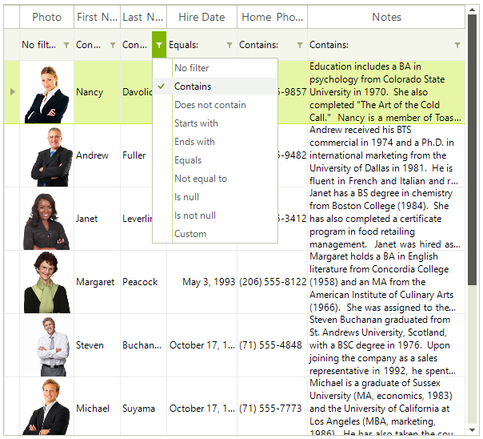

# Filtering Row


## 

The __GridFilterRowElement__ is the row that holds the filtering boxes. It appears automatically when you enable filtering (__GridViewTemplate.EnableFiltering = true__). __GridFilterRowElement__ could be pinned at the top or bottom as well as made scrollable.<br>

You can hide the operator text of the filter cells by setting the __ShowFilterCellOperator__ property to *false*:

#### Hide filter row

{{source=..\SamplesCS\GridView\Filtering\Filtering.cs region=filterOperatorText}} 
{{source=..\SamplesVB\GridView\Filtering\Filtering.vb region=filterOperatorText}} 

````C#
            this.radGridView1.MasterTemplate.ShowFilterCellOperatorText = false;
````
````VB.NET
        Me.RadGridView1.MasterTemplate.ShowFilterCellOperatorText = False
        '
````

{{endregion}} 


You can also hide the entire __GridFilterRowElement__: 

#### Hide filter row

{{source=..\SamplesCS\GridView\Filtering\Filtering.cs region=hidingTheFilterRow}} 
{{source=..\SamplesVB\GridView\Filtering\Filtering.vb region=hidingTheFilterRow}} 

````C#
            this.radGridView1.ShowFilteringRow = false;
````
````VB.NET
        Me.RadGridView1.ShowFilteringRow = False
        '
````

{{endregion}} 

>note You can still add FilterDescriptors programmatically when the __GridFilterRowElement__ is hidden.


>caution Filtering strings not allowed are: " LIKE ", " AND ", " OR ", "\"", ">", "<", "<>", "%", " NULL ", " IS ". Note: the spaces are important (e.g. " LIKE " compared to "LIKE").
>


You can customize the __GridFilterRowElement__ by using the __Visual Style Builder__.<br>
