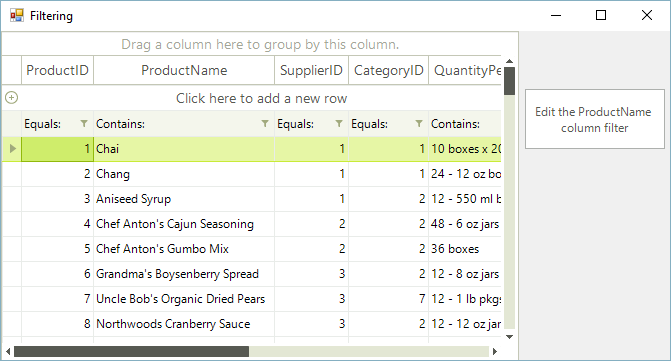

# Put a filter cell into edit mode programmatically

You can easily put a filter cell into edit mode by code. You should simply call the __BeginEdit__ method of the desired cell:

#### Put a filter cell in edit mode programmatically

{{source=..\SamplesCS\GridView\Filtering\Filtering.cs region=putFilterCellIntoEditModeProgramatically}} 
{{source=..\SamplesVB\GridView\Filtering\Filtering.vb region=putFilterCellIntoEditModeProgramatically}} 

````C#
this.radGridView1.MasterView.TableFilteringRow.Cells[1].BeginEdit();

````
````VB.NET
Me.RadGridView1.MasterView.TableFilteringRow.Cells(0).BeginEdit()

````

{{endregion}}




