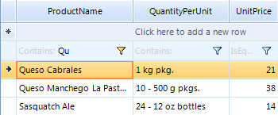
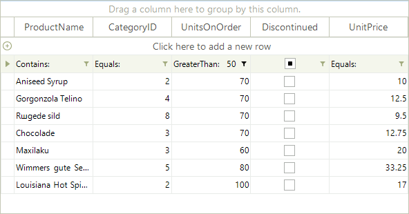

# Setting Filters Programmatically (simple descriptors)


## RadGridView FilterDescriptors

The RadGridView control includes FilterDescriptors property of the GridViewTemplate which is exposed in RadGridView class for MasterTemplate instance. This collection stores filter descriptors used for filtering operation. The most important classes are:        

* __FilterDescriptor__ - implements filtering property (field) name, filtering operator and value. Used to define simple filtering expressions like __Country = "Germany"__.

* __CompositeFilterDescriptor__ - a collection of multiple filter descriptors with logical operator. Used to define complex filtering expressions like __(Country = "Germany" AND (City = "Berlin" OR City = "Aachen"))__.

## Using simple FilterDescriptor:

#### Using simple filter descriptor

{{source=..\SamplesCS\GridView\Filtering\Filtering.cs region=usingSimpleFilterDescriptor}} 
{{source=..\SamplesVB\GridView\Filtering\Filtering.vb region=usingSimpleFilterDescriptor}} 

````C#
FilterDescriptor filter = new FilterDescriptor();
filter.PropertyName = "ProductName";
filter.Operator = FilterOperator.Contains;
filter.Value = "Qu";
filter.IsFilterEditor = true;
this.radGridView1.FilterDescriptors.Add(filter);

````
````VB.NET
Dim filter As New FilterDescriptor()
filter.PropertyName = "ProductName"
filter.[Operator] = FilterOperator.Contains
filter.Value = "Qu"
filter.IsFilterEditor = True
Me.RadGridView1.FilterDescriptors.Add(filter)

````

{{endregion}} 



FilterDescriptor major properties:

* The __PropertyName__ property defines the property, which values will be filtered.

* The __Operator__ property allows you to define the type of operator. The possible values are: __IsLike, IsNotLike, IsLessThan, IsLessThanOrEqualTo, IsEqualTo, IsNotEqualTo, IsGreaterThanOrEqualTo, IsGreaterThan, StartsWith, EndsWith, Contains, NotContains, IsNull, IsNotNull, IsContainedIn, IsNotContainedIn.__

* The __Value__ property is the value your data will be compared against.

When you add a new descriptor to the collection, the data is automatically filtered according to it.

Each data column (represented by [GridViewDataColumn](http://www.telerik.com/help/winforms/grid_gridviewdatacolumn.html)) has a __FilterDescriptor__  property that can be assigned a __FilterDescriptor__ bject:


#### Assigning a filter descriptor object

{{source=..\SamplesCS\GridView\Filtering\Filtering.cs region=assingingAFilterDescriptorObject}} 
{{source=..\SamplesVB\GridView\Filtering\Filtering.vb region=assingingAFilterDescriptorObject}} 

````C#
FilterDescriptor filter1 = new FilterDescriptor();
filter1.Operator = FilterOperator.Contains;
filter1.Value = "Qu";
filter1.IsFilterEditor = true;
this.radGridView1.Columns["ProductName"].FilterDescriptor = filter1;

````
````VB.NET
Dim filter1 As New FilterDescriptor()
filter1.[Operator] = FilterOperator.Contains
filter1.Value = "Qu"
filter1.IsFilterEditor = True
Me.RadGridView1.Columns("ProductName").FilterDescriptor = filter1

````

{{endregion}} 

__Setting Multiple Filters__

You can add filters to multiple columns by adding a FilterDescriptor for each one of them: 

#### Setting multiple filters

{{source=..\SamplesCS\GridView\Filtering\Filtering.cs region=settingMultipleFilters}} 
{{source=..\SamplesVB\GridView\Filtering\Filtering.vb region=settingMultipleFilters}} 

````C#
FilterDescriptor filterUnitsInStock = new FilterDescriptor();
filterUnitsInStock.PropertyName = "UnitsInStock";
filterUnitsInStock.Operator = FilterOperator.IsGreaterThan;
filterUnitsInStock.Value = 100;
filterUnitsInStock.IsFilterEditor = true;
this.radGridView1.FilterDescriptors.Add(filterUnitsInStock);
FilterDescriptor filterProductName = new FilterDescriptor();
filterProductName.PropertyName = "ProductName";
filterProductName.Operator = FilterOperator.StartsWith;
filterProductName.Value = "G";
filterProductName.IsFilterEditor = true;
this.radGridView1.FilterDescriptors.Add(filterProductName);

````
````VB.NET
Dim filterUnitsInStock As New FilterDescriptor()
filterUnitsInStock.PropertyName = "UnitsInStock"
filterUnitsInStock.[Operator] = FilterOperator.IsGreaterThan
filterUnitsInStock.Value = 100
filterUnitsInStock.IsFilterEditor = True
Me.RadGridView1.FilterDescriptors.Add(filterUnitsInStock)
Dim filterProductName As New FilterDescriptor()
filterProductName.PropertyName = "ProductName"
filterProductName.[Operator] = FilterOperator.StartsWith
filterProductName.Value = "G"
filterProductName.IsFilterEditor = True
Me.RadGridView1.FilterDescriptors.Add(filterProductName)

````

{{endregion}} 


