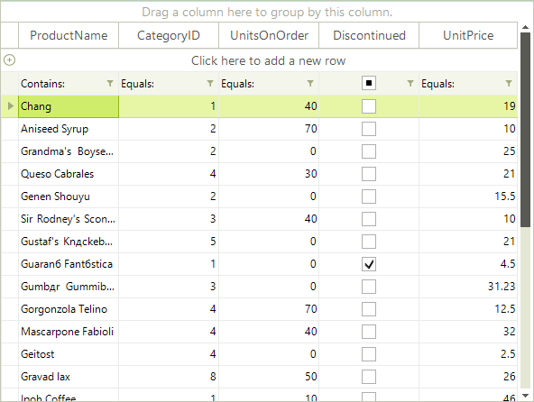

# Setting Filters Programmatically (composite descriptors)

## Using CompositeFilterDescriptor

To filter a single data field by multiple values, you have to use the __CompositeFilterDescriptor__ object. It contains a collection of filter descriptors objects and the logical operator for that filters.
        

#### __[C#] Setting composite filter descriptors__

{{source=..\SamplesCS\GridView\Filtering\Filtering.cs region=settingCompositeFilterDescriptors}}
	            CompositeFilterDescriptor compositeFilter = new CompositeFilterDescriptor();
	            compositeFilter.FilterDescriptors.Add(new FilterDescriptor("UnitsInStock", FilterOperator.IsGreaterThan, 100));
	            compositeFilter.FilterDescriptors.Add(new FilterDescriptor("ProductName", FilterOperator.StartsWith, "G"));
	            compositeFilter.LogicalOperator = FilterLogicalOperator.And;
	            this.radGridView1.FilterDescriptors.Add(compositeFilter);
	{{endregion}}

#### __[VB.NET] Setting composite filter descriptors__

{{source=..\SamplesVB\GridView\Filtering\Filtering.vb region=settingCompositeFilterDescriptors}}
	        Dim compositeFilter As New CompositeFilterDescriptor()
	        compositeFilter.FilterDescriptors.Add(New FilterDescriptor("UnitsInStock", FilterOperator.IsGreaterThan, 100))
	        compositeFilter.FilterDescriptors.Add(New FilterDescriptor("ProductName", FilterOperator.StartsWith, "G"))
	        compositeFilter.LogicalOperator = FilterLogicalOperator.[And]
	        Me.RadGridView1.FilterDescriptors.Add(compositeFilter)
	{{endregion}}

The composite FilterDescriptors supports __And__ and __Or__ logical operators. Result of the above example using __And__ logical operator:
        

Result of the above example using *__Or__* logical operator:
        

## More Complex Composite Filters

The composite filters allow you to create more complex filtering expressions. Such a complex filtering expression might include filters for multiple fields combined with different logical operators, like __(UnitsOnOrder= 0 AND (UnitsInStock> 100 OR ProductName.StartsWith(“G”)))__.
        

#### __[C#] Setting complex composite filter descriptors__

{{source=..\SamplesCS\GridView\Filtering\Filtering.cs region=settingComplexCompositeFilterDescriptors}}
	            CompositeFilterDescriptor compositeFilter1 = new CompositeFilterDescriptor();
	            compositeFilter1.FilterDescriptors.Add(new FilterDescriptor("UnitsInStock", FilterOperator.IsGreaterThan, 100));
	            compositeFilter1.FilterDescriptors.Add(new FilterDescriptor("ProductName", FilterOperator.StartsWith, "G"));
	            compositeFilter1.LogicalOperator = FilterLogicalOperator.Or;
	            FilterDescriptor filter2 = new FilterDescriptor("UnitsOnOrder", FilterOperator.IsEqualTo, 0);
	            CompositeFilterDescriptor filterDescriptor2 = new CompositeFilterDescriptor();
	            filterDescriptor2.FilterDescriptors.Add(compositeFilter);
	            filterDescriptor2.FilterDescriptors.Add(filter2);
	            filterDescriptor2.LogicalOperator = FilterLogicalOperator.And;
	            this.radGridView1.FilterDescriptors.Add(filterDescriptor2);
	{{endregion}}

#### __[VB.NET] Setting complex composite filter descriptors__

{{source=..\SamplesVB\GridView\Filtering\Filtering.vb region=settingComplexCompositeFilterDescriptors}}
	        Dim compositeFilter1 As New CompositeFilterDescriptor()
	        compositeFilter1.FilterDescriptors.Add(New FilterDescriptor("UnitsInStock", FilterOperator.IsGreaterThan, 100))
	        compositeFilter1.FilterDescriptors.Add(New FilterDescriptor("ProductName", FilterOperator.StartsWith, "G"))
	        compositeFilter1.LogicalOperator = FilterLogicalOperator.[Or]
	        Dim filter2 As New FilterDescriptor("UnitsOnOrder", FilterOperator.IsEqualTo, 0)
	        Dim filterDescriptor2 As New CompositeFilterDescriptor()
	        filterDescriptor2.FilterDescriptors.Add(compositeFilter)
	        filterDescriptor2.FilterDescriptors.Add(filter2)
	        filterDescriptor2.LogicalOperator = FilterLogicalOperator.[And]
	        Me.RadGridView1.FilterDescriptors.Add(filterDescriptor2)
	{{endregion}}

