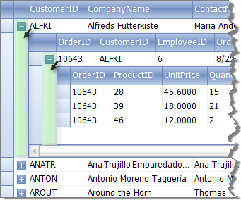
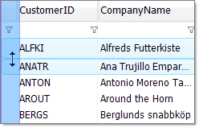

# Columns

RadGridView currently supports two main column types: 

* __Data-bound columns__ - all columns in this list inherit __GridViewDataColumn__ class 

* __Structure columns__ - all columns, which are added by __RadGridView__ automatically to facilitate some functionality are called structure columns (e.g. expand/collapse the hierarchy)

## Data-bound columns

The following are the available GridViewDataColumn descendants column types used in RadGridView:

* [GridViewCheckBoxColumn](BCA512FB-1394-4EE4-98A2-9B81CA5DEB72)

* [GridViewCommandColumn]()

* [GridViewDateTimeColumn]()

* [GridViewDecimalColumn]()

* [GridViewImageColumn]()

* [GridViewTextBoxColumn]()

* [GridViewComboBoxColumn]()

* [GridViewMaskBoxColumn]()

## Structure Columns

### GridViewIndentColumn

This column appears when the grid data is grouped or has a hierarchical structure. The GridViewIndentColumn facilitates expand and collapse functionality. The expand column is always placed in front of all other grid content columns and can not be moved.

### GridViewRowHeaderColumn

This column facilitates row resizing. When you move the cursor to an line in this column, the cursor changes to an arrow and you can resize the respective row.
