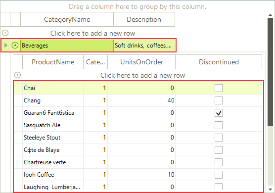
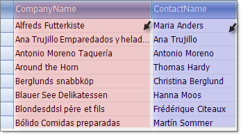
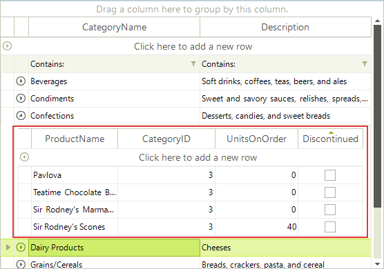

# Overview of RadGridView Structure

## Row

Each row in __RadGridView__ is represented by __GridRowElement__ class.

## HeaderRow

The header element is represented by __GridHeaderRowElement__ class.

## Add New Row

Depending on the value of __GridViewTemplate.AddNewRowPosition__ property, the new row element appears below the header row or after the data rows. 

## FilteringRow

*FilteringRow* appears automatically when you have [Filtering]() enabled by setting __RadGridView.EnableFiltering__ or __GridViewTemplate.EnableFiltering__ properties.

## GridViewIndentColumn

This column appears when the grid data is grouped or there is a hierarchical structure to facilitate the expand/collapse functionality. The expand column is always placed in front of all other grid content columns and cannot be moved.

## GridViewDataColumn

Displays a column bound to a field in a data source. 

## MasterTemplate

__MasterTemplate__ is the top most __GridViewTemplate__ in the hierarchical structure. It contains all inner __GridViewTemplates__(__GridViewTemplate.Templates__ collection). When there is no hierarchical structure, only __MasterTemplate__ is displayed. 

## GridViewTemplate

__GridViewTemplate__ is a basic class containing settings for a single level of the hierarchical structure.

## ScrollBars

__RadGridView__ will automatically show and hide scrollbars as needed. 

## GroupPanel

When you want to enable the group-by functionality for the end-user, you need to set __RadGridView.GroupingEnabled__ to *true* and __GridViewTemplate.EnableGrouping__.  If you want to prevent the end-user to drag column header into the __GroupPanel,__  set __GridViewTemplate.AllowDragToGroup__ to *false*. __RadGridView.ShowGroupPanel__ shows/hides the group panel.  You can access the group panel using __RadGridView.GridElement.HeaderElement.GroupPanel__ property. 
