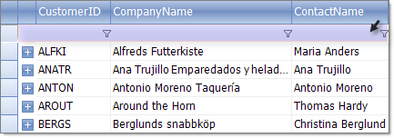
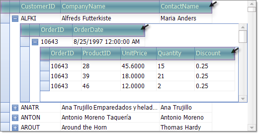
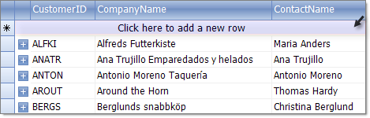

# Rows

There are two main row types in RadGridView: 

* Data rows

* Structure rows

## DataRows

Each data row in the grid represents a record from the specified __DataSource__. Each 
      		__RadGridView__ has a row collection of type
        	[GridViewRowInfo]().
      		The collection provides methods to add or remove items.
      	

>note Note that only Rows bound to the data source are kept in the Rows collection. The header, pager, filter and separator are not 
        	included in this collection.
>
Selected row

You can check if a grid row is in selected state using __GridRowElement.IsSelected__ property.
      				Multiple rows can be selected if the RadGridView __MultiSelect__ property is set to *True*.
     			 	

## Structure RowsFilteringRow

FilteringRow will appear automatically when you have
		      		[Filtering]()
		        	enabled either by __RadGridView.EnableFiltering__ or __GridViewTemplate.EnableFiltering__ properties.
		      	

HeaderRow

The header element is represented by __GridHeaderRowElement__object.

Add New Row

Depending of the value of the __GridViewTemplate.AddNewRowPosition__property the new row element appears below the
		      		header row or after the data rows.
		      	
