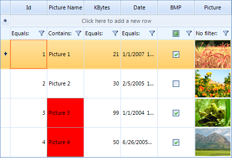

# UI Virtualization


__RadGridView__ uses virtualization for its cells and rows. To put it simply, this means that when binding to a DataTable with 1000 rows, you get 1000 data row objects created in RadGridView (of type __GridViewDataRowInfo__). However, not all data row objects can be visible at the same time in the RadGridView estate area in your application. This is why only the visual rows that can be shown in the estate area get created (these visual rows are of type __GridDataRowElement__), or about 20-30 rows for an average application with medium-sized RadGridView. These visual elements are reused during scrolling, filtering and other operations with the grid, meaning dramatically improved performance and memory footprint as only a small number of visual items are created.        
        

## Formatting events

Because of the virtualization you cannot access UI elements at design time or directly by using the Element tree or a property. Instead, you have to use formatting events. These events in RadGridView are __CellFormatting__ for data cells and __RowFormatting__ for data rows. When customizing system rows and cells, one should use __ViewCellFormatting__ and __ViewRowFormatting__ events instead. [Read more]()

Here is a quick sample:

{{source=..\SamplesCS\GridView\Cells\FormattingCells.cs region=uiVirtualization}} 
{{source=..\SamplesVB\GridView\Cells\FormattingCells.vb region=uiVirtualization}} 

````C#
void radGridView1_CellFormatting3(object sender, CellFormattingEventArgs e)
{
    if (e.CellElement.ColumnInfo.Name == "Picture Name")
    {
        if (e.CellElement.RowInfo.Cells["KBytes"].Value != null)
        {
            if ((decimal)e.CellElement.RowInfo.Cells["KBytes"].Value > 30)
            {
                e.CellElement.DrawFill = true;
                e.CellElement.GradientStyle = GradientStyles.Solid;
                e.CellElement.BackColor = Color.Red;
                e.CellElement.BorderBoxStyle = BorderBoxStyle.SingleBorder;
            }
            else
            {
                ResetProperties(e.CellElement);
            }
        }
    }
    else
    {
        ResetProperties(e.CellElement);
    }
}
void ResetProperties(GridCellElement cell)
{
    cell.ResetValue(LightVisualElement.DrawFillProperty, ValueResetFlags.Local);
    cell.ResetValue(LightVisualElement.GradientStyleProperty, ValueResetFlags.Local);
    cell.ResetValue(VisualElement.BackColorProperty, ValueResetFlags.Local);
    cell.ResetValue(LightVisualElement.BorderBoxStyleProperty, ValueResetFlags.Local);
}

````
````VB.NET
Private Sub radGridView1_CellFormatting3(ByVal sender As Object, ByVal e As CellFormattingEventArgs) Handles RadGridView1.CellFormatting
    If e.CellElement.ColumnInfo.Name = "Picture Name" Then
        If e.CellElement.RowInfo.Cells("KBytes").Value IsNot Nothing Then
            If CDec(e.CellElement.RowInfo.Cells("KBytes").Value) > 30 Then
                e.CellElement.DrawFill = True
                e.CellElement.GradientStyle = GradientStyles.Solid
                e.CellElement.BackColor = Color.Red
                e.CellElement.BorderBoxStyle = BorderBoxStyle.SingleBorder
            Else
                ResetProperties(e.CellElement)
            End If
        End If
    Else
        ResetProperties(e.CellElement)
    End If
End Sub
Private Sub ResetProperties(ByVal cell As GridCellElement)
    cell.ResetValue(LightVisualElement.DrawFillProperty, ValueResetFlags.Local)
    cell.ResetValue(LightVisualElement.GradientStyleProperty, ValueResetFlags.Local)
    cell.ResetValue(VisualElement.BackColorProperty, ValueResetFlags.Local)
    cell.ResetValue(LightVisualElement.BorderBoxStyleProperty, ValueResetFlags.Local)
End Sub

````

{{endregion}} 




## Style property

Another solution is the __Style__ property which is available when accessing logical cell objects. It allows for directly setting visual properties that will reflect the specified cell element. [Read more]()

Here is a quick sample:

{{source=..\SamplesCS\GridView\Cells\FormattingCells.cs region=uiVirtStyle}} 
{{source=..\SamplesVB\GridView\Cells\FormattingCells.vb region=uiVirtStyle}} 

````C#
for (int i = 0; i < this.radGridView1.Rows.Count; i++)
{
    if (this.radGridView1.Rows[i].Cells["KBytes"].Value != null)
    {
        if ((decimal)this.radGridView1.Rows[i].Cells["KBytes"].Value > 30)
        {
            this.radGridView1.Rows[i].Cells["Picture Name"].Style.CustomizeFill = true;
            this.radGridView1.Rows[i].Cells["Picture Name"].Style.CustomizeBorder = true;
            this.radGridView1.Rows[i].Cells["Picture Name"].Style.BackColor = Color.Red;
            this.radGridView1.Rows[i].Cells["Picture Name"].Style.BorderGradientStyle = GradientStyles.Solid;
            this.radGridView1.Rows[i].Cells["Picture Name"].Style.BorderBoxStyle = BorderBoxStyle.SingleBorder;
        }
    }
}

````
````VB.NET
For i As Integer = 0 To Me.radGridView1.Rows.Count - 1
    If Me.radGridView1.Rows(i).Cells("KBytes").Value IsNot Nothing Then
        If CDec(Me.radGridView1.Rows(i).Cells("KBytes").Value) > 30 Then
            Me.radGridView1.Rows(i).Cells("Picture Name").Style.CustomizeFill = True
            Me.radGridView1.Rows(i).Cells("Picture Name").Style.CustomizeBorder = True
            Me.radGridView1.Rows(i).Cells("Picture Name").Style.BackColor = Color.Red
            Me.radGridView1.Rows(i).Cells("Picture Name").Style.BorderGradientStyle = GradientStyles.Solid
            Me.radGridView1.Rows(i).Cells("Picture Name").Style.BorderBoxStyle = BorderBoxStyle.SingleBorder
        End If
    End If
Next i

````

{{endregion}} 


## Conditional formatting

Another feature that we provide is the conditional formatting which is available for end user via context menu. [Read more]()

Here is a quick sample of how conditional formatting can be set by code:

{{source=..\SamplesCS\GridView\Cells\ConditionalFormattingCells.cs region=conditionalFormattingCells}} 
{{source=..\SamplesVB\GridView\Cells\ConditionalFormattingCells.vb region=conditionalFormattingCells}} 

````C#
ConditionalFormattingObject obj = new ConditionalFormattingObject("MyCondition", ConditionTypes.Greater, "30", "", false);
obj.CellBackColor = Color.SkyBlue;
obj.CellForeColor = Color.Red;
obj.TextAlignment = ContentAlignment.MiddleRight;
this.radGridView1.Columns["UnitPrice"].ConditionalFormattingObjectList.Add(obj);

````
````VB.NET
Dim obj As New ConditionalFormattingObject("MyCondition", ConditionTypes.Greater, "30", "", False)
obj.CellBackColor = Color.SkyBlue
obj.CellForeColor = Color.Red
obj.TextAlignment = ContentAlignment.MiddleRight
Me.RadGridView1.Columns("UnitPrice").ConditionalFormattingObjectList.Add(obj)

````

{{endregion}} 


