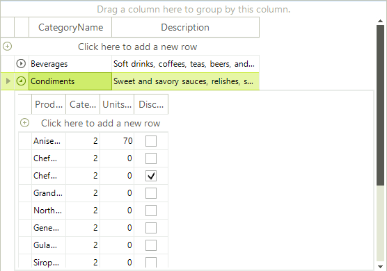
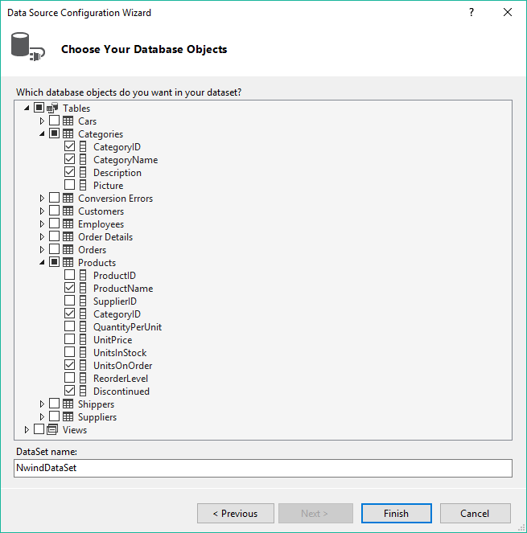
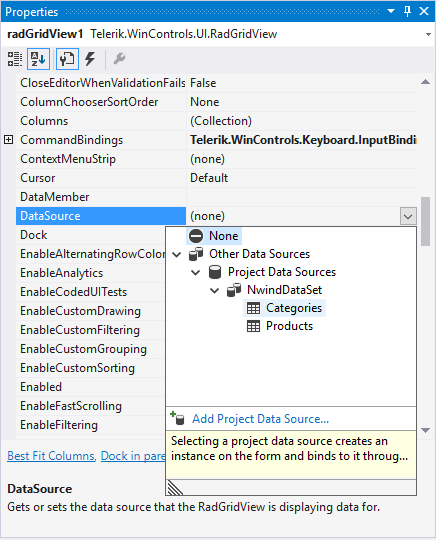
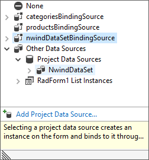

# Getting Started

## 

| RELATED VIDEOS |  
| ------ |
|[RadGridView for WinForms Webinar](http://tv.telerik.com/watch/winforms/webinar/radgridview-for-winforms-webinar) Lino Tadros from Falalel provides an in-depth overview of Telerik's RadGridView for WinForms (Runtime: 01:45:11)|

The example below demonstrates creating a hierarchical grid presenting two tables *Product Category* and *Product Information*.

## Setting up the Form 

1. Create a new __Windows Application__ project.
            

1. Drop a __RadGridView__ control on the form.
            

1. Set RadGridView __Dock__ property to __Fill__ in the Properties window of Visual Studio.
            

## Connecting to Data

1. Open the __DataSource__ property drop down in the *Properties* window of Visual Studio and select __Add Project Data Source__. This step will open the __Data Source Configuration Wizard__.
            

1. In the Data Source Configuration Wizard, Choose a Data Source Type page, select the __Database__ icon, and click __Next__.

1. In the Choose Your Data Connection page of the wizard, click on the __New Connection...__ button. This page displays the Add Connection dialog.
            

1. In the Add Connection dialog, click on the __Change...__ button. This will display the Change Data Source dialog.
            

1. In the Change Data Source dialog, select __Microsoft Access Data Base File__ from the data source list.
            

1. Click __OK__ to close the Change Data Source dialog.
            

1. In the Add Connection dialog, click on the __Browse...__ button. This step will display the Select Microsoft Access Database File dialog.
            

1. In the *Select Microsoft Access Database File* dialog, navigate to Telerik UI for WinForms installation directory and locate the Nwind.mdb file within the \Examples\QuickStart\Datasources directory. Select Nwind.mdb and click __OK__ to close the *Select Microsoft Access Database File* dialog.
            

1. Click __OK__ to close *Add Connection* dialog.
            

1. In *Choose Your Data Connection* page of the wizard, click __Next__. This step will display a Microsoft Visual Studio dialog that prompts to ask if you want to copy the file to your project. Click __Yes__ to close the dialog.
            

1. In Save the Connection String to the Application Configuration File page of the wizard, click the __Next__ button.
            

1. In *Choose Database Objects* page of the dialog, select columns from the Categories table: "CategoryID", "CategoryName" and "Description". Select columns from the Products table: "ProductName", "CategoryID", "UnitsOnOrder" and "Discontinued".

1. Click the __Finish__ button to close the *Data Source Configuration Wizard*.
            

1. In the *Properties* window of Visual Studio, open the __DataSource__ property drop down and select Categories from the NwindDataSet data source. This step will create *categoriesBindingSource* and *categoriesTableAdapter* controls.

1. Select the __DataSource__ property drop down a second time and select *Products* from *NwindDataSet* data source. This step will create *productsBindingSource* and *productsTableAdapter* controls.
            

1. Select the __DataSource__ property drop down for the third time and select *NwindDataSet*. This step will assign the entire dataset to the grid.

## Setting Properties

1. In the *Properties* window of Visual Studio, set the __DataMember__ property - select *Categories* from the drop down list. This step will assign categories as a top level table for the grid.
            

1. In the *Properties* window, set __AutoGenerateHierarchy__ to __True__.
            

1. From *RadGridView* smart tag, select __Open Property Builder__.
            

1. In *Property Builder Structure* pane, de-select *CategoryID *checkboxes.
            

1. Close the *Property Builder* window.
            

1. Press __F5__ to run the application. Notice that the grid first displays product categories. Each category has an icon that can be clicked to expand that category and show a child template with the corresponding products.
            
