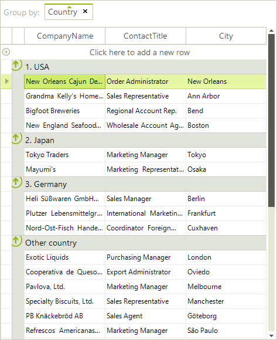
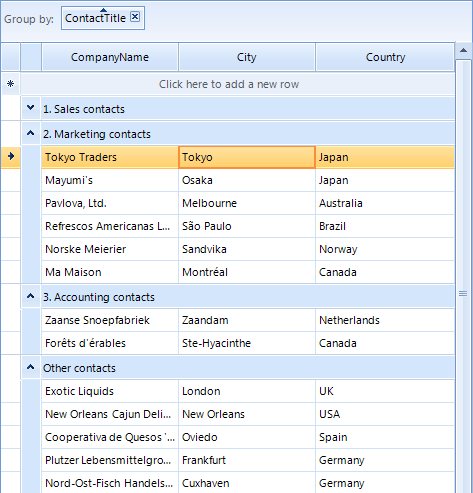

# Custom Grouping

Custom grouping is a flexible mechanism for creating RadGridView groups by using  custom logic. It has a higher priority than the applied
        __GroupDescriptors__ (added either by code or by dragging columns to the group panel).
      

Custom grouping is applied if user grouping is enabled through the __RadGridView.EnableGrouping__ or
        __GridViewTemplate.EnableGrouping__ properties. By default, grouping is enabled at all levels.
      

RadGridView provides two mechanisms for custom grouping:
      

* Handling the CustomGrouping event

* Replacing the RadGridView grouping mechanism by providing a custom __GroupPredicate__

You can use the __GroupSummaryEvaluate__ event to format the group header row text of the created custom groups.
      

## Using the CustomGrouping event

The __CustomGrouping__ event is fired if custom grouping is enabled through the
          __RadGridView.EnableCustomGrouping__ or __GridViewTemplate.EnableCustomGrouping__ properties.
          By default, custom grouping is disabled at all levels.
        

* __Template__ – the template that holds the rows that will be grouped
            

* __Row__ – the row which group is defined
            

* __Level__ – the level of the current group, represents zero-based depth of the group
            

* __GroupKey__ – identifier of the group
            

* __Handled__ – defines whether the row is processed by the custom algorithm or by the applied group descriptors.
            

The following example demonstrates how to handle the __CustomGrouping__ event to group the RadGridView rows
          by the values of the Country column creating groups only for predefined countries:
        

#### __[C#]__

{{region usingCustomGrouping}}
	            this.radGridView1.EnableCustomGrouping = true;
	            this.radGridView1.CustomGrouping += new GridViewCustomGroupingEventHandler(radGridView1_CustomGrouping);
	
	            GroupDescriptor descriptor = new GroupDescriptor("Country");
	            this.radGridView1.GroupDescriptors.Add(descriptor);
	
	            this.radGridView1.GroupSummaryEvaluate += new GroupSummaryEvaluateEventHandler(radGridView1_GroupSummaryEvaluate);
	{{endregion}}

#### __[C#]__

{{region usingCustomGrouping1}}
	        private void radGridView1_CustomGrouping(object sender, GridViewCustomGroupingEventArgs e)
	        {
	            string country = e.Row.Cells["Country"].Value.ToString();
	            switch (country)
	            {
	                case "USA":
	                    e.GroupKey = "1. USA";
	                    break;
	                case "Japan":
	                    e.GroupKey = "2. Japan";
	                    break;
	                case "Germany":
	                    e.GroupKey = "3. Germany";
	                    break;
	                default:
	                    e.GroupKey = "Other country";
	                    break;
	            }
	        }
	
	        private void radGridView1_GroupSummaryEvaluate(object sender, GroupSummaryEvaluationEventArgs e)
	        {
	            if (e.Value == null)
	            {
	                e.FormatString = e.Group.Key.ToString();
	            }
	        }
	{{endregion}}

#### __[VB.NET]__

{{region usingCustomGrouping}}
	        Me.RadGridView1.EnableCustomGrouping = True
	
	        Dim descriptor As New GroupDescriptor("Country")
	        Me.RadGridView1.GroupDescriptors.Add(descriptor)
	{{endregion}}

#### __[VB.NET]__

{{region usingCustomGrouping1}}
	    Private Sub RadGridView1_CustomGrouping(ByVal sender As Object, ByVal e As Telerik.WinControls.UI.GridViewCustomGroupingEventArgs) Handles RadGridView1.CustomGrouping
	        Dim country As String = e.Row.Cells("Country").Value.ToString()
	        Select Case country
	            Case "USA"
	                e.GroupKey = "1. USA"
	                Exit Select
	            Case "Japan"
	                e.GroupKey = "2. Japan"
	                Exit Select
	            Case "Germany"
	                e.GroupKey = "3. Germany"
	                Exit Select
	            Case Else
	                e.GroupKey = "Other country"
	                Exit Select
	        End Select
	    End Sub
	
	    Private Sub RadGridView1_GroupSummaryEvaluate(ByVal sender As Object, ByVal e As Telerik.WinControls.UI.GroupSummaryEvaluationEventArgs) Handles RadGridView1.GroupSummaryEvaluate
	        If e.Value Is Nothing Then
	            e.FormatString = e.Group.Key.ToString()
	        End If
	    End Sub
	{{endregion}}

## Implementing grouping mechanism by using GroupPredicate

You can replace the grouping mechanism in RadGridView with a custom one by setting the __GroupPredicate__ of the
          __GridViewTemplate__.
        

The following example demonstrates how to use a custom grouping mechanism in RadGridView to group the rows by the values of the
          ContactTitle column, creating groups only for the desired contact title categories:
        

#### __[C#]__

{{region usingGroupPredicate}}
	            GroupDescriptor descriptor = new GroupDescriptor("ContactTitle");
	            this.radGridView1.GroupDescriptors.Add(descriptor);
	
	            this.radGridView1.MasterTemplate.GroupPredicate = new GroupPredicate<GridViewRowInfo>(PerformGrouping);
	            this.radGridView1.GroupSummaryEvaluate += new GroupSummaryEvaluateEventHandler(radGridView1_GroupSummaryEvaluate);
	{{endregion}}

#### __[C#]__

{{region usingGroupPredicate1}}
	        private object PerformGrouping(GridViewRowInfo row, int level)
	        {
	            string title = row.Cells["ContactTitle"].Value.ToString();
	            string groupKey;
	            if (title.StartsWith("Sales"))
	            {
	                groupKey = "1. Sales contacts";
	            }
	            else if (title.StartsWith("Marketing"))
	            {
	                groupKey = "2. Marketing contacts";
	            }
	            else if (title.StartsWith("Accounting"))
	            {
	                groupKey = "3. Accounting contacts";
	            }
	            else
	            {
	                groupKey = "Other contacts";
	            }
	
	            return groupKey;
	        }
	
	        private void radGridView1_GroupSummaryEvaluate(object sender, GroupSummaryEvaluationEventArgs e)
	        {
	            if (e.Value == null)
	            {
	                e.FormatString = e.Group.Key.ToString();
	            }
	        }
	{{endregion}}

#### __[VB.NET]__

{{region usingGroupPredicate}}
	        Dim descriptor As New GroupDescriptor("ContactTitle")
	        Me.RadGridView1.GroupDescriptors.Add(descriptor)
	        Me.RadGridView1.MasterTemplate.GroupPredicate = New GroupPredicate(Of GridViewRowInfo)(AddressOf PerformGrouping)
	{{endregion}}

#### __[VB.NET]__

{{region usingGroupPredicate1}}
	    Private Function PerformGrouping(ByVal row As GridViewRowInfo, ByVal level As Integer) As Object
	        Dim title As String = row.Cells("ContactTitle").Value.ToString()
	        Dim groupKey As String
	        If title.StartsWith("Sales") Then
	            groupKey = "1. Sales contacts"
	        ElseIf title.StartsWith("Marketing") Then
	            groupKey = "2. Marketing contacts"
	        ElseIf title.StartsWith("Accounting") Then
	            groupKey = "3. Accounting contacts"
	        Else
	            groupKey = "Other contacts"
	        End If
	
	        Return groupKey
	    End Function
	
	    Private Sub RadGridView1_GroupSummaryEvaluate(ByVal sender As Object, ByVal e As Telerik.WinControls.UI.GroupSummaryEvaluationEventArgs) Handles RadGridView1.GroupSummaryEvaluate
	        If e.Value Is Nothing Then
	            e.FormatString = e.Group.Key.ToString()
	        End If
	    End Sub
	{{endregion}}

