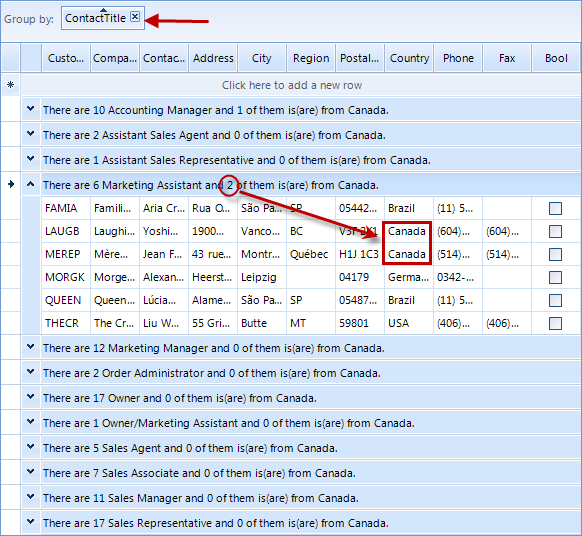

# Formatting Group Header Row

## 

__GroupSummaryEvaluate__allows to modify the header text of the group rows. The event is fired when the group header row text is needed.
          So if you want to modify the group’s text, first you have to subscribe to the __GroupSummaryEvaluate__ event and then perform the actual
          grouping, because when the __GroupContentCellElement__ (the group header row) is being displayed, the event is fired and if you are
          not subscribed for it, it will apply its default settings.
         

The example below demonstrates how you can change the group header text of each group if grouping is based on some specific column:
		

#### __[C#] Change group header text__

{{source=..\SamplesCS\GridView\Grouping\FormattingGroupHeaderRow.cs region=groupHeaderText}}
	        void radGridView1_GroupSummaryEvaluate(object sender, Telerik.WinControls.UI.GroupSummaryEvaluationEventArgs e)
	        {
	            if (e.SummaryItem.Name == "Country")
	            {
	                e.FormatString = String.Format("Group by country: {0}", e.Value);
	            }
	        }
	{{endregion}}

#### __[VB.NET] Change group header text__

{{source=..\SamplesVB\GridView\Grouping\FormattingGroupHeaderRow.vb region=groupHeaderText}}
	    Private Sub RadGridView1_GroupSummaryEvaluate(ByVal sender As Object, ByVal e As Telerik.WinControls.UI.GroupSummaryEvaluationEventArgs) Handles RadGridView1.GroupSummaryEvaluate
	        If e.SummaryItem.Name = "Country" Then
	            e.FormatString = [String].Format("Group by country: {0}", e.Value)
	        End If
	    End Sub
	{{endregion}}

The following example demonstrates formatting of group header which uses data from the group rows:

#### __[C#] Formatting group header by using data grom data rows__

{{source=..\SamplesCS\GridView\Grouping\FormattingGroupHeaderRow.cs region=formatGroupHeaderWhichUsersDataFromGroupRows}}
	        void radGridView1_GroupSummaryEvaluate1(object sender, Telerik.WinControls.UI.GroupSummaryEvaluationEventArgs e)
	        {
	            if (e.SummaryItem.Name == "ContactTitle")
	            {
	                int count = e.Group.ItemCount;
	                int contactsInCanada = 0;
	                foreach (GridViewRowInfo row in e.Group)
	                {
	                    if (row.Cells["Country"].Value.ToString() == "Canada")
	                    {
	                        contactsInCanada++;
	                    }
	                }
	                e.FormatString = String.Format("There are {0} {1} and {2} of them is(are) from Canada.", count, e.Value, contactsInCanada);
	            }
	        }
	{{endregion}}

#### __[VB.NET] Formatting group header by using data grom data rows__

{{source=..\SamplesVB\GridView\Grouping\FormattingGroupHeaderRow.vb region=formatGroupHeaderWhichUsersDataFromGroupRows}}
	    Private Sub RadGridView1_GroupSummaryEvaluate1(ByVal sender As Object, ByVal e As Telerik.WinControls.UI.GroupSummaryEvaluationEventArgs) Handles RadGridView1.GroupSummaryEvaluate
	        If e.SummaryItem.Name = "ContactTitle" Then
	            Dim contactsCount As Integer = e.Group.ItemCount
	            Dim contactsInCanada As Integer = 0
	            For Each row As GridViewRowInfo In e.Group
	                If row.Cells("Country").Value.ToString() = "Canada" Then
	                    contactsInCanada += 1
	                End If
	            Next
	            e.FormatString = [String].Format("There are {0} {1} and {2} of them is(are) from France.", contactsCount, e.Value, contactsInCanada)
	        End If
	    End Sub
	{{endregion}}

