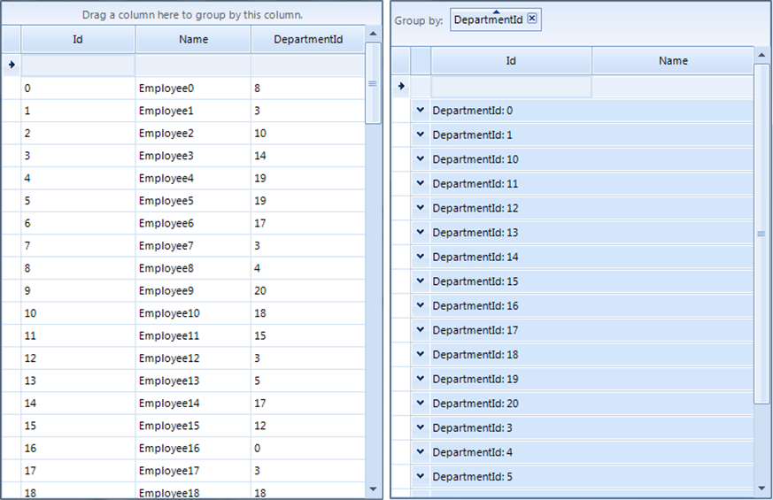
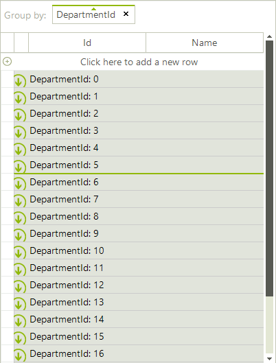

# Sorting group rows


By default, when you perform grouping, __RadGridView__ sorts the created group rows alphabetically.
      This article demonstrates how to customize the groups sort order.

## 

Consider the __RadGridView__ is [bound]() to a list of custom objects. If you group by __DepartmentId__ column you will notice that the group rows are sorted alphabetically as this property is *typeof(string)*.
        
>caption Fig.1 Alphabetical sort order<br>

However, you can change this sort order by using a group comparer. It is necessary to create a class that implements the  __IComparer<Group<GridViewRowInfo>>__ interface where you should return an integer number in the implemented __Compare__ method. The following code snippet illustrates how to order the group rows considering the integer value, not the string:

#### Custom group comparer

{{source=..\SamplesCS\GridView\Grouping\SortingGroupRows.cs region=GroupComparer}} 
{{source=..\SamplesVB\GridView\Grouping\SortingGroupRows.vb region=GroupComparer}} 

````C#
        
public class GroupComparer : IComparer<Group<GridViewRowInfo>>
{
    public int Compare(Group<GridViewRowInfo> x, Group<GridViewRowInfo> y)
    {
        int parsedX;
        int parsedY;
        if (int.TryParse(((object[])x.Key).First().ToString(), out parsedX) &&
            int.TryParse(((object[])y.Key).First().ToString(), out parsedY))
        {
            return parsedX.CompareTo(parsedY);
        }
        return x.Key.ToString().CompareTo(y.Key.ToString());
    }
}

````
````VB.NET
Public Class GroupComparer
    Implements IComparer(Of Group(Of GridViewRowInfo))
    Public Function [Compare](x As Group(Of GridViewRowInfo), y As Group(Of GridViewRowInfo)) As Integer _
    Implements IComparer(Of Group(Of GridViewRowInfo)).[Compare]
        Dim parsedX As Integer
        Dim parsedY As Integer
        If Integer.TryParse(DirectCast(x.Key, Object()).First().ToString(), parsedX) AndAlso _
        Integer.TryParse(DirectCast(y.Key, Object()).First().ToString(), parsedY) Then
            Return parsedX.CompareTo(parsedY)
        End If
        Return x.Key.ToString().CompareTo(y.Key.ToString())
    End Function

````

{{endregion}} 

The last thing you need to do is to replace the default MasterTemplate.__GroupComparer__ with your custom one:

#### Custom group comparer

{{source=..\SamplesCS\GridView\Grouping\SortingGroupRows.cs region=Replace}} 
{{source=..\SamplesVB\GridView\Grouping\SortingGroupRows.vb region=Replace}} 

````C#
this.radGridView1.MasterTemplate.GroupComparer = new GroupComparer();

````
````VB.NET
Me.RadGridView1.MasterTemplate.GroupComparer = New GroupComparer()

````

{{endregion}} 

>caption Fig.2 Custom sort order of group rows<br>
