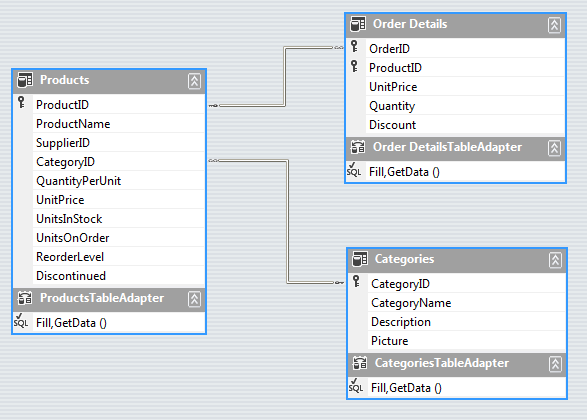

# Binding to Hierarchical Data Automatically


## Generating two-level hierarchy


| RELATED VIDEOS |  |
| ------ | ------ |
|[RadGridView for WinForms Hierarchy Overview](http://tv.telerik.com//watch/winforms/radgrid/radgridview-winforms-hierarchy-overview)<br>In this video you will learn the various ways you can display hierarchical data in a RadGridView. (Runtime: 12:13)||

At runtime, if the data source for the grid is a __System.Data.DataSet__ type and there are relations defined in it, the hierarchy can be created automatically. Set the	__AutoGenerateHierarchy__ property	__true__ to get this behavior. In the example below, the Northwind dataset has Categories and Products joined by CategoryID.<br>

The run-time code fills the categories and products data tables, sets the __AutoGenerateHierarchy__ to __true__, assigns the data set containing both tables to the grid __DataSource__ and the __DataMember__ is the name of the parent table. The last three lines of code below can be configured at design time.

{{source=..\SamplesCS\GridView\HierarchicalGrid\BindingToHierarchicalGridAutomatically.cs region=BindingToHierarchicalGridAutomatically}} 
{{source=..\SamplesVB\GridView\HierarchicalGrid\BindingToHierarchicalGridAutomatically.vb region=BindingToHierarchicalGridAutomatically}} 

````C#
        
private void BindingToHierarchicalGridAutomatically_Load(object sender, EventArgs e)
{
    this.productsTableAdapter.Fill(this.nwindDataSet.Products);
    this.categoriesTableAdapter.Fill(this.nwindDataSet.Categories);
    radGridView1.AutoGenerateHierarchy = true;
    radGridView1.DataSource = this.nwindDataSet;
    radGridView1.DataMember = "Categories";
}

````
````VB.NET
Private Sub BindingToHierarchicalGridAutomatically_Load(ByVal sender As System.Object, ByVal e As System.EventArgs) Handles MyBase.Load
    'TODO: This line of code loads data into the 'NwindDataSet.Order_Details' table. You can move, or remove it, as needed.
    Me.Order_DetailsTableAdapter.Fill(Me.NwindDataSet.Order_Details)
    'TODO: This line of code loads data into the 'NwindDataSet.Order_Details' table. You can move, or remove it, as needed.
    Me.ProductsTableAdapter.Fill(Me.NwindDataSet.Products)
    Me.CategoriesTableAdapter.Fill(Me.NwindDataSet.Categories)
    RadGridView1.AutoGenerateHierarchy = True
    RadGridView1.DataSource = Me.NwindDataSet
    RadGridView1.DataMember = "Categories"
End Sub

````

{{endregion}} 

## Generating multi-level hierarchy

It is possible to auto generate Multi-level hierarchy as well. You should again set the __DataSource__ and __AutoGenerateHierarachy__ properties of the RadGridView. Here are the three data tables from the Northwind database, used in the code snippet to generate the three-level hierarchy:<br>

{{source=..\SamplesCS\GridView\HierarchicalGrid\BindingToHierarchicalGridAutomatically.cs region=BindingToMultiLevelHierarchicalGridAutomatically}} 
{{source=..\SamplesVB\GridView\HierarchicalGrid\BindingToHierarchicalGridAutomatically.vb region=BindingToMultiLevelHierarchicalGridAutomatically}} 

````C#
        
public void Dummy()
{ 
    this.productsTableAdapter.Fill(this.nwindDataSet.Products);
    this.categoriesTableAdapter.Fill(this.nwindDataSet.Categories);
    this.order_DetailsTableAdapter.Fill(this.nwindDataSet.Order_Details);
    radGridView1.DataSource = nwindDataSet;
    radGridView1.DataMember = "Categories";
    radGridView1.AutoGenerateHierarchy = true;
}

````
````VB.NET
Public Sub Dummy()
    Me.ProductsTableAdapter.Fill(Me.NwindDataSet.Products)
    Me.CategoriesTableAdapter.Fill(Me.NwindDataSet.Categories)
    RadGridView1.DataSource = NwindDataSet
    RadGridView1.DataMember = "Categories"
    RadGridView1.AutoGenerateHierarchy = True
End Sub

````

{{endregion}} 


