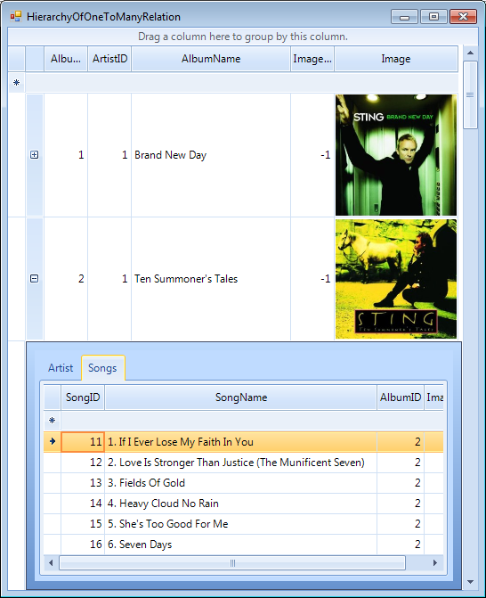

# Hierarchy of one to many relations


## 

__RadGridView__ supports binding to a hierarchy containing one to many relations. The result is presented in tabs inside child views.<br>

Follow these steps to setup the hierarchy:

__1.__ Bind to a data source (e.g. DataTable)

__2.__ Add at least two child templates and set their data source.

__3.__ Add relations to connect the child templates with the master template.

__4.__ Run the project.

{{source=..\SamplesCS\GridView\HierarchicalGrid\HierarchyOfOneToManyRelation.cs region=HierarchyOfOneToManyRelation}} 
{{source=..\SamplesVB\GridView\HierarchicalGrid\HierarchyOfOneToManyRelation.vb region=HierarchyOfOneToManyRelation}} 

````C#
private void HierarchyOfOneToManyRelation_Load(object sender, EventArgs e)
{
    this.songsTableAdapter.Fill(this.musicCollectionDataSet.Songs);
    this.artistsTableAdapter.Fill(this.musicCollectionDataSet.Artists);
    this.albumsTableAdapter.Fill(this.musicCollectionDataSet.Albums);
   
    this.radGridView1.DataSource = albumsBindingSource;
    radGridView1.Columns["Image"].ImageLayout = ImageLayout.Zoom;
    GridViewTemplate childTemplate1 = new GridViewTemplate();
    childTemplate1.DataSource = artistsBindingSource;
    childTemplate1.Columns["Image"].ImageLayout = ImageLayout.Zoom;
    childTemplate1.Caption = "Artist";
    
    this.radGridView1.MasterTemplate.Templates.Add(childTemplate1);
    GridViewRelation relation1 = new GridViewRelation(this.radGridView1.MasterTemplate);
    relation1.RelationName = "productmodel_productModelDescription";
    relation1.ParentColumnNames.Add("ArtistID");
    relation1.ChildColumnNames.Add("ArtistID");
    relation1.ChildTemplate = childTemplate1;
    this.radGridView1.Relations.Add(relation1);
    GridViewTemplate childTemplate2 = new GridViewTemplate();
    childTemplate2.DataSource = songsBindingSource;
    childTemplate2.Caption = "Songs";
    this.radGridView1.MasterTemplate.Templates.Add(childTemplate2);
    GridViewRelation relation2 = new GridViewRelation(this.radGridView1.MasterTemplate);
    relation2.RelationName = "productdescription_productModelDescription";
    relation2.ParentColumnNames.Add("AlbumID");
    relation2.ChildColumnNames.Add("AlbumID");
    relation2.ChildTemplate = childTemplate2;
    this.radGridView1.Relations.Add(relation2);
}

````
````VB.NET
Private Sub HierarchyOfOneToManyRelation_Load(ByVal sender As System.Object, ByVal e As System.EventArgs) Handles MyBase.Load
    Me.SongsTableAdapter.Fill(Me.MusicCollectionDataSet.Songs)
    Me.ArtistsTableAdapter.Fill(Me.MusicCollectionDataSet.Artists)
    Me.AlbumsTableAdapter.Fill(Me.MusicCollectionDataSet.Albums)
    Me.RadGridView1.DataSource = AlbumsBindingSource
    RadGridView1.Columns("Image").ImageLayout = ImageLayout.Zoom
    Dim childTemplate1 As New GridViewTemplate()
    childTemplate1.DataSource = ArtistsBindingSource
    childTemplate1.Columns("Image").ImageLayout = ImageLayout.Zoom
    childTemplate1.Caption = "Artist"
    Me.RadGridView1.MasterTemplate.Templates.Add(childTemplate1)
    Dim relation1 As New GridViewRelation(Me.RadGridView1.MasterTemplate)
    relation1.RelationName = "productmodel_productModelDescription"
    relation1.ParentColumnNames.Add("ArtistID")
    relation1.ChildColumnNames.Add("ArtistID")
    relation1.ChildTemplate = childTemplate1
    Me.RadGridView1.Relations.Add(relation1)
    Dim childTemplate2 As New GridViewTemplate()
    childTemplate2.DataSource = SongsBindingSource
    childTemplate2.Caption = "Songs"
    Me.RadGridView1.MasterTemplate.Templates.Add(childTemplate2)
    Dim relation2 As New GridViewRelation(Me.RadGridView1.MasterTemplate)
    relation2.RelationName = "productdescription_productModelDescription"
    relation2.ParentColumnNames.Add("AlbumID")
    relation2.ChildColumnNames.Add("AlbumID")
    relation2.ChildTemplate = childTemplate2
    Me.RadGridView1.Relations.Add(relation2)
End Sub

````

{{endregion}} 
>note There is an example demonstrating how to build hierarchy containing one-to-many relations in the demo application.
>


## Formatting tabs

In some cases you may want to set custom text to the tabs of the child views different than the text of the template's caption. In this case, the solution is to use the [Formatting events]() that RadGridView exposes, and more specifically, the ViewCellFormatting event. This event will give you access to the detail cell that contains the whole RadPageViewElement and from this element you will be able to set the text of each tab separately. For example, if we need to display the count of the rows in each view, we can use the following code snippet in order to apply our custom text:

{{source=..\SamplesCS\GridView\HierarchicalGrid\HierarchyOfOneToManyRelation.cs region=formattingTabs}} 
{{source=..\SamplesVB\GridView\HierarchicalGrid\HierarchyOfOneToManyRelation.vb region=formattingTabs}} 

````C#
void radGridView1_ViewCellFormatting(object sender, CellFormattingEventArgs e)
{
    GridDetailViewCellElement detailCell = e.CellElement as GridDetailViewCellElement;
    if (detailCell != null)
    {
        for (int i = 0; i < detailCell.PageViewElement.Items.Count; i++)
        {
            // We take the view that contains the child rows from the corresponding RadPageViewStripItem
            GridViewInfo info = (GridViewInfo)detailCell.PageViewElement.Items[i].Tag;
            // We set our custom text to the tab, taking the count of rows that the child view has
            detailCell.PageViewElement.Items[i].Text = string.Format("{0}, Rows={1}", info.ViewTemplate.Caption, info.Rows.Count.ToString());
        }
    }
}

````
````VB.NET
Private Sub RadGridView1_ViewCellFormatting(ByVal sender As Object, ByVal e As Telerik.WinControls.UI.CellFormattingEventArgs) Handles RadGridView1.ViewCellFormatting
    Dim detailCell As GridDetailViewCellElement = TryCast(e.CellElement, GridDetailViewCellElement)
    If detailCell IsNot Nothing Then
        For i As Integer = 0 To detailCell.PageViewElement.Items.Count - 1
            ' We take the view that contains the child rows from the corresponding RadPageViewStripItem
            Dim info As GridViewInfo = CType(detailCell.PageViewElement.Items(i).Tag, GridViewInfo)
            ' We set our custom text to the tab, taking the count of rows that the child view has
            detailCell.PageViewElement.Items(i).Text = String.Format("{0}, Rows={1}", info.ViewTemplate.Caption, info.Rows.Count.ToString())
        Next i
    End If
End Sub

````

{{endregion}} 

The result is shown on the screenshot below:<br>
