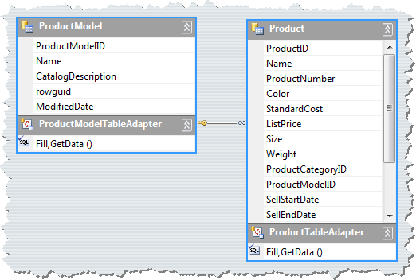

# Load-On-Demand Hierarchy


| RELATED VIDEOS |  |
| ------ | ------ |
|[Event Based Hierarchies with RadGridView for WinForms](http://tv.telerik.com/watch/winforms/event-based-hierarchies-with-radgridview-for-winforms)<br>In this video, you will learn how to automatically and manually create object relational hierarchies in RadGridView for WinForms.||

## 

In many cases you may need to load your data not when RadGridView is being initialized, but at a later moment, when you interact with RadGridView or with your application. For example, a child template can be loaded on demand to delay the initialization of a resource-demanding feature of the application until it is required. In order to load a GridViewTemplate on demand, you should follow these high-level steps:
        

1. Create and define a columns schema for the presented data at the first level of the hierarchy.

1. Create and define a columns schema for the presented data  and a child GridViewTemplate.

1. Create and associate a  GridViewEventDataProvider with the child GridViewTemplate.

1. Handle the RowSourceNeeded event to populate the data for each parent row.

## Sample load-on-demand scenario

The following example shows a load-on-demand scenario using a typed DataSet.  Let have the following Products data from the AdventureWorks database:<br>

Steps to create a Load-On-Demand hierarchy mode:
        

1\. First, create a columns schema for the first (parent) level of the hierarchy. If RadGridView is in a data-bound mode and we do not need to set a custom schema, we can just set the DataSource property of RadGridView which will set the schema and will populate the parent level with data. You can also set the AutoSizeColumnsMode to Fill to get a better view of the data:

{{source=..\SamplesCS\GridView\HierarchicalGrid\LoadOnDemandHierarchy.cs region=bindingRadGridView}} 
{{source=..\SamplesVB\GridView\HierarchicalGrid\LoadOnDemandHierarchy.vb region=bindingRadGridView}} 

````C#
this.radGridView1.DataSource = productModelBindingSource;
this.radGridView1.AutoSizeColumnsMode = GridViewAutoSizeColumnsMode.Fill;

````
````VB.NET
Me.RadGridView1.DataSource = ProductModelBindingSource
Me.RadGridView1.AutoSizeColumnsMode = GridViewAutoSizeColumnsMode.Fill

````

{{endregion}} 

2\. Then, create a Child template and a columns schema for the "Product" data:

{{source=..\SamplesCS\GridView\HierarchicalGrid\LoadOnDemandHierarchy.cs region=childTemplate}} 
{{source=..\SamplesVB\GridView\HierarchicalGrid\LoadOnDemandHierarchy.vb region=childTemplate}} 

````C#
private GridViewTemplate CreateChildTemplate()
{
    GridViewTemplate template = new GridViewTemplate();
    template.AutoSizeColumnsMode = GridViewAutoSizeColumnsMode.Fill;
    GridViewTextBoxColumn namecolumn = new GridViewTextBoxColumn("Name");
    GridViewTextBoxColumn productNumberColumn = new GridViewTextBoxColumn("ProductNumber");
    GridViewTextBoxColumn colorColumn = new GridViewTextBoxColumn("Color");
    GridViewDecimalColumn listPriceColumn = new GridViewDecimalColumn("ListPrice");
    GridViewTextBoxColumn sizeColumn = new GridViewTextBoxColumn("Size");
    GridViewDecimalColumn weightColumn = new GridViewDecimalColumn("Weight");
    GridViewDateTimeColumn discontinuedColumn = new GridViewDateTimeColumn("DiscontinuedDate");
    template.Columns.AddRange(namecolumn,
        productNumberColumn,
        colorColumn,
        listPriceColumn,
        sizeColumn,
        weightColumn,
        discontinuedColumn);
    return template;
}

````
````VB.NET
Private Function CreateChildTemplate() As GridViewTemplate
    Dim template As New GridViewTemplate()
    template.AutoSizeColumnsMode = GridViewAutoSizeColumnsMode.Fill
    Dim namecolumn As New GridViewTextBoxColumn("Name")
    Dim productNumberColumn As New GridViewTextBoxColumn("ProductNumber")
    Dim colorColumn As New GridViewTextBoxColumn("Color")
    Dim listPriceColumn As New GridViewDecimalColumn("ListPrice")
    Dim sizeColumn As New GridViewTextBoxColumn("Size")
    Dim weightColumn As New GridViewDecimalColumn("Weight")
    Dim discontinuedColumn As New GridViewDateTimeColumn("DiscontinuedDate")
    template.Columns.AddRange(namecolumn, productNumberColumn, colorColumn, listPriceColumn, sizeColumn, weightColumn, discontinuedColumn)
    Return template
End Function

````

{{endregion}} 

3\. Setup the load-on-demand mode by using GridViewEventDataProvider and RowSourceNeeded event:

{{source=..\SamplesCS\GridView\HierarchicalGrid\LoadOnDemandHierarchy.cs region=loadOnDemandMode}} 
{{source=..\SamplesVB\GridView\HierarchicalGrid\LoadOnDemandHierarchy.vb region=loadOnDemandMode}} 

````C#
void Form1_Load(object sender, EventArgs e)
{
    this.productModelTableAdapter.Fill(this.adventureLT2008DataSet.ProductModel);
    this.productTableAdapter.Fill(this.adventureLT2008DataSet.Product);
    GridViewTemplate childTemplate = CreateChildTemplate();
    this.radGridView1.Templates.Add(childTemplate);
    childTemplate.HierarchyDataProvider = new GridViewEventDataProvider(childTemplate);
    this.radGridView1.RowSourceNeeded += new GridViewRowSourceNeededEventHandler(radGridView1_RowSourceNeeded);
}

````
````VB.NET
Private Sub Form1_Load(ByVal sender As System.Object, ByVal e As System.EventArgs) Handles MyBase.Load
    Me.ProductModelTableAdapter.Fill(Me.AdventureLT2008DataSet.ProductModel)
    Me.ProductTableAdapter.Fill(Me.AdventureLT2008DataSet.Product)
    Dim childTemplate As GridViewTemplate = CreateChildTemplate()
    Me.RadGridView1.Templates.Add(childTemplate)
    childTemplate.HierarchyDataProvider = New GridViewEventDataProvider(childTemplate)
    AddHandler RadGridView1.RowSourceNeeded, AddressOf radGridView1_RowSourceNeeded
End Sub

````

{{endregion}} 


4\. Load the data on demand for an expanded parent row by using the RowSourceNeeded event:

>important You should make sure that there is a relation between the tables in the dataset. In the bellow example the relation name is "ProductModel_Product" and the relation is between the ProductModelID field in both tables.

{{source=..\SamplesCS\GridView\HierarchicalGrid\LoadOnDemandHierarchy.cs region=handlingRowSourceNeeded}} 
{{source=..\SamplesVB\GridView\HierarchicalGrid\LoadOnDemandHierarchy.vb region=handlingRowSourceNeeded}} 

````C#
void radGridView1_RowSourceNeeded(object sender, GridViewRowSourceNeededEventArgs e)
{
    DataRowView rowView = e.ParentRow.DataBoundItem as DataRowView;
    DataRow[] rows = rowView.Row.GetChildRows("ProductModel_Product");
    foreach (DataRow dataRow in rows)
    {
        GridViewRowInfo row = e.Template.Rows.NewRow();
        row.Cells["Name"].Value = dataRow["Name"];
        row.Cells["ProductNumber"].Value = dataRow["ProductNumber"];
        row.Cells["Color"].Value = dataRow["Color"];
        row.Cells["ListPrice"].Value = dataRow["ListPrice"];
        row.Cells["Size"].Value = dataRow["Size"];
        row.Cells["Weight"].Value = dataRow["Weight"];
        row.Cells["DiscontinuedDate"].Value = dataRow["DiscontinuedDate"];
        e.SourceCollection.Add(row);
    }
}

````
````VB.NET
Private Sub radGridView1_RowSourceNeeded(ByVal sender As Object, ByVal e As GridViewRowSourceNeededEventArgs)
    Dim rowView As DataRowView = TryCast(e.ParentRow.DataBoundItem, DataRowView)
    Dim rows() As DataRow = rowView.Row.GetChildRows("ProductModel_Product")
    For Each dataRow As DataRow In rows
        Dim row As GridViewRowInfo = e.Template.Rows.NewRow()
        row.Cells("Name").Value = dataRow("Name")
        row.Cells("ProductNumber").Value = dataRow("ProductNumber")
        row.Cells("Color").Value = dataRow("Color")
        row.Cells("ListPrice").Value = dataRow("ListPrice")
        row.Cells("Size").Value = dataRow("Size")
        row.Cells("Weight").Value = dataRow("Weight")
        row.Cells("DiscontinuedDate").Value = dataRow("DiscontinuedDate")
        e.SourceCollection.Add(row)
    Next dataRow
End Sub

````

{{endregion}} 

This new event based hierarchy mode can be used in different lazy loading scenarios including ORM frameworks, WCF services or complex business objects.
