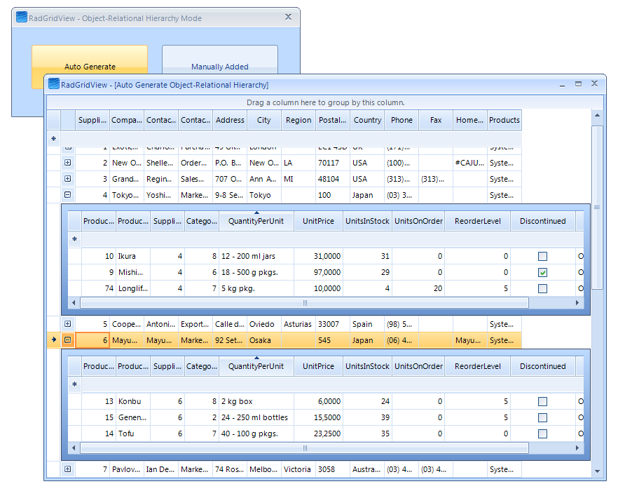
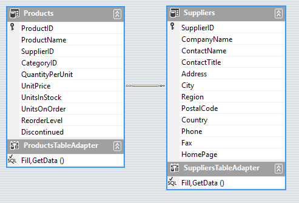
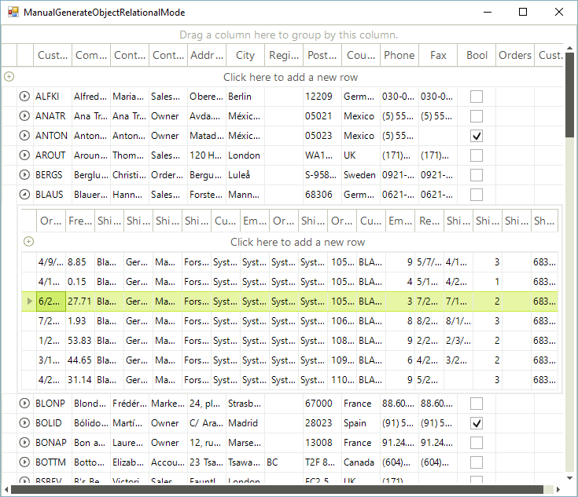

# Object Relational Hierarchy Mode

## 
<table><th><tr><td>

RELATED VIDEOS</td><td></td></tr></th><tr><td>[Creating Object Relational Hierarchies in RadGridView for WinForms](http://tv.telerik.com/watch/winforms/creating-object-relational-hierarchies-in-radgridview-for-winforms)

In this video, you will learn how to automatically and manually create object relational hierarchies in RadGridView for WinForms.
              </td><td></td></tr></table>

>In case you are using Telerik Open Access ORM, here you can find additional information regarding
            [Creating New Domain Model](http://documentation.telerik.com/openaccess-orm/developers-guide/openaccess-orm-domain-model/model-definition-basics/openaccess-tasks-update-schema-mechanisms-update-db-from-model)

## Auto generating hierarchy mode 

The Object-Relational Hierarchy mode is used to show hierarchy based on a complex IList (IEnumarable) object that contains inner ILits (IEnumerable) properties.

In order to create an Object-Relational Hierarchy automatically in this scenario, you must set only the DataSource and the AutoGenerateHierarachy properties of RadGridView.

Here is an example with an entity model using the Northwind database:

#### __[C#] Example of automatically generating hierarchy mode__

{{source=..\SamplesCS\GridView\HierarchicalGrid\AutoGenerateObjectRelationHierarchyMode.cs region=AutoGenerateObjectRelationHierarchyMode}}
	        private void AutoGenerateObjectRelationHierarchyMode_Load(object sender, EventArgs e)
	        {
	            NorthwindEntities entities = new NorthwindEntities();
	            var query = from suppliers in entities.Suppliers select suppliers;
	
	            this.radGridView1.DataSource = query.ToList();
	            this.radGridView1.AutoGenerateHierarchy = true;
	        }
	{{endregion}}

#### __[VB.NET] Example of automatically generating hierarchy mode__

{{source=..\SamplesVB\GridView\HierarchicalGrid\AutoGenerateObjectRelationHierarchyMode.vb region=AutoGenerateObjectRelationHierarchyMode}}
	    Private Sub AutoGenerateObjectRelationHierarchyMode_Load(ByVal sender As Object, ByVal e As System.EventArgs) Handles Me.Load
	        Dim entities As New NorthwindEntities()
	        Dim query = From suppliers In entities.Suppliers Select suppliers
	
	        Me.RadGridView1.DataSource = query.ToList()
	        Me.RadGridView1.AutoGenerateHierarchy = True
	    End Sub
	{{endregion}}

## Manually generating hierarchy mode 

The Object-Relational hierarchy mode can be setup manually by creating the Child GridViewTemplate and adding GridViewRelation between GridViewTemplates. This special relation should contain the name of the property that belongs to the parent object and that returns  an IList (IEnumerable)  of the subobjects.  RadGridView uses the name of the property to load the necessary data for the child GridViewTemplate when the user expands a parent row.

>In this mode only the DataSource of parent  GridViewTemplate or RadGridView control must be set to a collection of custom business object or ORM data objects.

The following example demonstrates how you can manually build an Object-Relational Hierarchy using the "Customers" entity model from the Northwind database:

#### __[C#] Example of manually generating hierarchy mode__

{{source=..\SamplesCS\GridView\HierarchicalGrid\ManualGenerateObjectRelationalMode.cs region=ManualGenerateObjectRelationalMode}}
	        void ManualGenerateObjectRelationalMode_Load(object sender, EventArgs e)
	        {
	            NorthwindEntities entities = new NorthwindEntities();
	            var query = from customers in entities.Customers select customers;
	
	            GridViewTemplate childTemplate = CreateChildTemplate();
	
	            GridViewRelation relation = new GridViewRelation(this.radGridView1.MasterTemplate, childTemplate);
	            relation.ChildColumnNames.Add("Orders");
	            this.radGridView1.Relations.Add(relation);
	            this.radGridView1.DataSource = query.ToList();
	        }
	
	        private GridViewTemplate CreateChildTemplate()
	        {
	            GridViewTemplate childTemplate = new GridViewTemplate();
	            this.radGridView1.Templates.Add(childTemplate);
	
	            GridViewTextBoxColumn column = new GridViewTextBoxColumn("OrderDate");
	            childTemplate.Columns.Add(column);
	            column = new GridViewTextBoxColumn("Freight");
	            childTemplate.Columns.Add(column);
	            column = new GridViewTextBoxColumn("ShipName");
	            childTemplate.Columns.Add(column);
	            column = new GridViewTextBoxColumn("ShipCountry");
	            childTemplate.Columns.Add(column);
	            column = new GridViewTextBoxColumn("ShipCity");
	            childTemplate.Columns.Add(column);
	            column = new GridViewTextBoxColumn("ShipAddress");
	            childTemplate.Columns.Add(column);
	            childTemplate.AutoSizeColumnsMode = GridViewAutoSizeColumnsMode.Fill;
	
	            return childTemplate;
	        }
	{{endregion}}

#### __[VB.NET] Example of manually generating hierarchy mode__

{{source=..\SamplesVB\GridView\HierarchicalGrid\ManualGenerateObjectRelationalMode.vb region=ManualGenerateObjectRelationalMode}}
	    Private Sub ManualGenerateObjectRelationalMode_Load(ByVal sender As Object, ByVal e As System.EventArgs) Handles Me.Load
	        Dim entities As New NorthwindEntities()
	        Dim query = From customers In entities.Customers Select customers
	
	        Dim childTemplate As GridViewTemplate = CreateChildTemplate()
	
	        Dim relation As New GridViewRelation(Me.RadGridView1.MasterTemplate, childTemplate)
	        relation.ChildColumnNames.Add("Orders")
	        Me.RadGridView1.Relations.Add(relation)
	        Me.RadGridView1.DataSource = query.ToList()
	
	    End Sub
	
	    Private Function CreateChildTemplate() As GridViewTemplate
	        Dim childTemplate As New GridViewTemplate()
	        Me.radGridView1.Templates.Add(childTemplate)
	
	        Dim column As New GridViewTextBoxColumn("OrderDate")
	        childTemplate.Columns.Add(column)
	        column = New GridViewTextBoxColumn("Freight")
	        childTemplate.Columns.Add(column)
	        column = New GridViewTextBoxColumn("ShipName")
	        childTemplate.Columns.Add(column)
	        column = New GridViewTextBoxColumn("ShipCountry")
	        childTemplate.Columns.Add(column)
	        column = New GridViewTextBoxColumn("ShipCity")
	        childTemplate.Columns.Add(column)
	        column = New GridViewTextBoxColumn("ShipAddress")
	        childTemplate.Columns.Add(column)
	        childTemplate.AutoSizeColumnsMode = GridViewAutoSizeColumnsMode.Fill
	
	        Return childTemplate
	    End Function
	{{endregion}}

>importantAs you can notice, we can perform all data operations on the child templates – grouping, sorting and filtering. RadGridView processes only the amount of data required for a particular data operation (lazy data loading). This provides us with better performance and small memory footprint.
