# Tutorial: Binding to Hierarchical Data

## 

| RELATED VIDEOS |  |
| ------ | ------ |
|[RadGridView for WinForms Hierarchy Overview](http://tv.telerik.com/winforms/radgrid/radgridview-winforms-hierarchy-overview)In this video you will learn the various ways you can display hierarchical data in a RadGridView. (Runtime: 12:13)|
>caption 

|

The following tutorial demonstrates configuring the grid to display multiple
          tables in a hierarchy. The example below uses the Northwind Categories table as
          the parent table and lists the appropriate Product table records below each
          category. The tutorial only uses the two tables, but the example can be
          extended to larger numbers of child tables.
        

The task has two basic steps:

1. Configure datasources.

1. Define child grid view templates, one for each level in the
            hierarchy.

1. Define relations between parent and child tables.

## Configure Datasources

1. Place a RadGridView component on a form. Set the Dock property to
            Fill.

1. In the Properties window locate the __DataSource__
            property and click the arrow to open the list. Select the __Add Project Data Source...__ link. 
              *
              This step will display the Data
              Source Configuration Wizard.
            *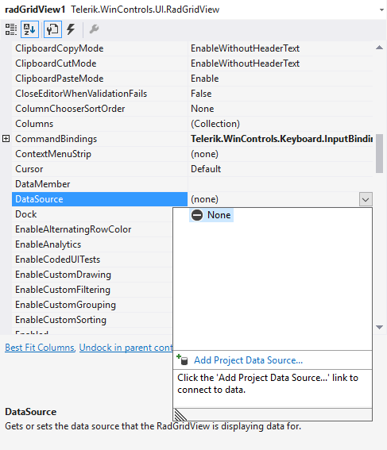

1. In the Data Source Configuration Wizard, Choose a Data Source Type
            page, select the __Database__ icon. Click the
            __Next__ button.

1. In the Database Model page of the Data Source Configuration Wizard choose __Database__ icon. Click the
            __Next__ button.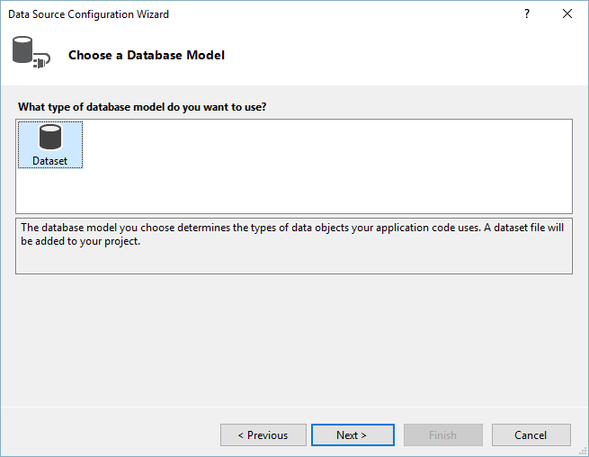

1. In the Choose Your data Connection page click the __New
              Connection...__ button. *
              This step will display the Add
              Connection dialog.
            *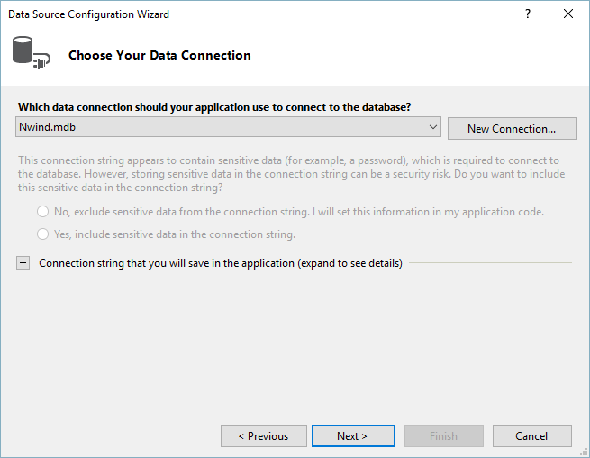

1. In the Add Connection dialog click the __Change...__
            button. *This step will display the Change Data Source dialog.*

1. Select the __Microsoft Access Database File__ data
            source. Click the __OK__ button to close the Change Data
            Source dialog.

1. Click the __Browse__ button of the dialog to navigate to a database file.
            After a file is selected, click the OK button to continue. 

1. Click the __Next__ button of the dialog that appears and __Next__ 
            button of the next dialog page to save the ConnectionString name: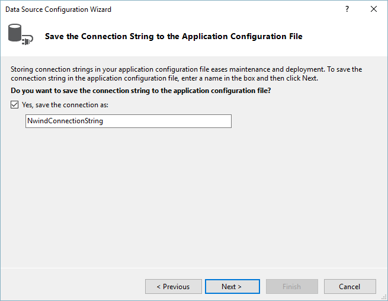

1. In the Choose Your Database Objects page, select the
            __"Categories"__ and __"Products"__ checkboxes.
            Click the __Finish__ button to close the Data Source
            Configuration Wizard.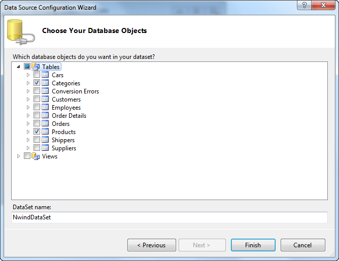

1. In the Visual Studio Properties window for the grid
            __DataSource__ property select the "Products" table. *
              This
              step will create DataSet, BindingSource and TableAdapter objects for the
              products table.
            *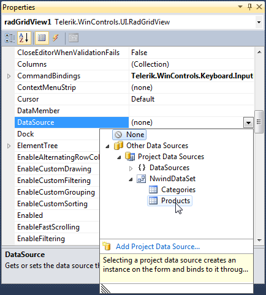

1. In the Visual Studio Properties window for the grid
            __DataSource__ property select the "Categories" table.
            *
              This step will create DataSet, BindingSource and TableAdapter objects
              for the categories table.
            *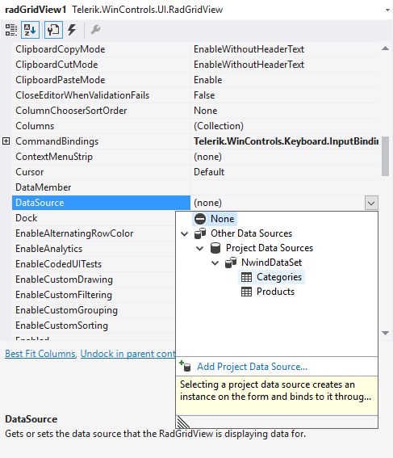 
          

1. The project design should look similar to the screenshot below. The
            RadGridView DataSource property should be left to point at the binding source of the Categories
            table. Note the new data components in the component tray under the design
            surface.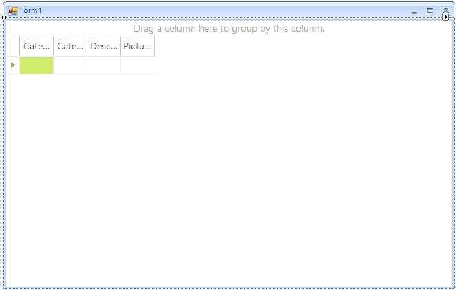

## Define Child Templates

1. In the Properties Window click the ellipses for
            the __Templates__
            property. *
              This step will display the GridViewTemplate Collection
              Editor.
            *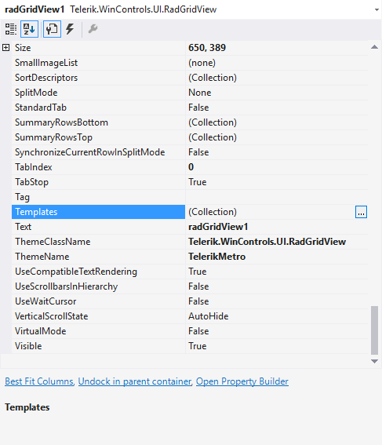

1. In the GridViewTemplate Collection Editor, click the
            __Add__ button to add a child grid view template. In the
            properties for the new grid view template, use
            the __DataSource__ property drop down to locate and
            select the binding source of the datatable __"Products"__. 
            Click the __OK__ button to
            close the dialog.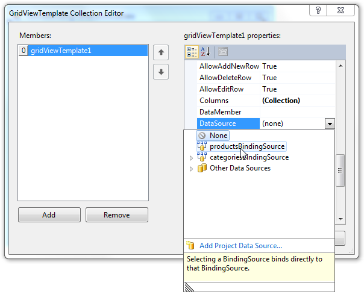

## Define relations

1. In the Properties Window click the ellipses for the grid
            __Relations__ property. *
              This step will display the
              GridViewRelation Collection Editor.
            *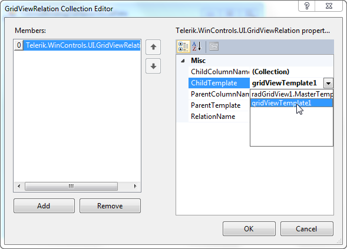

1. In the GridViewRelation Collection Editor, click the
            __Add__ button to add a relation. *
              The relation will
              describe the parent/child relationship between the category data (parent
              table) and the products (child table) for each category.
            *

1. Set the __RelationName__ property to
            "CategoryProduct".

1. Set the GridViewRelation __ChildTemplate__ property to the
            child grid view template (created earlier in the GridViewTemplate
            Collection Editor) using the drop down list. 

1. 

1. Set the __ParentTemplate__ property to the grid view
            __MasterTemplate__.

1. Click the ellipses for the __ChildColumnName__ property.
            *This step will display the ColumnName Collection Editor.*

1. In the ColumnName Collection Editor click the __Add__
            button and set the column __Name__ property to "CategoryID".
            Click the __OK__ button to close the dialog.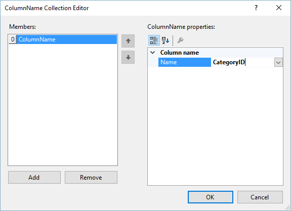

1. Click the ellipses for the __ParentColumnName__ property.
            In the ColumnName Collection Editor click the __Add__ button
            and set the column __Name__ property to "CategoryID". Click
            the __OK__ button to close the dialog.

1. Press __F5__ to run the application.
