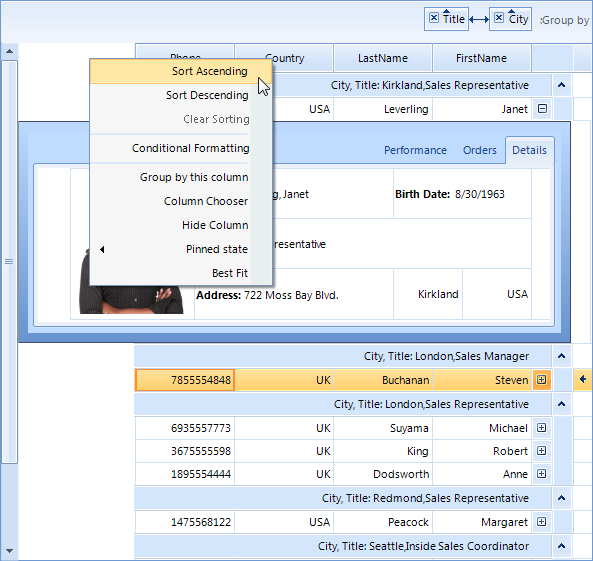

# Right-to-left support

## 

You can present the content of your grid instance in a right-to-left direction by setting the __RightToLeft__ property to *Yes*:                
         

#### __[C#]__

{{source=..\SamplesCS\GridView\Localization\Localization1.cs region=rtl}}
	            this.radGridView1.RightToLeft = System.Windows.Forms.RightToLeft.Yes;
	{{endregion}}

#### __[VB.NET]__

{{source=..\SamplesVB\GridView\Localization\Localization1.vb region=rtl}}
	        Me.RadGridView1.RightToLeft = System.Windows.Forms.RightToLeft.Yes
	{{endregion}}

