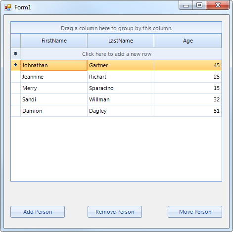
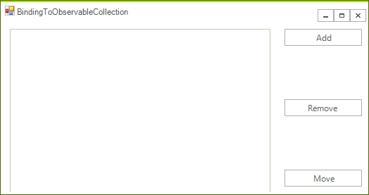

# Binding to ObservableCollection

## 

The example bellow demonstrates how to bind the __RadGridView__ to an ObservableCollection. This collection represents a dynamic data 
        collection that provides notification when changes (add, move, remove) occur.
        

>This collection is available in .NET version 4.0 and above. For this reason it is only supported in the .NET4.0 version of our assemblies
            (the ones with suffix .40), so please make sure you use those in order to take advantage of this functionality.
          

The example creates an ObservableCollection of Person, initializes the collection and assigns it to the grid DataSource property.
        There are also three buttons allowing the user to add, remove and move items from and in the collection. 
        The changes in the collection are automatically reflected by the grid.
        

1. First place a RadGridView and 3 buttons on a blank form. Name the buttons accordingly:
            

1. Add the following sample class to the project:
            

#### __[C#] Creating sample class __

{{source=..\SamplesCS\GridView\PopulatingwithData\BindingToObservableCollection.cs region=SampleClass}}
	    public class Person
	    {
	        public string FirstName { get; set; }
	        
	        public string LastName { get; set; }
	        
	        public int Age { get; set; }
	        
	        public Person(string firstName, string lastName, int age)
	        {
	            this.FirstName = firstName;
	            this.LastName = lastName;
	            this.Age = age;
	        }
	    }
	{{endregion}}

#### __[VB.NET] Creating sample class__

{{source=..\SamplesVB\GridView\PopulatingwithData\BindingToObservableCollection.vb region=SampleClass}}
	Public Class Person
	    Public Property FirstName() As String
	        Get
	            Return m_FirstName
	        End Get
	        Set(value As String)
	            m_FirstName = value
	        End Set
	    End Property
	    Private m_FirstName As String
	
	    Public Property LastName() As String
	        Get
	            Return m_LastName
	        End Get
	        Set(value As String)
	            m_LastName = value
	        End Set
	    End Property
	    Private m_LastName As String
	
	    Public Property Age() As Integer
	        Get
	            Return m_Age
	        End Get
	        Set(value As Integer)
	            m_Age = value
	        End Set
	    End Property
	    Private m_Age As Integer
	
	    Public Sub New(firstName As String, lastName As String, age As Integer)
	        Me.FirstName = firstName
	        Me.LastName = lastName
	        Me.Age = age
	    End Sub
	End Class
	{{endregion}}

1. Define the collection along with the function that initializes it:
            

#### __[C#] Defining the collection__

{{source=..\SamplesCS\GridView\PopulatingwithData\BindingToObservableCollection.cs region=Collection}}
	        private  System.Collections.ObjectModel.ObservableCollection<Person> people = new  System.Collections.ObjectModel.ObservableCollection<Person>();
	
	        private void IntilalizeCollection()
	        {
	            people.Add(new Person("Johnathan", "Gartner", 45));
	            people.Add(new Person("Jeannine", "Richart", 25));
	            people.Add(new Person("Merry", "Sparacino", 15));
	            people.Add(new Person("Sandi", "Willman", 32));
	            people.Add(new Person("Damion", "Dagley", 51));
	        }
	{{endregion}}

#### __[VB.NET] Defining the collection__

{{source=..\SamplesVB\GridView\PopulatingwithData\BindingToObservableCollection.vb region=Collection}}
	    Private people As New System.Collections.ObjectModel.ObservableCollection(Of Person)()
	
	    Private Sub IntilalizeCollection()
	        people.Add(New Person("Johnathan", "Gartner", 45))
	        people.Add(New Person("Jeannine", "Richart", 25))
	        people.Add(New Person("Merry", "Sparacino", 15))
	        people.Add(New Person("Sandi", "Willman", 32))
	        people.Add(New Person("Damion", "Dagley", 51))
	    End Sub
	{{endregion}}

1. Add the following event handlers for the buttons:
            

#### __[C#] Add new record to the collection__

{{source=..\SamplesCS\GridView\PopulatingwithData\BindingToObservableCollection.cs region=Add}}
	        private void Add_Click(object sender, EventArgs e)
	        {
	            people.Add(new Person("Damion", "Dagley", 51));
	        }
	{{endregion}}

#### __[VB.NET] Add new record to the collection__

{{source=..\SamplesVB\GridView\PopulatingwithData\BindingToObservableCollection.vb region=Add}}
	    Private Sub Add_Click(sender As Object, e As EventArgs)
	        people.Add(New Person("Damion", "Dagley", 51))
	    End Sub
	{{endregion}}

#### __[C#] Remove a record from the collection__

{{source=..\SamplesCS\GridView\PopulatingwithData\BindingToObservableCollection.cs region=Remove}}
	        private void Remove_Click(object sender, EventArgs e)
	        {
	            if (people.Count > 0)
	            {
	                people.RemoveAt(0);
	            }
	        }
	{{endregion}}

#### __[VB.NET] Remove a record from the collection__

{{source=..\SamplesVB\GridView\PopulatingwithData\BindingToObservableCollection.vb region=Remove}}
	    Private Sub Remove_Click(sender As Object, e As EventArgs)
	        If people.Count > 0 Then
	            people.RemoveAt(0)
	        End If
	    End Sub
	{{endregion}}

#### __[C#] Change a record position__

{{source=..\SamplesCS\GridView\PopulatingwithData\BindingToObservableCollection.cs region=Move}}
	        private void Move_Click(object sender, EventArgs e)
	        {
	            people.Move(people.Count - 1, 0);
	        }
	{{endregion}}

#### __[VB.NET] Change a record position__

{{source=..\SamplesVB\GridView\PopulatingwithData\BindingToObservableCollection.vb region=Move}}
	    Private Sub Move_Click(sender As Object, e As EventArgs)
	        people.Move(people.Count - 1, 0)
	    End Sub
	{{endregion}}

1. Finally just call the InitializeCollection method to populate the collection and bind the __RadGridView__ to it:
            

#### __[C#] Binding to the collection__

{{source=..\SamplesCS\GridView\PopulatingwithData\BindingToObservableCollection.cs region=Binding}}
	        private void BindingToObservableCollection_Load(object sender, EventArgs e)
	        {
	            IntilalizeCollection();
	            this.radGridView1.DataSource = people;
	        }
	{{endregion}}

#### __[VB.NET] Binding to the collection__

{{source=..\SamplesVB\GridView\PopulatingwithData\BindingToObservableCollection.vb region=Binding}}
	    Private Sub BindingToObservableCollection_Load(sender As Object, e As EventArgs) Handles MyBase.Load
	        IntilalizeCollection()
	        Me.radGridView1.DataSource = people
	    End Sub
	{{endregion}}

Now each change you introduce to the collection by pressing the buttons will be automatically reflected in __RadGridView__.
        
