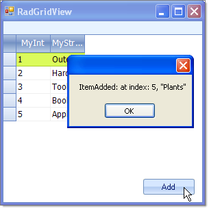

# Binding to BindingList


## 

BindingList is a generic list type that has additional binding support. While you can [bind to a generic list](), BindingList provides additional control over list items, i.e. if they can be edited, removed or added. BindingList also surfaces events that notify when the list has been changed. The example below creates a list of MyObject, initializes the list and assigns the list to the grid DataSource property. The example also uses a ListChangedEventHandler that reports the type of change that occurred, the new index of the item and the content of the item.



{{source=..\SamplesCS\GridView\PopulatingWithData\BindingToBindingList.cs region=MyObjectClass}} 
{{source=..\SamplesVB\GridView\PopulatingWithData\BindingToBindingList.vb region=MyObjectClass}} 

````C#
public class MyObject
{
    public MyObject(int myInt, string myString)
    {
        _myInt = myInt;
        _myString = myString;
    }
    private int _myInt;
    public int MyInt
    {
        get { return _myInt; }
        set { _myInt = value; }
    }
    private string _myString;
    public string MyString
    {
        get { return _myString; }
        set { _myString = value; }
    }
}

````
````VB.NET
Public Class MyObject
    Public Sub New(ByVal myInt As Integer, ByVal myString As String)
        _myInt = myInt
        _myString = myString
    End Sub
    Private _myInt As Integer
    Public Property MyInt() As Integer
        Get
            Return _myInt
        End Get
        Set(ByVal value As Integer)
            _myInt = value
        End Set
    End Property
    Private _myString As String
    Public Property MyString() As String
        Get
            Return _myString
        End Get
        Set(ByVal value As String)
            _myString = value
        End Set
    End Property
End Class

````

{{endregion}} 

{{source=..\SamplesCS\GridView\PopulatingWithData\BindingToBindingList.cs region=bindingToBindingList}} 
{{source=..\SamplesVB\GridView\PopulatingWithData\BindingToBindingList.vb region=bindingToBindingList}} 

````C#
private BindingList<MyObject> myList;
private void Form1_Load(object sender, EventArgs e)
{
    myList = new BindingList<MyObject>();
    myList.Add(new MyObject(1, "Outdoor"));
    myList.Add(new MyObject(2, "Hardware"));
    myList.Add(new MyObject(3, "Tools"));
    myList.Add(new MyObject(4, "Books"));
    myList.Add(new MyObject(5, "Appliances"));
    myList.RaiseListChangedEvents = true;
    myList.ListChanged += new ListChangedEventHandler(myList_ListChanged);
    radGridView1.DataSource = myList;
}
void myList_ListChanged(object sender, ListChangedEventArgs e)
{
    MessageBox.Show(e.ListChangedType.ToString() + ": at index: " + e.NewIndex.ToString() + ", \"" + myList[e.NewIndex].MyString + "\"");
}
private void radButton1_Click(object sender, EventArgs e)
{
    myList.Add(new MyObject(6, "Plants"));
}

````
````VB.NET
Private myList As BindingList(Of MyObject)
Private Sub Form1_Load(ByVal sender As Object, ByVal e As EventArgs) Handles Me.Load
    myList = New BindingList(Of MyObject)()
    myList.Add(New MyObject(1, "Outdoor"))
    myList.Add(New MyObject(2, "Hardware"))
    myList.Add(New MyObject(3, "Tools"))
    myList.Add(New MyObject(4, "Books"))
    myList.Add(New MyObject(5, "Appliances"))
    myList.RaiseListChangedEvents = True
    AddHandler myList.ListChanged, AddressOf myList_ListChanged
    RadGridView1.DataSource = myList
End Sub
Sub myList_ListChanged(ByVal sender As Object, ByVal e As ListChangedEventArgs)
    MessageBox.Show(e.ListChangedType.ToString() + ": at index: " + e.NewIndex.ToString() + ", """ + myList(e.NewIndex).MyString + """")
End Sub
Private Sub RadButton1_Click_1(ByVal sender As System.Object, ByVal e As System.EventArgs) Handles RadButton1.Click
    myList.Add(New MyObject(6, "Plants"))
End Sub

````

{{endregion}} 


