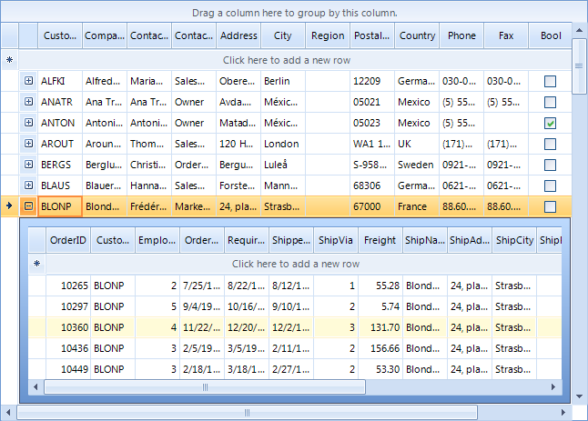
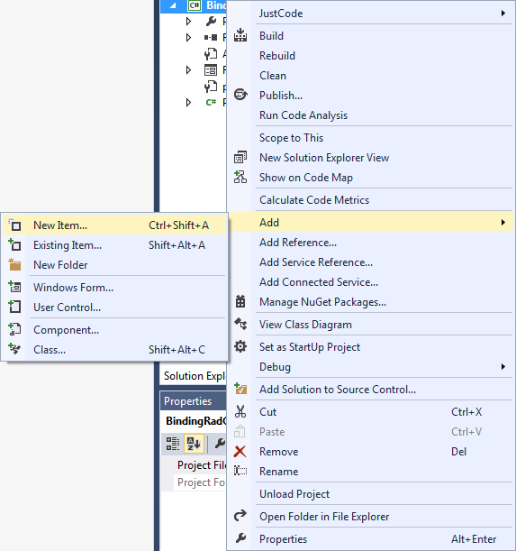
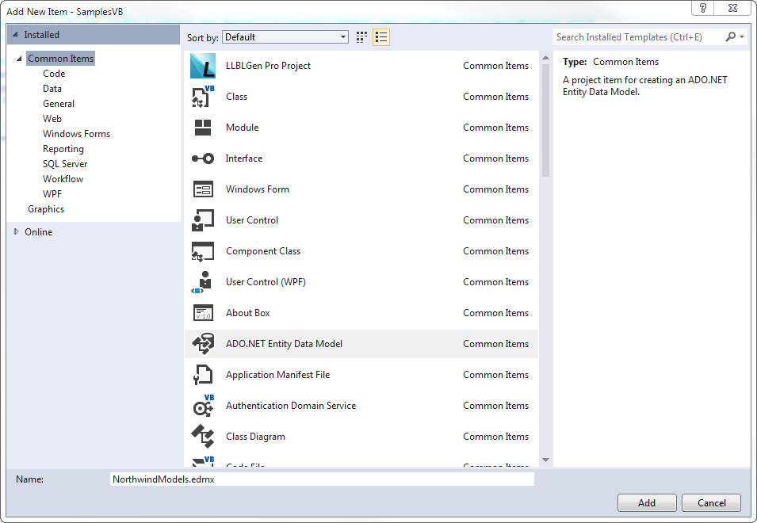
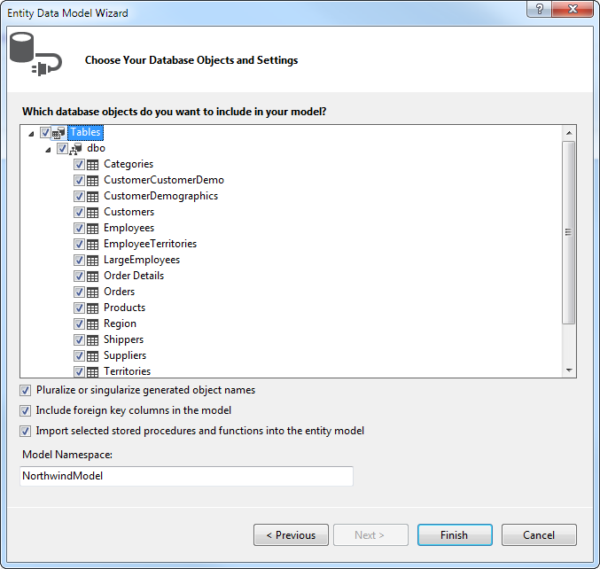

# Binding to EntityFramework using Database first approach

This article demonstrates how to build a hierarchical Grid using Entity Framework and Database first approach.
      

## Installing and Configuring Entity Framework

In order to download Entity Framework you can follow this MSDN article - 
          [
              Get Entity Framework
            ](
            http://msdn.microsoft.com/en-us/data/ee712906.aspx
          ). If you are using Visual Studio version below 2012 you may need to install the NuGet package manager -
          [
              Installing NuGet
            ](
            http://docs.nuget.org/docs/start-here/installing-nuget
          )

After you have installed Entity Framework, follow these steps:
        

1. Right-click on your Project in Visual Studio and choose Add > New Item
            

1. Choose ADO.NET Entity Data Model
            

1. From the next window choose Generate From Database and Click next
            

1. Choose your database and click Next
            

1. From this final window select the needed tables and click Finish
            

Now our Models should be generated.        

## Configure RadGridView to work with EntityFramework

1. Add RadGridView to the Form and then in the code behind add an instance of the DbContext which will provide us access to the data in the database
            

#### __[C#]__

{{region addDbContext}}
	        NorthwindEntities dbContext = new NorthwindEntities();
	{{endregion}}

#### __[VB]__

{{region addDbContext}}
	    Dim dbContext As New NorthwindEntities
	{{endregion}}

>When binding RadGridView we will be using the Local property of DbSet. The Local property provides access to the data without a query being sent to the database.  It is also in sync with the
                DbSet. For example, if an entry is deleted from the Local property,  the next time a query is executed it will be deleted from the database.
              

1. Add the following code to your Form’s constructor:

#### __[C#]__

{{region addDataSource}}
	            dbContext.Customers.Load();
	            this.radGridView1.DataSource = this.dbContext.Customers.Local.ToBindingList();
	{{endregion}}

#### __[VB]__

{{region addDataSource}}
	        dbContext.Customers.Load()
	        Me.radGridView1.DataSource = Me.dbContext.Customers.Local.ToBindingList()
	{{endregion}}

These extension methods are located in the System.Data.Entity namespace. As the Local property represents the local data, we need to first Load the data from the Database. Then by calling
              ToBindingList we make sure that our RadGridView and the Local data will be in sync.
            

>When adding new rows in RadGridView by default the Id cell of the new rows will be 0 since the data was not send to the database, therefore no UniqueId has been assigned yet.

1. Now we just need to add the the relation between the Customers and Orders tables:

            

#### __[C#]__

{{region addRelation}}
	            dbContext.Orders.Load();
	
	            GridViewTemplate template = new GridViewTemplate();
	            template.DataSource = dbContext.Orders.Local.ToBindingList();
	            this.radGridView1.MasterTemplate.Templates.Add(template);
	
	            GridViewRelation relation = new GridViewRelation(this.radGridView1.MasterTemplate);
	            relation.ChildTemplate = template;
	            relation.RelationName = "CustomersToOrders";
	            relation.ParentColumnNames.Add("CustomerId");
	            relation.ChildColumnNames.Add("CustomerId");
	            this.radGridView1.Relations.Add(relation);
	{{endregion}}

#### __[VB]__

{{region addRelation}}
	        dbContext.Orders.Load()
	
	        Dim template As New GridViewTemplate()
	        template.DataSource = dbContext.Orders.Local.ToBindingList()
	        Me.radGridView1.MasterTemplate.Templates.Add(template)
	
	        Dim relation As New GridViewRelation(Me.radGridView1.MasterTemplate)
	        relation.ChildTemplate = template
	        relation.RelationName = "CustomersToOrders"
	        relation.ParentColumnNames.Add("CustomerId")
	        relation.ChildColumnNames.Add("CustomerId")
	        Me.radGridView1.Relations.Add(relation)
	{{endregion}}

1. The final step is to save the changes to the database when the form closes. For this purpose we need to subscribe to the FormClosing event of the Form and add the following code in the event handle:
            

#### __[C#]__

{{region saveChanges}}
	            this.dbContext.SaveChanges();
	{{endregion}}

#### __[VB]__

{{region saveChanges}}
	        Me.dbContext.SaveChanges()
	{{endregion}}

Now, if you run your application you should see the hierarchical data.
