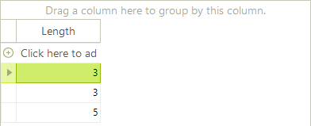

# Binding to Generic Lists


## Binding to Lists of Simple Types

Generally, you should not try to bind __RadGridView__ to a list of simple types. __RadGridView__ internally creates columns and reads data for the properties of the objects it is bound to. However, the integer type, for example does not have any properties so if you try to bind __RadGridView__ to a List of integers, you will get no data. Following the same logic, if you bind __RadGridView__ to a collection of strings, you will get a column representing the length of these strings, because the only property of a string object is the Length property.<br>

{{source=..\SamplesCS\GridView\PopulatingWithData\BindingToGenericLists.cs region=bindingToListOfSimpleTypes}} 
{{source=..\SamplesVB\GridView\PopulatingWithData\BindingToGenericLists.vb region=bindingToListOfSimpleTypes}} 

````C#
            List<string> list = new List<string>();
            list.Add("One");
            list.Add("Two");
            list.Add("Three");
            radGridView1.DataSource = list;
````
````VB.NET
        Dim list As New List(Of String)()
        list.Add("One")
        list.Add("Two")
        list.Add("Three")
        RadGridView1.DataSource = list
        '
````

{{endregion}} 


## Binding to Lists of Objects

Generic Lists of objects containing [bindable types]() can be bound to RadGridView by assigning the List to the __DataSource__ property of the grid. 

The example below defines a "MyObject" class containing one integer and one string property. The next set of code snippets "Creating an List of Objects" creates an array of MyObject, initializes the array and assigns the array to the __DataSource__. The MyObject class would typically be placed in its own separate class file and the List creation, initialization and assignment code might be placed in a Form_Load event handler.<br>

{{source=..\SamplesCS\GridView\PopulatingWithData\BindingToGenericLists.cs region=objectClass}} 
{{source=..\SamplesVB\GridView\PopulatingWithData\BindingToGenericLists.vb region=objectClass}} 

````C#
    public class MyObject
    {
        public MyObject(int myInt, string myString)
        {
            _myInt = myInt;
            _myString = myString;
        }
        private int _myInt;
        public int MyInt
        {
            get { return _myInt; }
            set { _myInt = value; }
        }
        private string _myString;
        public string MyString
        {
            get { return _myString; }
            set { _myString = value; }
        }
    }
````
````VB.NET
Public Class MyObject
    Public Sub New(ByVal myInt As Integer, ByVal myString As String)
        _myInt = myInt
        _myString = myString
    End Sub
    Private _myInt As Integer
    Public Property MyInt() As Integer
        Get
            Return _myInt
        End Get
        Set(ByVal value As Integer)
            _myInt = value
        End Set
    End Property
    Private _myString As String
    Public Property MyString() As String
        Get
            Return _myString
        End Get
        Set(ByVal value As String)
            _myString = value
        End Set
    End Property
End Class
'
````

{{endregion}} 

{{source=..\SamplesCS\GridView\PopulatingWithData\BindingToGenericLists.cs region=bindingtoObjectsOfSimpleType}} 
{{source=..\SamplesVB\GridView\PopulatingWithData\BindingToGenericLists.vb region=bindingtoObjectsOfSimpleType}} 

````C#
            List<MyObject> myList = new List<MyObject>();
            myList.Add(new MyObject(1, "Outdoor"));
            myList.Add(new MyObject(2, "Hardware"));
            myList.Add(new MyObject(3, "Tools"));
            myList.Add(new MyObject(4, "Books"));
            myList.Add(new MyObject(5, "Appliances"));
            radGridView1.DataSource = myList;
````
````VB.NET
        Dim myList As New List(Of MyObject)()
        myList.Add(New MyObject(1, "Outdoor"))
        myList.Add(New MyObject(2, "Hardware"))
        myList.Add(New MyObject(3, "Tools"))
        myList.Add(New MyObject(4, "Books"))
        myList.Add(New MyObject(5, "Appliances"))
        RadGridView1.DataSource = myList
        '
````

{{endregion}} 


