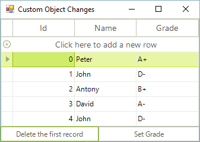
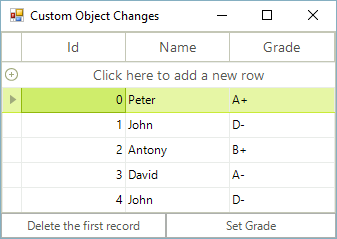
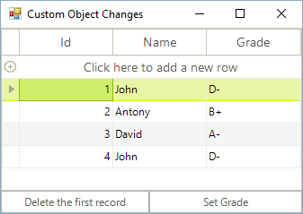

# Reflecting Custom Object Changes in RGV

RadGridView is capable of fetching bindable properties and data.
        However, one important issue must be noted: during the data binding process,
        the grid extracts the data from the data source, but for any later changes
        in the data source, RadGridView should be notified.
        Your bindable collection and business objects should follow some standards
        established in .NET in order to notify RadGridView about the changes:
        

* 

              The collection that you will bind to RadGridView should implement IBindingList or
              IBindingListView interfaces. This will allow RadGridView to get notified about
              insert and delete operations of records.
            

* 

              Your business objects should implement INotifyPropertyChanged interface (.NET 2.0). This will allow
              RadGridView to reflect changes which occur to the properties of the business objects.
            
        We will not only analyze the correct case that you should follow, but we will also
        analyze the cases where incorrect collections or business object implementations are used.
        This will allow you to understand what you can expect from RadGridView in the various cases.
      

## Binding to non-IBindingList collections containing objects that do not implement INotifyPropertyChanged

          Before observing what will happen if we bind to an IBindingList collection,
          let's see what will actually happen if we bind RadGridView to a collection of a wrong type.
          

          Such a collection is List. Although it is a generic collection and it is convenient for
          storing a number of business objects, it does not support the two-way binding mechanism needed
          for the purposes of the notifications.
          

          Here are the steps for this scenario:
          

1. 

                Create a class called Student:
                

#### __[C#]__

{{source=..\SamplesCS\GridView\PopulatingWithData\Student.cs region=student}}
	    public class Student
	    {
	        int m_id;
	        string m_name;
	        string m_grade;
	
	        public Student(int m_id, string m_name, string m_grade)
	        {
	            this.m_id = m_id;
	            this.m_name = m_name;
	            this.m_grade = m_grade;
	        }
	
	        public int Id
	        {
	            get
	            {
	                return m_id;
	            }
	            set
	            {
	                m_id = value;
	            }
	        }
	
	        public string Name
	        {
	            get
	            {
	                return m_name;
	            }
	            set
	            {
	                m_name = value;
	            }
	        }
	
	        public string Grade
	        {
	            get
	            {
	                return m_grade;
	            }
	            set
	            {
	                m_grade = value;
	            }
	        }
	    }
	{{endregion}}

#### __[VB.NET]__

{{source=..\SamplesVB\GridView\PopulatingWithData\Student.vb region=student}}
	Public Class Student
	    Private m_id As Integer
	    Private m_name As String
	    Private m_grade As String
	
	    Public Sub New(ByVal m_id As Integer, ByVal m_name As String, ByVal m_grade As String)
	        Me.m_id = m_id
	        Me.m_name = m_name
	        Me.m_grade = m_grade
	    End Sub
	
	    Public Property Id() As Integer
	        Get
	            Return m_id
	        End Get
	        Set(ByVal value As Integer)
	            m_id = value
	        End Set
	    End Property
	
	    Public Property Name() As String
	        Get
	            Return m_name
	        End Get
	        Set(ByVal value As String)
	            m_name = value
	        End Set
	    End Property
	
	    Public Property Grade() As String
	        Get
	            Return m_grade
	        End Get
	        Set(ByVal value As String)
	            m_grade = value
	        End Set
	    End Property
	End Class
	{{endregion}}

1. 

                Fill a List collection with several Students and bind it to RadGridView:
                

#### __[C#]__

{{source=..\SamplesCS\GridView\PopulatingWithData\ReflectingCustomObjectChanges.cs region=list}}
	        List<Student> collectionOfStudents = new List<Student>();
	
	        protected override void OnLoad(EventArgs e)
	        {
	            base.OnLoad(e);
	            
	            collectionOfStudents.Add(new Student(0, "Peter", "A+"));
	            collectionOfStudents.Add(new Student(1, "John", "D-"));
	            collectionOfStudents.Add(new Student(2, "Antony", "B+"));
	            collectionOfStudents.Add(new Student(3, "David", "A-"));
	            collectionOfStudents.Add(new Student(4, "John", "D-"));
	            this.radGridView1.DataSource = collectionOfStudents;
	        }
	{{endregion}}

#### __[VB.NET]__

{{source=..\SamplesVB\GridView\PopulatingWithData\ReflectingCustomObjectChanges.vb region=list}}
	    Private collectionOfStudents As New List(Of Student)()
	
	    Protected Overrides Sub OnLoad(ByVal e As EventArgs)
	        MyBase.OnLoad(e)
	
	        collectionOfStudents.Add(New Student(0, "Peter", "A+"))
	        collectionOfStudents.Add(New Student(1, "John", "D-"))
	        collectionOfStudents.Add(New Student(2, "Antony", "B+"))
	        collectionOfStudents.Add(New Student(3, "David", "A-"))
	        collectionOfStudents.Add(New Student(4, "John", "D-"))
	        Me.radGridView1.DataSource = collectionOfStudents
	    End Sub
	{{endregion}}

1. 

                On a button click, remove the first Student from the collection:
                

#### __[C#]__

{{source=..\SamplesCS\GridView\PopulatingWithData\ReflectingCustomObjectChanges.cs region=buttonRemove}}
	        private void btnDeleteRecord_Click(object sender, EventArgs e)
	        {
	            collectionOfStudents.RemoveAt(0);
	        }
	{{endregion}}

#### __[VB.NET]__

{{source=..\SamplesVB\GridView\PopulatingWithData\ReflectingCustomObjectChanges.vb region=buttonRemove}}
	    Private Sub btnDeleteRecord_Click(ByVal sender As Object, ByVal e As EventArgs)
	        collectionOfStudents.RemoveAt(0)
	    End Sub
	{{endregion}}

          The initial view when we start the application is this:
          

          What will happen after we press the button once? We will have the same view:
          

          RadGridView is not synchronized, simply because nothing notifies it about the change in the collection.
        

## Binding to IBindingList collections containing objects that do not implement INotifyPropertyChanged

          Let's now bind RadGridView to a collection that implements IBindingList. A very
          popular and appropriate collection that implements IBindingList is BindingList.
          Here, we will not only analyze how RadGridView behaves in relation to the bound collection,
          but we will also check why the implementation of INotifyPropertyChanged does matter.
          Here are the steps for this scenario:
          

1. 

                Create a class called Student. This class will be the same as the class in the previous section, so we will
                not post the implementation here for bravity.
              

1. 

                Fill a BindingList collection with several Students and bind it to RadGridView:
                

#### __[C#]__

{{source=..\SamplesCS\GridView\PopulatingWithData\ReflectingCustomObjectChanges.cs region=bindingList}}
	        BindingList<Student> collectionOfStudents = new BindingList<Student>();
	
	        protected override void OnLoad(EventArgs e)
	        {
	            base.OnLoad(e);
	
	            collectionOfStudents.Add(new Student(0, "Peter", "A+"));
	            collectionOfStudents.Add(new Student(1, "John", "D-"));
	            collectionOfStudents.Add(new Student(2, "Antony", "B+"));
	            collectionOfStudents.Add(new Student(3, "David", "A-"));
	            collectionOfStudents.Add(new Student(4, "John", "D-"));
	            this.radGridView1.DataSource = collectionOfStudents;
	        }
	{{endregion}}

#### __[VB.NET]__

{{source=..\SamplesVB\GridView\PopulatingWithData\ReflectingCustomObjectChanges.vb region=bindingList}}
	        Private collectionOfStudents As New BindingList(Of Student)()
	
	        Protected Overrides Sub OnLoad(ByVal e As EventArgs)
	            MyBase.OnLoad(e)
	
	            collectionOfStudents.Add(New Student(0, "Peter", "A+"))
	            collectionOfStudents.Add(New Student(1, "John", "D-"))
	            collectionOfStudents.Add(New Student(2, "Antony", "B+"))
	            collectionOfStudents.Add(New Student(3, "David", "A-"))
	            collectionOfStudents.Add(New Student(4, "John", "D-"))
	            Me.radGridView1.DataSource = collectionOfStudents
	        End Sub
	{{endregion}}

1. 

                On a button click, remove the first Student from the collection:
                

#### __[C#]__

{{source=..\SamplesCS\GridView\PopulatingWithData\ReflectingCustomObjectChanges.cs region=buttonRemove}}
	        private void btnDeleteRecord_Click(object sender, EventArgs e)
	        {
	            collectionOfStudents.RemoveAt(0);
	        }
	{{endregion}}

#### __[VB.NET]__

{{source=..\SamplesVB\GridView\PopulatingWithData\ReflectingCustomObjectChanges.vb region=buttonRemove}}
	    Private Sub btnDeleteRecord_Click(ByVal sender As Object, ByVal e As EventArgs)
	        collectionOfStudents.RemoveAt(0)
	    End Sub
	{{endregion}}

1. 

                On a button click of another button, change the Grade of the last Student in the collection to "F":
                

#### __[C#]__

{{source=..\SamplesCS\GridView\PopulatingWithData\ReflectingCustomObjectChanges.cs region=setGrade}}
	        private void btnSetGrade_Click(object sender, EventArgs e)
	        {
	            collectionOfStudents[collectionOfStudents.Count - 1].Grade = "F";
	        }
	{{endregion}}

#### __[VB.NET]__

{{source=..\SamplesVB\GridView\PopulatingWithData\ReflectingCustomObjectChanges.vb region=setGrade}}
	    Private Sub btnSetGrade_Click(ByVal sender As Object, ByVal e As EventArgs)
	        collectionOfStudents(collectionOfStudents.Count - 1).Grade = "F"
	    End Sub
	{{endregion}}

          Let's now test this case. At the beginning we have this view:
          

          After we press the button which removes the first record, we indeed get a RadGridView with four records in return. This
          is because RadGridView is bound to a collection that implements IBindingList:
          

          Let's now press the other button in order to change the Grade of the last student in the collection. The result is
          shown below:
          

          You do not see a difference? This is normal and expected, because the type Student does not
          implement INotifyPropertyChanged, so the changes in the properties of the Student objects are not reflected in RadGridView.
        

## Binding to IBindingList collections containing objects that do implement INotifyPropertyChanged

          This is the most valid case among the three described cases. Here, we are binding to a collection
          that implements IBindingList and which contains objects that implement INotifyPropertyChanged. Such a
          combinations of objects notifies RadGridView for all changes, no matter whether
          a record is inserted/deleted or a property is changed in one of the objects that implement INotifyPropertyChanged.
          Here are the steps for this case:
          

1. 

                Create a class Student that implements INotifyPropertyChanged:
                

#### __[C#]__

{{source=..\SamplesCS\GridView\PopulatingWithData\StudentDynamic.cs region=student}}
	    public class Student : System.ComponentModel.INotifyPropertyChanged
	    {
	        int m_id;
	        string m_name;
	        string m_grade;
	
	        public event PropertyChangedEventHandler PropertyChanged;
	
	        public Student(int m_id, string m_name, string m_grade)
	        {
	            this.m_id = m_id;
	            this.m_name = m_name;
	            this.m_grade = m_grade;
	        }
	
	        public int Id
	        {
	            get
	            {
	                return m_id;
	            }
	            set
	            {
	                if (this.m_id != value)
	                {
	                    this.m_id = value;
	                    OnPropertyChanged("Id");
	                }
	            }
	        }
	
	        public string Name
	        {
	            get
	            {
	                return m_name;
	            }
	            set
	            {
	                if (this.m_name != value)
	                {
	                    this.m_name = value;
	                    OnPropertyChanged("Name");
	                }
	            }
	        }
	
	        public string Grade
	        {
	            get
	            {
	                return m_grade;
	            }
	            set
	            {
	                if (this.m_grade != value)
	                {
	                    this.m_grade = value;
	                    OnPropertyChanged("Grade");
	                }
	            }
	        }
	    
	        protected virtual void OnPropertyChanged(string propertyName)
	        {
	            if (PropertyChanged != null)
	            {
	                PropertyChanged(this, new PropertyChangedEventArgs(propertyName));
	            }
	        }
	    }
	{{endregion}}

#### __[VB.NET]__

{{source=..\SamplesVB\GridView\PopulatingWithData\StudentDynamic.vb region=student}}
	    Public Class Student
	        Implements System.ComponentModel.INotifyPropertyChanged
	        Private m_id As Integer
	        Private m_name As String
	        Private m_grade As String
	
	        Public Event PropertyChanged As PropertyChangedEventHandler Implements System.ComponentModel.INotifyPropertyChanged.PropertyChanged
	
	        Public Sub New(ByVal m_id As Integer, ByVal m_name As String, ByVal m_grade As String)
	            Me.m_id = m_id
	            Me.m_name = m_name
	            Me.m_grade = m_grade
	        End Sub
	
	        Public Property Id() As Integer
	            Get
	                Return m_id
	            End Get
	            Set(ByVal value As Integer)
	                If Me.m_id <> value Then
	                    Me.m_id = value
	                    OnPropertyChanged("Id")
	                End If
	            End Set
	        End Property
	
	        Public Property Name() As String
	            Get
	                Return m_name
	            End Get
	            Set(ByVal value As String)
	                If Me.m_name <> value Then
	                    Me.m_name = value
	                    OnPropertyChanged("Name")
	                End If
	            End Set
	        End Property
	
	        Public Property Grade() As String
	            Get
	                Return m_grade
	            End Get
	            Set(ByVal value As String)
	                If Me.m_grade <> value Then
	                    Me.m_grade = value
	                    OnPropertyChanged("Grade")
	                End If
	            End Set
	        End Property
	
	        Protected Overridable Sub OnPropertyChanged(ByVal propertyName As String)
	            RaiseEvent PropertyChanged(Me, New PropertyChangedEventArgs(propertyName))
	        End Sub
	    End Class
	{{endregion}}

1. 

                Fill a BindingList collection with a few objects of type Student and bind RadGridView to it:
                

#### __[C#]__

{{source=..\SamplesCS\GridView\PopulatingWithData\ReflectingCustomObjectChanges.cs region=bindingList}}
	        BindingList<Student> collectionOfStudents = new BindingList<Student>();
	
	        protected override void OnLoad(EventArgs e)
	        {
	            base.OnLoad(e);
	
	            collectionOfStudents.Add(new Student(0, "Peter", "A+"));
	            collectionOfStudents.Add(new Student(1, "John", "D-"));
	            collectionOfStudents.Add(new Student(2, "Antony", "B+"));
	            collectionOfStudents.Add(new Student(3, "David", "A-"));
	            collectionOfStudents.Add(new Student(4, "John", "D-"));
	            this.radGridView1.DataSource = collectionOfStudents;
	        }
	{{endregion}}

#### __[VB.NET]__

{{source=..\SamplesVB\GridView\PopulatingWithData\ReflectingCustomObjectChanges.vb region=bindingList}}
	        Private collectionOfStudents As New BindingList(Of Student)()
	
	        Protected Overrides Sub OnLoad(ByVal e As EventArgs)
	            MyBase.OnLoad(e)
	
	            collectionOfStudents.Add(New Student(0, "Peter", "A+"))
	            collectionOfStudents.Add(New Student(1, "John", "D-"))
	            collectionOfStudents.Add(New Student(2, "Antony", "B+"))
	            collectionOfStudents.Add(New Student(3, "David", "A-"))
	            collectionOfStudents.Add(New Student(4, "John", "D-"))
	            Me.radGridView1.DataSource = collectionOfStudents
	        End Sub
	{{endregion}}

1. 

                On a button click, remove the first object in the collection:
                

#### __[C#]__

{{source=..\SamplesCS\GridView\PopulatingWithData\ReflectingCustomObjectChanges.cs region=buttonRemove}}
	        private void btnDeleteRecord_Click(object sender, EventArgs e)
	        {
	            collectionOfStudents.RemoveAt(0);
	        }
	{{endregion}}

#### __[VB.NET]__

{{source=..\SamplesVB\GridView\PopulatingWithData\ReflectingCustomObjectChanges.vb region=buttonRemove}}
	    Private Sub btnDeleteRecord_Click(ByVal sender As Object, ByVal e As EventArgs)
	        collectionOfStudents.RemoveAt(0)
	    End Sub
	{{endregion}}

1. 

                On a button click of another button, set the Grade of the last Student to "F":
                

#### __[C#]__

{{source=..\SamplesCS\GridView\PopulatingWithData\ReflectingCustomObjectChanges.cs region=setGrade}}
	        private void btnSetGrade_Click(object sender, EventArgs e)
	        {
	            collectionOfStudents[collectionOfStudents.Count - 1].Grade = "F";
	        }
	{{endregion}}

#### __[VB.NET]__

{{source=..\SamplesVB\GridView\PopulatingWithData\ReflectingCustomObjectChanges.vb region=setGrade}}
	    Private Sub btnSetGrade_Click(ByVal sender As Object, ByVal e As EventArgs)
	        collectionOfStudents(collectionOfStudents.Count - 1).Grade = "F"
	    End Sub
	{{endregion}}

          Let's now test this case. At the beginning we have this view:
          

          After we press the button which removes the first record, we indeed get a RadGridView with four records in return. This
          is because RadGridView is bound to a collection that implements IBindingList:
          

          Let's now press the other button in order to change the Grade of the last student in the collection. The result is
          shown below:
          

          As you can see RadGridView successfully reflects the change in the Grade property that we make.
          This is because of the improved Student object implements INotifyPropertyChanged and
          because of the BindingList that implements IBindingList.
        
