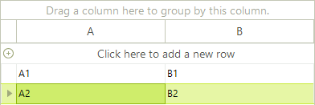

# Unbound Mode

When in unbound mode of RadGridView does not use a data source to generate its content. In this mode, you need to add/remove the grid columns and rows using the provided API or the __RadGridView__ user interface (in design-time). You can also have a spreadsheet-like grid with empty rows and columns, letting the user enter own data. This topic described the three possible scenarios for creating unbound grids:

* Creating empty grids with __RowCount__ property set to the number of desired rows

* Creating grids and filling them with data, using the __Cells__ collection

* Creating grids and filling them with data, using the __Rows__ collection

## Creating Empty Grid

You can create a grid with empty rows and columns and let the user fill the data. You should add columns to the __Columns__ collection of the corresponding __GridViewTemplate__ (or __RadGridView__ in cases of flat grid). Then you should set the __RowCount__ property to the number of desired rows. The grid does take into account the number of the rows that are already set (as described further in this topic). If you have explicitly set 5 rows and set __RowCount__ to 10, __RadGridView__ will add 5 more empty rows so that the total number will be 10. 

The following code demonstrates how to create a grid with two columns and ten rows: 

{{source=..\SamplesCS\GridView\PopulatingWithData\UnboundMode.cs region=creatingEmptyGrid}} 
{{source=..\SamplesVB\GridView\PopulatingWithData\UnboundMode.vb region=creatingEmptyGrid}} 

````C#
            
this.radGridView1.RowCount = 10;
this.radGridView1.Columns.Add(new GridViewTextBoxColumn("A"));
this.radGridView1.Columns.Add(new GridViewTextBoxColumn("B"));
this.radGridView1.MasterTemplate.AllowAddNewRow = false;

````
````VB.NET
Me.RadGridView1.RowCount = 10
Me.RadGridView1.Columns.Add(New GridViewTextBoxColumn("A"))
Me.RadGridView1.Columns.Add(New GridViewTextBoxColumn("B"))
Me.RadGridView1.MasterTemplate.AllowAddNewRow = False

````

{{endregion}} 

The result from the code above is on the screenshot below:


## Adding rows programmatically (through Cells collection)

In this scenario, you should add the data for each cell in the row, specifying the cell index or the column name. Note that you should first create the columns:

{{source=..\SamplesCS\GridView\PopulatingWithData\UnboundMode.cs region=addingRowsThroughCellsCollection}} 
{{source=..\SamplesVB\GridView\PopulatingWithData\UnboundMode.vb region=addingRowsThroughCellsCollection}} 

````C#
            
this.radGridView1.Columns.Add(new GridViewTextBoxColumn("A"));
this.radGridView1.Columns.Add(new GridViewTextBoxColumn("B"));
GridViewRowInfo rowInfo = this.radGridView1.Rows.AddNew();
rowInfo.Cells[0].Value = "A1";
rowInfo.Cells[1].Value = "B1";
rowInfo = this.radGridView1.Rows.AddNew();
rowInfo.Cells["A"].Value = "A2";
rowInfo.Cells["B"].Value = "B2";

````
````VB.NET
Public Sub Form1_Load1(sender As Object, e As EventArgs)
    Me.RadGridView1.Columns.Add(New GridViewTextBoxColumn("A"))
    Me.RadGridView1.Columns.Add(New GridViewTextBoxColumn("B"))
    Dim rowInfo As GridViewRowInfo = Me.RadGridView1.Rows.AddNew()
    rowInfo.Cells(0).Value = "A1"
    rowInfo.Cells(1).Value = "B1"
    rowInfo = Me.RadGridView1.Rows.AddNew()
    rowInfo.Cells("A").Value = "A2"
    rowInfo.Cells("B").Value = "B2"
End Sub

````

{{endregion}} 

The code above results in the following grid:



## Adding rows programmatically (through Rows collection)

You can have the same result as the picture above by adding the rows data using the __Add__ method of the __Rows__ collection: 

{{source=..\SamplesCS\GridView\PopulatingWithData\UnboundMode.cs region=addingRowsThroughRowsCollection}} 
{{source=..\SamplesVB\GridView\PopulatingWithData\UnboundMode.vb region=addingRowsThroughRowsCollection}} 

````C#
            
this.radGridView1.Columns.Add(new GridViewTextBoxColumn("A"));
this.radGridView1.Columns.Add(new GridViewTextBoxColumn("B"));
this.radGridView1.Rows.Add("A1", "B1");
this.radGridView1.Rows.Add("A2", "B2");

````
````VB.NET
Public Sub Form1_Load2(sender As Object, e As EventArgs)
    Me.RadGridView1.Columns.Add(New GridViewTextBoxColumn("A"))
    Me.RadGridView1.Columns.Add(New GridViewTextBoxColumn("B"))
    Me.RadGridView1.Rows.Add("A1", "B1")
    Me.RadGridView1.Rows.Add("A2", "B2")
End Sub

````

{{endregion}} 

## Hierarchical Grid in Unbound mode

Setting the hierarchical grid in unbound mode is quite similar to that for the bound mode with only difference is setting the unbound mode itself. First of all you need to create and the columns you need. After that set up the relation and finally load the data.

{{source=..\SamplesCS\GridView\PopulatingWithData\UnboundMode.cs region=creatingHierarchicalGridInUnboundMode}} 
{{source=..\SamplesVB\GridView\PopulatingWithData\UnboundMode.vb region=creatingHierarchicalGridInUnboundMode}} 

````C#
    
public void creatingHierarchicalGridInUnboundMode()
{
    //setup the master template
    GridViewImageColumn column = new GridViewImageColumn("Photo");
    column.ImageLayout = ImageLayout.Stretch;
    radGridView1.MasterTemplate.Columns.Add(column);
    GridViewTextBoxColumn textColumn = new GridViewTextBoxColumn("Name");
    textColumn.Width = 150;
    radGridView1.MasterTemplate.Columns.Add(textColumn);
    radGridView1.MasterTemplate.Columns.Add(new GridViewDecimalColumn("Salary"));
    GridViewDateTimeColumn dateTimeColumn = new GridViewDateTimeColumn("Hire Date");
    dateTimeColumn.Width = 100;
    dateTimeColumn.TextAlignment = ContentAlignment.MiddleCenter;
    radGridView1.MasterTemplate.Columns.Add(dateTimeColumn);
    textColumn = new GridViewTextBoxColumn("Title");
    textColumn.Width = 150;
    radGridView1.MasterTemplate.Columns.Add(textColumn);
    radGridView1.MasterTemplate.Columns.Add(new GridViewCheckBoxColumn("Active"));
    radGridView1.MasterTemplate.Columns.Add(new GridViewCommandColumn("Action"));
    
    //setup the child template
    GridViewTemplate template = new GridViewTemplate();
    template.AllowAddNewRow = true;
    template.Columns.Add(new GridViewTextBoxColumn("Name"));
    template.Columns.Add(new GridViewTextBoxColumn("Product Number"));
    template.Columns.Add(new GridViewDecimalColumn("Quantity"));
    template.Columns.Add(new GridViewDecimalColumn("Discount"));
    template.Columns.Add(new GridViewDecimalColumn("Total"));
    radGridView1.MasterTemplate.Templates.Add(template);
    
    //create the relation
    GridViewRelation relation = new GridViewRelation(radGridView1.MasterTemplate);
    relation.ChildTemplate = template;
    relation.RelationName = "EmployeesOrders";
    relation.ParentColumnNames.Add("Name");
    relation.ChildColumnNames.Add("Name");
    radGridView1.Relations.Add(relation);
    
    //load data
    LoadUnboundData();
}
    
private void LoadUnboundData()
{
    using (radGridView1.DeferRefresh())
    {
        for (int i = 0; i < nwindDataSet.Employees.Count; i++)
        {
            Random random = new Random((int)DateTime.Now.Ticks);
            NwindDataSet.EmployeesRow row = nwindDataSet.Employees[i];
            string name = row.FirstName + " " + row.LastName;
            radGridView1.MasterTemplate.Rows.Add(GetImageFromData(row.Photo), name, random.Next(45000), row.HireDate, row.Title, (random.Next(100) > 50), "View");
            GridViewTemplate template = radGridView1.MasterTemplate.Templates[0];
            int rowCount = random.Next(20);
            for (int j = 0; j < rowCount; j++)
            {
                template.Rows.Add(name, random.Next(1000), random.Next(50), random.Next(100), random.Next(10000));
            }
        }
    }
}
    
private Image GetImageFromData(byte[] imageData)
{
    const int OleHeaderLength = 78;
    
    MemoryStream memoryStream = new MemoryStream();
    
    if (HasOleContainerHeader(imageData))
    {
        memoryStream.Write(imageData, OleHeaderLength, imageData.Length - OleHeaderLength);
    }
    else
    {
        memoryStream.Write(imageData, 0, imageData.Length);
    }
        
    Bitmap bitmap = new Bitmap(memoryStream);
        
    return bitmap.GetThumbnailImage(55, 65, null, new IntPtr());
}
    
private bool HasOleContainerHeader(byte[] imageByteArray)
{
    const byte OleByte0 = 21;
        
    const byte OleByte1 = 28;
        
    return (imageByteArray[0] == OleByte0) && (imageByteArray[1] == OleByte1);
}

````
````VB.NET
Public Sub creatingHierarchicalGridInUnboundMode()
    'setup the master template
    Dim column As New GridViewImageColumn("Photo")
    column.ImageLayout = ImageLayout.Stretch
    RadGridView1.MasterTemplate.Columns.Add(column)
    Dim textColumn As New GridViewTextBoxColumn("Name")
    textColumn.Width = 150
    RadGridView1.MasterTemplate.Columns.Add(textColumn)
    RadGridView1.MasterTemplate.Columns.Add(New GridViewDecimalColumn("Salary"))
    Dim dateTimeColumn As New GridViewDateTimeColumn("Hire Date")
    dateTimeColumn.Width = 100
    dateTimeColumn.TextAlignment = ContentAlignment.MiddleCenter
    RadGridView1.MasterTemplate.Columns.Add(dateTimeColumn)
    textColumn = New GridViewTextBoxColumn("Title")
    textColumn.Width = 150
    RadGridView1.MasterTemplate.Columns.Add(textColumn)
    RadGridView1.MasterTemplate.Columns.Add(New GridViewCheckBoxColumn("Active"))
    RadGridView1.MasterTemplate.Columns.Add(New GridViewCommandColumn("Action"))
    'setup the child template
    Dim template As New GridViewTemplate()
    template.AllowAddNewRow = True
    template.Columns.Add(New GridViewTextBoxColumn("Name"))
    template.Columns.Add(New GridViewTextBoxColumn("Product Number"))
    template.Columns.Add(New GridViewDecimalColumn("Quantity"))
    template.Columns.Add(New GridViewDecimalColumn("Discount"))
    template.Columns.Add(New GridViewDecimalColumn("Total"))
    RadGridView1.MasterTemplate.Templates.Add(template)
    'create the relation
    Dim relation As New GridViewRelation(RadGridView1.MasterTemplate)
    relation.ChildTemplate = template
    relation.RelationName = "EmployeesOrders"
    relation.ParentColumnNames.Add("Name")
    relation.ChildColumnNames.Add("Name")
    RadGridView1.Relations.Add(relation)
    'load data
    LoadUnboundData()
End Sub
Private Sub LoadUnboundData()
    Using RadGridView1.DeferRefresh()
        For i As Integer = 0 To NwindDataSet.Employees.Count - 1
            Dim now As Long = Date.Now.Ticks
            Dim seed As Integer = CType(now And Integer.MaxValue, Integer)
            Dim random As New Random(seed)
            Dim row As NwindDataSet.EmployeesRow = NwindDataSet.Employees(i)
            Dim name As String = row.FirstName & " " & row.LastName
            RadGridView1.MasterTemplate.Rows.Add(GetImageFromData(row.Photo), name, random.Next(45000), row.HireDate, row.Title, (random.Next(100) > 50), "View")
            Dim template As GridViewTemplate = RadGridView1.MasterTemplate.Templates(0)
            Dim rowCount As Integer = random.Next(20)
            For j As Integer = 0 To rowCount - 1
                template.Rows.Add(name, random.Next(1000), random.Next(50), random.Next(100), random.Next(10000))
            Next j
        Next i
    End Using
End Sub
Private Function GetImageFromData(ByVal imageData() As Byte) As Image
    Const OleHeaderLength As Integer = 78
    Dim memoryStream As New MemoryStream()
    If HasOleContainerHeader(imageData) Then
        memoryStream.Write(imageData, OleHeaderLength, imageData.Length - OleHeaderLength)
    Else
        memoryStream.Write(imageData, 0, imageData.Length)
    End If
    Dim bitmap As New Bitmap(memoryStream)
    Return bitmap.GetThumbnailImage(55, 65, Nothing, New IntPtr())
End Function
Private Function HasOleContainerHeader(ByVal imageByteArray() As Byte) As Boolean
    Const OleByte0 As Byte = 21
    Const OleByte1 As Byte = 28
    Return (imageByteArray(0) = OleByte0) AndAlso (imageByteArray(1) = OleByte1)
End Function

````

{{endregion}} 


