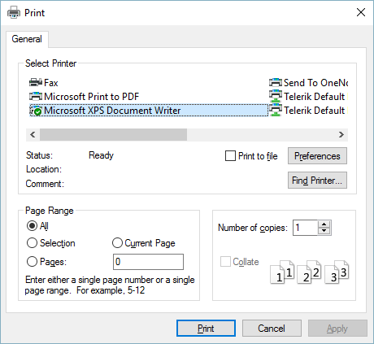

# Printing Support

| RELATED VIDEOS |  |
| ------ | ------ |
|[Getting Started with Printing for RadGridView](http://tv.telerik.com/watch/winforms/getting-started-with-printing-for-radgridview-)<br>This video demonstrates how to use the new Print features of RadGridView without the need to export to other formats. It also includes a tour of new end-user printing features.||

RadGridView provides printing support, which allows you to print the grid content by using [RadPrintDocument.]() You are able to print:

* [ViewDefinitions]()

* [Grouped grid]()

* [Summaries]()

* Hidden rows and Hidden columns

* Header on each page

RadGridView has two public methods available for printing - __Print()__ and  __PrintPreview()__. The first method will directly send a print job to the default printer with the settings currently saved in the [PrintStyle]() property. This method has one overload available which can show a system __PrintDialog__ with the available printers and their options.

{{source=..\SamplesCS\GridView\Printing support\PrintingSupport.cs region=print}} 
{{source=..\SamplesVB\GridView\Printing support\PrintingSupport.vb region=print}} 

````C#
this.radGridView1.Print();
this.radGridView1.Print(true);

````
````VB.NET
Me.RadGridView1.Print()
Me.RadGridView1.Print(True)

````

{{endregion}} 



The other available method is __PrintPreview()__, which opens [RadPrintPreviewDialog.]()

{{source=..\SamplesCS\GridView\Printing support\PrintingSupport.cs region=PrintPreview}} 
{{source=..\SamplesVB\GridView\Printing support\PrintingSupport.vb region=PrintPreview}} 

````C#
this.radGridView1.PrintPreview();

````
````VB.NET
Me.RadGridView1.PrintPreview()

````

{{endregion}} 


# See Also
* [Events and Customization]()

* [GridPrintStyle]()

* [Printing Hierarchical Grid]()

