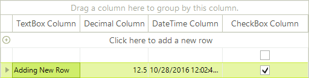
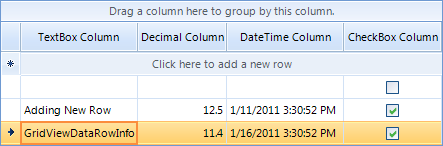

# Adding and Inserting Rows


## Adding rows to RadGridView

Adding new rows in the RadGridView can be achieved via the __Rows__ collection. For example if the grid control contains three columns – [GridViewTextBoxColumn](), [GridViewDecimalColumn](), [GridViewDateTimeColumn]() and [GridViewCheckBoxColumn]() you can add an empty row as follows:
      	

__RadGridView.Rows.AddNew()__ adds an empty row and allows the user to enter a value for each column cells’

{{source=..\SamplesCS\GridView\Rows\AddingAndInsertingRows.cs region=addNewRow}} 
{{source=..\SamplesVB\GridView\Rows\AddingAndInsertingRows.vb region=addNewRow}} 

````C#
radGridView1.Rows.AddNew();

````
````VB.NET
RadGridView1.Rows.AddNew()

````

{{endregion}} 


__RadGridView.Rows.Add(value-for-first-column, value-for-second-column, value-for-third-column)__ – adds a new rows with the specified values. You can use the following code snippet to add values for each column

{{source=..\SamplesCS\GridView\Rows\AddingAndInsertingRows.cs region=addRow}} 
{{source=..\SamplesVB\GridView\Rows\AddingAndInsertingRows.vb region=addRow}} 

````C#
radGridView1.Rows.Add("Adding New Row", 12.5, DateTime.Now, true);

````
````VB.NET
RadGridView1.Rows.Add("Adding New Row", 12.5, DateTime.Now, True)

````

{{endregion}} 




You can also add rows by creating an instance of __GridViewDataRowInfo__ and adding it to the __Rows__ collection of __RadGridView__

{{source=..\SamplesCS\GridView\Rows\AddingAndInsertingRows.cs region=addRowWithRowInfo}} 
{{source=..\SamplesVB\GridView\Rows\AddingAndInsertingRows.vb region=addRowWithRowInfo}} 

````C#
GridViewDataRowInfo rowInfo = new GridViewDataRowInfo(this.radGridView1.MasterView);
rowInfo.Cells[0].Value = "GridViewDataRowInfo";
rowInfo.Cells[1].Value = 11.4;
rowInfo.Cells[2].Value = DateTime.Now.AddDays(5);
rowInfo.Cells[3].Value = true;
radGridView1.Rows.Add(rowInfo);

````
````VB.NET
Dim rowInfo As New GridViewDataRowInfo(Me.RadGridView1.MasterView)
rowInfo.Cells(0).Value = "GridViewDataRowInfo"
rowInfo.Cells(1).Value = 11.4
rowInfo.Cells(2).Value = DateTime.Now.AddDays(5)
rowInfo.Cells(3).Value = True
RadGridView1.Rows.Add(rowInfo)

````

{{endregion}} 




## Inserting rows in RadGridView

Rows can be inserted at a specified position by using the __Insert__ method of the __Rows__ collection of RadGridView. Below you can see an example of this functionality:

{{source=..\SamplesCS\GridView\Rows\AddingAndInsertingRows.cs region=insertRow}} 
{{source=..\SamplesVB\GridView\Rows\AddingAndInsertingRows.vb region=insertRow}} 

````C#
GridViewDataRowInfo dataRowInfo = new GridViewDataRowInfo(this.radGridView1.MasterView);
dataRowInfo.Cells[0].Value = "Inserted Row";
dataRowInfo.Cells[1].Value = 1156.54;
dataRowInfo.Cells[2].Value = DateTime.Now.AddDays(14);
radGridView1.Rows.Insert(2, dataRowInfo);

````
````VB.NET
Dim dataRowInfo As New GridViewDataRowInfo(Me.RadGridView1.MasterView)
rowInfo.Cells(0).Value = "Inserted Row"
rowInfo.Cells(1).Value = 1154.54
rowInfo.Cells(2).Value = DateTime.Now.AddDays(14)
RadGridView1.Rows.Insert(2, dataRowInfo)

````

{{endregion}} 


