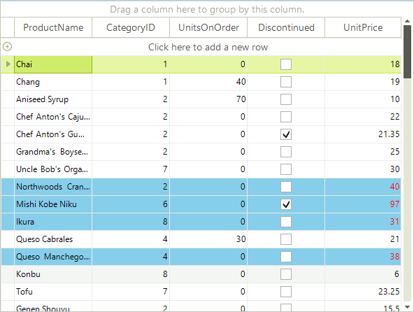

# Conditional Formatting Rows


Cells and rows can be styled based on data conditions using the __ConditionalFormattingObject__. Setup the condition in the constructor for the __ConditionalFormattingObject__. The constructor parameters are:

* The name of the condition. 

* A __ConditionTypes__ enumeration value: Equal, NotEqual, StartsWith, EndsWith, Contains, DoesNotContain, Greater, GreaterOrEqual, Less, LessOrEqual, Between, NotBetween.

* A string for the first value used to test the condition.

* A string for the second value used to test the condition.

* An "ApplyToRow" boolean that if true allows you to format the entire row that the cell appears in.

The __ConditionalFormattingObject__ also contains formatting properties for the cell, row and text alignment. 

* __CellBackColor__ sets the background color for the cell.
        

* __CellForeColor__ sets the cell text font color.
        

* __CellFont__ sets the cell text font.
        

* __RowBackColor__ sets the background color for the entire row that the cell appears in.
        

* __RowForeColor__ sets the cell text font color for the entire row that the cell appears in.
        

* __RowFont__ sets the cell text font for the entire row that the cell appears in.
        

* __TextAlignment__ is a __ContentAlignment__ enumeration value that can be __TopLeft__, __TopCenter__, __TopRight__, __MiddleLeft__, __MiddleCenter__, __MiddleRight__, __BottomLeft__, __BottomCenter__ and __BottomRight__.

## Conditional Formatting Rows

This example looks for the same condition as the [cell formatting example](). The difference is that the last parameter ("ApplyToRow") passed to the __ConditionalFormattingObject__ is set to true, allowing the __RowBackColor__ property to be recognized.  

{{source=..\SamplesCS\GridView\Rows\ConditionalFormattingRows.cs region=conditionalFormatting}} 
{{source=..\SamplesVB\GridView\Rows\ConditionalFormattingRows.vb region=conditionalFormatting}} 

````C#
ConditionalFormattingObject obj = new ConditionalFormattingObject("MyCondition", ConditionTypes.Greater, "30", "", true);
obj.CellForeColor = Color.Red;
obj.RowBackColor = Color.SkyBlue;
this.radGridView1.Columns["UnitPrice"].ConditionalFormattingObjectList.Add(obj);

````
````VB.NET
Dim obj = New ConditionalFormattingObject("MyCondition", ConditionTypes.Greater, "30", "", True)
obj.CellForeColor = Color.Red
obj.RowBackColor = Color.SkyBlue
Me.RadGridView1.Columns("Unit Price").ConditionalFormattingObjectList.Add(obj)

````

{{endregion}} 


>caution The declarative nature of Conditional Formatting limits the situations in which it can be used. While the provided functionality covers most scenarios, there are situations in which you will need to use [events]().
>


