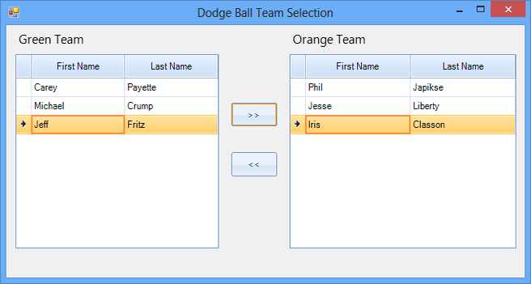
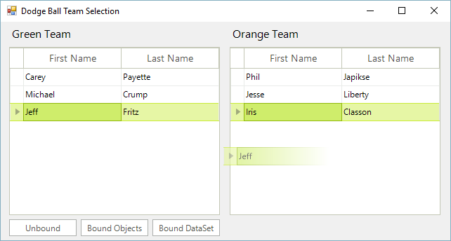
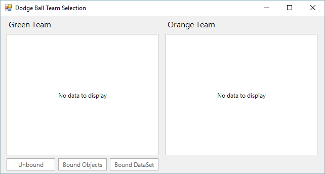

# Drag and Drop

Sometimes applications need to allow users to split items up into separate groupings. One way to handle this scenario is through moving data back and forth between several RadGridView controls. There is a multitude of ways of implementing this. One way is that you could add buttons between two grids with buttons labeled with arrows denoting the direction in which to move selected data.

On the other hand, in order to achieve a better user experience, implementing drag and drop functionality between the grids is ideal.

This help article demonstrates how to extend the RadGridView control to enable drag and drop functionality between two grids, whether it be an unbound grid, bound to a binding list of objects, or bound to a DataSet. It supports the ability to drag and drop multiple rows at a time.

## Getting started

To get started:

1. Open Visual Studio 2012 and create a new Telerik UI for WinForms project.
            

1. Add a new class called “DragAndDropRadGrid.cs”.
            

1. Modify the class to extend the RadGridView control through inheritance.
            

#### __[C#] __

{{source=..\SamplesCS\GridView\Rows\DragAndDropRadGrid.cs region=Definition}}
	public class DragAndDropRadGrid : RadGridView
	{{endregion}}

#### __[VB.NET] __

{{source=..\SamplesVB\GridView\Rows\DragAndDropRadGrid.vb region=Definition}}
	Public Class DragAndDropRadGrid
	    Inherits RadGridView
	{{endregion}}

The drag and drop functionality is made easy using the built-in RadGridViewDragDropService as the plumbing code is already handled, you only need to handle events emanating from this
          service. Create a default constructor for the DragAndDropRadGrid class. In this constructor we will grab a reference to the RadGridView RadDragDropService and generate event handler
          stubs for a few of the service’s events.
        

#### __[C#] __

{{source=..\SamplesCS\GridView\Rows\DragAndDropRadGrid.cs region=Constructor}}
	    public DragAndDropRadGrid() 
	    {  
	        this.MultiSelect = true;                       
	        
	        //handle drag and drop events for the grid through the DragDrop service
	        RadDragDropService svc = 
	                this.GridViewElement.GetService<RadDragDropService>();
	        svc.PreviewDragStart += svc_PreviewDragStart;
	        svc.PreviewDragDrop += svc_PreviewDragDrop;
	        svc.PreviewDragOver += svc_PreviewDragOver;
	 
	        //register the custom row selection behavior
	        var gridBehavior = this.GridBehavior as BaseGridBehavior;
	        gridBehavior.UnregisterBehavior(typeof(GridViewDataRowInfo));
	        gridBehavior.RegisterBehavior(typeof(GridViewDataRowInfo), new RowSelectionGridBehavior());
	
	    }
	{{endregion}}

#### __[VB.NET] __

{{source=..\SamplesVB\GridView\Rows\DragAndDropRadGrid.vb region=Constructor}}
	    Public Sub New()
	        Me.MultiSelect = True
	
	        'handle drag and drop events for the grid through the DragDrop service
	        Dim svc As RadDragDropService = Me.GridViewElement.GetService(Of RadDragDropService)()
	        AddHandler svc.PreviewDragStart, AddressOf svc_PreviewDragStart
	        AddHandler svc.PreviewDragDrop, AddressOf svc_PreviewDragDrop
	        AddHandler svc.PreviewDragOver, AddressOf svc_PreviewDragOver
	
	        'register the custom row selection behavior
	        Dim gridBehavior = TryCast(Me.GridBehavior, BaseGridBehavior)
	        gridBehavior.UnregisterBehavior(GetType(GridViewDataRowInfo))
	        gridBehavior.RegisterBehavior(GetType(GridViewDataRowInfo), New RowSelectionGridBehavior())
	
	    End Sub
	{{endregion}}

## Starting the Drag and Drop Service using behaviors

In order to start the drag and drop service when the user clicks on a row with the left mouse button, it is necessary to create a custom grid behavior.
        To do this, create a new class that inherits the GridDataRowBehavior class. In addition the drag and drop service allows you to disable the auto scrolling while 
        dragging functionality:
      

#### __[C#] __

{{source=..\SamplesCS\GridView\Rows\DragAndDropRadGrid.cs region=GridBehavior}}
	//initiates drag and drop service for clicked rows
	public class RowSelectionGridBehavior : GridDataRowBehavior
	{
	    protected override bool OnMouseDownLeft(MouseEventArgs e)
	    {
	        GridDataRowElement row = this.GetRowAtPoint(e.Location) as GridDataRowElement;
	        if (row != null)
	        {
	            RadGridViewDragDropService svc = this.GridViewElement.GetService<RadGridViewDragDropService>();
	            svc.AllowAutoScrollColumnsWhileDragging = false;
	            svc.AllowAutoScrollRowsWhileDragging = false;
	            svc.Start(row);
	        }
	        return base.OnMouseDownLeft(e);
	    }
	}
	{{endregion}}

#### __[VB.NET] __

{{source=..\SamplesVB\GridView\Rows\DragAndDropRadGrid.vb region=GridBehavior}}
	'initiates drag and drop service for clicked rows
	Public Class RowSelectionGridBehavior
	    Inherits GridDataRowBehavior
	    Protected Overrides Function OnMouseDownLeft(ByVal e As MouseEventArgs) As Boolean
	        Dim row As GridDataRowElement = TryCast(Me.GetRowAtPoint(e.Location), GridDataRowElement)
	        If Not row Is Nothing Then
	            Dim svc As RadGridViewDragDropService = Me.GridViewElement.GetService(Of RadGridViewDragDropService)()
	            svc.AllowAutoScrollColumnsWhileDragging = False
	            svc.AllowAutoScrollRowsWhileDragging = False
	            svc.Start(row)
	        End If
	        Return MyBase.OnMouseDownLeft(e)
	    End Function
	End Class
	{{endregion}}

It is important to register this behavior in our grid. Build the solution and our custom grid is now setup and ready to use. You can locate it in the Visual Studio toolbox when in the design view of a form. 

## Drag and Drop events

The PreviewDragStart event is fired once the Drag and Drop service on the grid is started. In this case, we simply want to tell the drag and drop service if the drag operation can move forward. Implement the PreviewDragStart event handler as follows:

#### __[C#] __

{{source=..\SamplesCS\GridView\Rows\DragAndDropRadGrid.cs region=PreviewDragStart}}
	    //required to initiate drag and drop when grid is in bound mode
	    private void svc_PreviewDragStart(object sender, PreviewDragStartEventArgs e)
	    {
	        e.CanStart = true;
	    }
	{{endregion}}

#### __[VB.NET] __

{{source=..\SamplesVB\GridView\Rows\DragAndDropRadGrid.vb region=PreviewDragStart}}
	    'required to initiate drag and drop when grid is in bound mode
	    Private Sub svc_PreviewDragStart(ByVal sender As Object, ByVal e As PreviewDragStartEventArgs)
	        e.CanStart = True
	    End Sub
	{{endregion}}

The next event we will handle is the PreviewDragOver event. This event allows you to control on what targets the row being dragged can be dropped on. In this case, as long as it’s being dropped somewhere on the target grid, we are good with it. Implement the handler as follows:

#### __[C#] __

{{source=..\SamplesCS\GridView\Rows\DragAndDropRadGrid.cs region=PreviewDragOver}}
	    private void svc_PreviewDragOver(object sender, RadDragOverEventArgs e)
	    {
	        if (e.DragInstance is GridDataRowElement)
	        {
	            e.CanDrop = e.HitTarget is GridDataRowElement || 
	                        e.HitTarget is GridTableElement ||
	                        e.HitTarget is GridSummaryRowElement;
	        }
	    }
	{{endregion}}

#### __[VB.NET] __

{{source=..\SamplesVB\GridView\Rows\DragAndDropRadGrid.vb region=PreviewDragOver}}
	    Private Sub svc_PreviewDragOver(ByVal sender As Object, ByVal e As RadDragOverEventArgs)
	        If TypeOf e.DragInstance Is GridDataRowElement Then
	            e.CanDrop = TypeOf e.HitTarget Is GridDataRowElement OrElse
	                        TypeOf e.HitTarget Is GridTableElement OrElse
	                        TypeOf e.HitTarget Is GridSummaryRowElement
	        End If
	    End Sub
	{{endregion}}

The last event we want to handle in our implementation is the PreviewDragDrop event. This event allows you to get a handle on all the aspects of the drag and drop operation, the source (drag) grid, the destination (target) grid, as well as the row being dragged. This is where we will initiate the actual physical move of the row(s) from one grid to the other. Implement the handler as follows:

#### __[C#] __

{{source=..\SamplesCS\GridView\Rows\DragAndDropRadGrid.cs region=PreviewDragDrop}}
	    //gather drag/source grid and target/destination information and initiate the move of selected rows
	    private void svc_PreviewDragDrop(object sender, RadDropEventArgs e)
	    {
	        var rowElement = e.DragInstance as GridDataRowElement;
	
	        if (rowElement == null)
	        {
	            return;
	        }
	        e.Handled = true;
	
	        var dropTarget = e.HitTarget as RadItem;
	        var targetGrid = dropTarget.ElementTree.Control as RadGridView;
	        if (targetGrid == null)
	        {
	            return;
	        }
	
	        var dragGrid = rowElement.ElementTree.Control as RadGridView;
	        if (targetGrid != dragGrid)
	        {
	            e.Handled = true;
	            //append dragged rows to the end of the target grid
	            int index = targetGrid.RowCount;
	
	            //Grab every selected row from the source grid, including the current row
	            List<GridViewRowInfo> rows = 
	                                dragGrid.SelectedRows.ToList<GridViewRowInfo>();
	            if (dragGrid.CurrentRow != null)
	            {
	                GridViewRowInfo row = dragGrid.CurrentRow;
	                if (!rows.Contains(row))
	                    rows.Add(row);
	            }
	            this.MoveRows(targetGrid, dragGrid, rows, index);
	        }
	    }
	{{endregion}}

#### __[VB.NET] __

{{source=..\SamplesVB\GridView\Rows\DragAndDropRadGrid.vb region=PreviewDragDrop}}
	    'gather drag/source grid and target/destination information and initiate the move of selected rows
	    Private Sub svc_PreviewDragDrop(ByVal sender As Object, ByVal e As RadDropEventArgs)
	        Dim rowElement = TryCast(e.DragInstance, GridDataRowElement)
	
	        If rowElement Is Nothing Then
	            Return
	        End If
	        e.Handled = True
	
	        Dim dropTarget = TryCast(e.HitTarget, RadItem)
	        Dim targetGrid = TryCast(dropTarget.ElementTree.Control, RadGridView)
	        If targetGrid Is Nothing Then
	            Return
	        End If
	
	        Dim dragGrid = TryCast(rowElement.ElementTree.Control, RadGridView)
	        If Not targetGrid Is dragGrid Then
	            e.Handled = True
	            'append dragged rows to the end of the target grid
	            Dim index As Integer = targetGrid.RowCount
	
	            'Grab every selected row from the source grid, including the current row
	            Dim rows As New List(Of GridViewRowInfo)
	
	            For Each row As GridViewRowInfo In dragGrid.SelectedRows
	                rows.Add(row)
	            Next
	            If Not dragGrid.CurrentRow Is Nothing Then
	                Dim row As GridViewRowInfo = dragGrid.CurrentRow
	                If (Not rows.Contains(row)) Then
	                    rows.Add(row)
	                End If
	            End If
	            Me.MoveRows(targetGrid, dragGrid, rows, index)
	        End If
	    End Sub
	{{endregion}}

## Moving the data from one source to the other

You will notice at the end of the PreviewDragDrop handler that we need to create a MoveRows function that will handle the actual moving the data from the source to the destination. As mentioned at the beginning of the article, three distinct data scenarios will be handled:

* Unbound

* Bound to Objects (through a BindingList)

* Bound to a DataSet

It is in the MoveRows method where the physical moving of the data happens. Basically what we need in this method is to add the data into the target data source, and remove it from the source data source in order to complete the drag and drop operation under the covers. Implement the MoveRows method as follows:

#### __[C#] __

{{source=..\SamplesCS\GridView\Rows\DragAndDropRadGrid.cs region=MoveRows}}
	    private void MoveRows(RadGridView targetGrid, RadGridView dragGrid, 
	                            IList<GridViewRowInfo> dragRows, int index) 
	    { 
	        dragGrid.BeginUpdate();
	        targetGrid.BeginUpdate();
	        for (int i = dragRows.Count - 1; i >= 0; i--)
	        {
	            GridViewRowInfo row = dragRows[i];
	            if (row is GridViewSummaryRowInfo)
	            {
	                continue;
	            }
	            if (targetGrid.DataSource == null)
	            {
	                //unbound scenario
	                GridViewRowInfo newRow = targetGrid.Rows.NewRow();
	
	                foreach (GridViewCellInfo cell in row.Cells)
	                {
	                    if (newRow.Cells[cell.ColumnInfo.Name] != null)
	                        newRow.Cells[cell.ColumnInfo.Name].Value = cell.Value;
	                }
	
	                targetGrid.Rows.Insert(index, newRow);
	
	                row.IsSelected = false;
	                dragGrid.Rows.Remove(row);
	            }
	            else if (typeof(DataSet).IsAssignableFrom(targetGrid.DataSource.GetType()))
	            {
	                //bound to a dataset scenario
	                var sourceTable = ((DataSet)dragGrid.DataSource).Tables[0];
	                var targetTable = ((DataSet)targetGrid.DataSource).Tables[0];
	
	                var newRow = targetTable.NewRow();
	                foreach (GridViewCellInfo cell in row.Cells)
	                {
	                    newRow[cell.ColumnInfo.Name] = cell.Value;
	                }
	
	                sourceTable.Rows.Remove(((DataRowView)row.DataBoundItem).Row);
	                targetTable.Rows.InsertAt(newRow, index);
	            }
	            else if (typeof(IList).IsAssignableFrom(targetGrid.DataSource.GetType()))
	            {
	                //bound to a list of objects scenario
	                var targetCollection = (IList)targetGrid.DataSource;
	                var sourceCollection = (IList)dragGrid.DataSource;
	                sourceCollection.Remove(row.DataBoundItem);
	                targetCollection.Add(row.DataBoundItem);
	            }
	            else
	            {
	                throw new ApplicationException("Unhandled Scenario");
	            }
	            index++;
	        }
	        dragGrid.EndUpdate(true);
	        targetGrid.EndUpdate(true);
	    }
	
	{{endregion}}

#### __[VB.NET] __

{{source=..\SamplesVB\GridView\Rows\DragAndDropRadGrid.vb region=MoveRows}}
	    Private Sub MoveRows(ByVal targetGrid As RadGridView, ByVal dragGrid As RadGridView, ByVal dragRows As IList(Of GridViewRowInfo), ByVal index As Integer)
	        dragGrid.BeginUpdate()
	        targetGrid.BeginUpdate()
	        For i As Integer = dragRows.Count - 1 To 0 Step -1
	            Dim row As GridViewRowInfo = dragRows(i)
	            If TypeOf row Is GridViewSummaryRowInfo Then
	                Continue For
	            End If
	            If targetGrid.DataSource Is Nothing Then
	                'unbound scenario
	                Dim newRow As GridViewRowInfo = targetGrid.Rows.NewRow()
	
	                For Each cell As GridViewCellInfo In row.Cells
	                    If Not newRow.Cells(cell.ColumnInfo.Name) Is Nothing Then
	                        newRow.Cells(cell.ColumnInfo.Name).Value = cell.Value
	                    End If
	                Next cell
	
	                targetGrid.Rows.Insert(index, newRow)
	
	                row.IsSelected = False
	                dragGrid.Rows.Remove(row)
	            ElseIf GetType(DataSet).IsAssignableFrom(targetGrid.DataSource.GetType()) Then
	                'bound to a dataset scenario
	                Dim sourceTable = (CType(dragGrid.DataSource, DataSet)).Tables(0)
	                Dim targetTable = (CType(targetGrid.DataSource, DataSet)).Tables(0)
	
	                Dim newRow = targetTable.NewRow()
	                For Each cell As GridViewCellInfo In row.Cells
	                    newRow(cell.ColumnInfo.Name) = cell.Value
	                Next cell
	
	                sourceTable.Rows.Remove((CType(row.DataBoundItem, DataRowView)).Row)
	                targetTable.Rows.InsertAt(newRow, index)
	            ElseIf GetType(IList).IsAssignableFrom(targetGrid.DataSource.GetType()) Then
	                'bound to a list of objects scenario
	                Dim targetCollection = CType(targetGrid.DataSource, IList)
	                Dim sourceCollection = CType(dragGrid.DataSource, IList)
	                sourceCollection.Remove(row.DataBoundItem)
	                targetCollection.Add(row.DataBoundItem)
	            Else
	                Throw New ApplicationException("Unhandled Scenario")
	            End If
	            index += 1
	        Next i
	        dragGrid.EndUpdate(True)
	        targetGrid.EndUpdate(True)
	    End Sub
	{{endregion}}

## Using our new control

Open the designer for Form1 and layout your form by dragging two instances of our DragAndDropRadGrid control (name them leftGrid and rightGrid respectively). Then drag three RadButton instances and name them btnUnbound, btnBoundObjects, and btnBoundDataSet. Visually layout the form and label your form elements in the designer as follows:

Initialize some settings of the grids in the default constructor of the form as follows, we’ll also add a method to reset the grids:

#### __[C#] __

{{source=..\SamplesCS\GridView\Rows\DragAndDropRadGridForm1.cs region=Form1}}
	        public DragAndDropRadGridForm1()
	        {
	            InitializeComponent();
	            leftGrid.ShowGroupPanel = false;
	            rightGrid.ShowGroupPanel = false;
	            leftGrid.AllowAddNewRow = false;
	            rightGrid.AllowAddNewRow = false;
	            leftGrid.AutoSizeColumnsMode = GridViewAutoSizeColumnsMode.Fill;
	            rightGrid.AutoSizeColumnsMode = GridViewAutoSizeColumnsMode.Fill;
	        }
	
	        private void ResetGrids()
	        {
	            leftGrid.DataSource = null;
	            leftGrid.Rows.Clear();
	            leftGrid.Columns.Clear();
	            rightGrid.DataSource = null;
	            rightGrid.Rows.Clear();
	            rightGrid.Columns.Clear();
	        }
	{{endregion}}

#### __[VB.NET] __

{{source=..\SamplesVB\GridView\Rows\DragAndDropRadGridForm1.vb region=Form1}}
	        Public Sub New()
	            InitializeComponent()
	            leftGrid.ShowGroupPanel = False
	            rightGrid.ShowGroupPanel = False
	            leftGrid.AllowAddNewRow = False
	            rightGrid.AllowAddNewRow = False
	            leftGrid.AutoSizeColumnsMode = GridViewAutoSizeColumnsMode.Fill
	            rightGrid.AutoSizeColumnsMode = GridViewAutoSizeColumnsMode.Fill
	        End Sub
	
	        Private Sub ResetGrids()
	            leftGrid.DataSource = Nothing
	            leftGrid.Rows.Clear()
	            leftGrid.Columns.Clear()
	            rightGrid.DataSource = Nothing
	            rightGrid.Rows.Clear()
	            rightGrid.Columns.Clear()
	        End Sub
	{{endregion}}

First we will implement the usage of our custom grid in an unbound scenario. To do this, double-click on the Unbound button to implement its click event handler as follows:

#### __[C#] __

{{source=..\SamplesCS\GridView\Rows\DragAndDropRadGridForm1.cs region=Unbound}}
	        private void btnUnbound_Click(object sender, EventArgs e)
	        {
	            ResetGrids();
	
	            PrepareUnboundGrid(leftGrid);
	            leftGrid.Rows.Add("Carey", "Payette");
	            leftGrid.Rows.Add("Michael", "Crump");
	            leftGrid.Rows.Add("Jeff", "Fritz");
	            PrepareUnboundGrid(rightGrid);
	            rightGrid.Rows.Add("Phil", "Japikse");
	            rightGrid.Rows.Add("Jesse", "Liberty");
	            rightGrid.Rows.Add("Iris", "Classon");
	        }
	
	        private void PrepareUnboundGrid(RadGridView grid)
	        {
	            //setup columns
	            GridViewTextBoxColumn firstName = new GridViewTextBoxColumn("FirstName", "FirstName");
	            firstName.HeaderText = "First Name";
	            GridViewTextBoxColumn lastName = new GridViewTextBoxColumn("LastName", "LastName");
	            lastName.HeaderText = "Last Name";
	           
	            grid.Columns.AddRange(firstName,lastName);
	        }
	{{endregion}}

#### __[VB.NET] __

{{source=..\SamplesVB\GridView\Rows\DragAndDropRadGridForm1.vb region=Unbound}}
	        Private Sub btnUnbound_Click(ByVal sender As Object, ByVal e As EventArgs) Handles btnUnbound.Click
	            ResetGrids()
	
	            PrepareUnboundGrid(leftGrid)
	            leftGrid.Rows.Add("Carey", "Payette")
	            leftGrid.Rows.Add("Michael", "Crump")
	            leftGrid.Rows.Add("Jeff", "Fritz")
	            PrepareUnboundGrid(rightGrid)
	            rightGrid.Rows.Add("Phil", "Japikse")
	            rightGrid.Rows.Add("Jesse", "Liberty")
	            rightGrid.Rows.Add("Iris", "Classon")
	        End Sub
	
	        Private Sub PrepareUnboundGrid(ByVal grid As RadGridView)
	            'setup columns
	            Dim firstName As GridViewTextBoxColumn = New GridViewTextBoxColumn("FirstName", "FirstName")
	            firstName.HeaderText = "First Name"
	            Dim lastName As GridViewTextBoxColumn = New GridViewTextBoxColumn("LastName", "LastName")
	            lastName.HeaderText = "Last Name"
	
	            grid.Columns.AddRange(firstName, lastName)
	        End Sub
	{{endregion}}

Next we will implement the usage of our grid when it is bound to a BindingList. Double-click on the Bound to Objects button, and implement it as follows:

#### __[C#] __

{{source=..\SamplesCS\GridView\Rows\DragAndDropRadGridForm1.cs region=BoundObjects}}
	        private void btnBoundObjects_Click(object sender, EventArgs e)
	        {
	            ResetGrids();
	
	            BindingList<Player> dataList1 = new BindingList<Player>();
	            dataList1.Add(new Player() { FirstName = "Carey", LastName = "Payette" });
	            dataList1.Add(new Player() { FirstName = "Michael", LastName = "Crump" });
	            dataList1.Add(new Player() { FirstName = "Jeff", LastName = "Fritz" });
	            BindingList<Player> dataList2 = new BindingList<Player>();
	            dataList2.Add(new Player() { FirstName = "Phil", LastName = "Japikse" });
	            dataList2.Add(new Player() { FirstName = "Jesse", LastName = "Liberty" });
	            dataList2.Add(new Player() { FirstName = "Iris", LastName = "Classon"});
	           
	            leftGrid.DataSource = dataList1;
	            rightGrid.DataSource = dataList2;
	        }
	{{endregion}}

#### __[VB.NET] __

{{source=..\SamplesVB\GridView\Rows\DragAndDropRadGridForm1.vb region=BoundObjects}}
	        Private Sub btnBoundObjects_Click(ByVal sender As Object, ByVal e As EventArgs) Handles btnBoundObjects.Click
	            ResetGrids()
	
	            Dim dataList1 As New BindingList(Of Player)()
	            dataList1.Add(New Player() With { _
	                .FirstName = "Carey", _
	                .LastName = "Payette" _
	            })
	            dataList1.Add(New Player() With { _
	                .FirstName = "Michael", _
	                .LastName = "Crump" _
	            })
	            dataList1.Add(New Player() With { _
	                .FirstName = "Jeff", _
	                .LastName = "Fritz" _
	            })
	            Dim dataList2 As New BindingList(Of Player)()
	            dataList2.Add(New Player() With { _
	                .FirstName = "Phil", _
	                .LastName = "Japikse" _
	            })
	            dataList2.Add(New Player() With { _
	                .FirstName = "Jesse", _
	                .LastName = "Liberty" _
	            })
	            dataList2.Add(New Player() With { _
	                .FirstName = "Iris", _
	                .LastName = "Classon" _
	            })
	
	            leftGrid.DataSource = dataList1
	            rightGrid.DataSource = dataList2
	        End Sub
	{{endregion}}

Add a Player class to the Form1.cs source file to support this scenario defined as the following:

#### __[C#] __

{{source=..\SamplesCS\GridView\Rows\DragAndDropRadGridForm1.cs region=Player}}
	    public class Player
	    {
	        public string FirstName { get; set; }
	        public string LastName { get; set; }
	    }
	{{endregion}}

#### __[VB.NET] __

{{source=..\SamplesVB\GridView\Rows\DragAndDropRadGridForm1.vb region=Player}}
	    Public Class Player
	        Public Property FirstName() As String
	            Get
	                Return m_FirstName
	            End Get
	            Set(ByVal value As String)
	                m_FirstName = Value
	            End Set
	        End Property
	        Private m_FirstName As String
	        Public Property LastName() As String
	            Get
	                Return m_LastName
	            End Get
	            Set(ByVal value As String)
	                m_LastName = Value
	            End Set
	        End Property
	        Private m_LastName As String
	    End Class
	{{endregion}}

Lastly we will implement the scenario of when the grids are bound to a DataSet. Implement the click event handler of the Bound to DataSet button as follows:

#### __[C#] __

{{source=..\SamplesCS\GridView\Rows\DragAndDropRadGridForm1.cs region=DataSet}}
	        private void btnBoundDataSet_Click(object sender, EventArgs e)
	        {
	            ResetGrids();
	
	            DataSet ds1 = new DataSet();
	            DataTable team1 = new DataTable();
	            team1.Columns.Add("First Name", typeof(string));
	            team1.Columns.Add("Last Name", typeof(string));
	            team1.Rows.Add("Carey", "Payette");
	            team1.Rows.Add("Michael", "Crump");
	            team1.Rows.Add("Jeff", "Fritz");
	            ds1.Tables.Add(team1);
	
	            DataSet ds2 = new DataSet();
	            DataTable team2 = new DataTable();
	            team2.Columns.Add("First Name", typeof(string));
	            team2.Columns.Add("Last Name", typeof(string));
	            team2.Rows.Add("Phil", "Japikse");
	            team2.Rows.Add("Jesse", "Liberty");
	            team2.Rows.Add("Iris", "Classon");
	            ds2.Tables.Add(team2);
	            
	            leftGrid.DataSource = ds1;
	            leftGrid.DataMember = "Table1";
	            rightGrid.DataSource = ds2;
	            rightGrid.DataMember = "Table1";
	        }
	{{endregion}}

#### __[VB.NET] __

{{source=..\SamplesVB\GridView\Rows\DragAndDropRadGridForm1.vb region=DataSet}}
	        Private Sub btnBoundDataSet_Click(ByVal sender As Object, ByVal e As EventArgs) Handles btnBoundDataSet.Click
	            ResetGrids()
	
	            Dim ds1 As DataSet = New DataSet()
	            Dim team1 As DataTable = New DataTable()
	            team1.Columns.Add("First Name", GetType(String))
	            team1.Columns.Add("Last Name", GetType(String))
	            team1.Rows.Add("Carey", "Payette")
	            team1.Rows.Add("Michael", "Crump")
	            team1.Rows.Add("Jeff", "Fritz")
	            ds1.Tables.Add(team1)
	
	            Dim ds2 As DataSet = New DataSet()
	            Dim team2 As DataTable = New DataTable()
	            team2.Columns.Add("First Name", GetType(String))
	            team2.Columns.Add("Last Name", GetType(String))
	            team2.Rows.Add("Phil", "Japikse")
	            team2.Rows.Add("Jesse", "Liberty")
	            team2.Rows.Add("Iris", "Classon")
	            ds2.Tables.Add(team2)
	
	            leftGrid.DataSource = ds1
	            leftGrid.DataMember = "Table1"
	            rightGrid.DataSource = ds2
	            rightGrid.DataMember = "Table1"
	        End Sub
	{{endregion}}

Go ahead and build and run the application. You are now able to use drag and drop functionality in bound and unbound modes. You are also able to select multiple rows using either the shift or control key, and holding the key down while you drag the rows between the grids.
