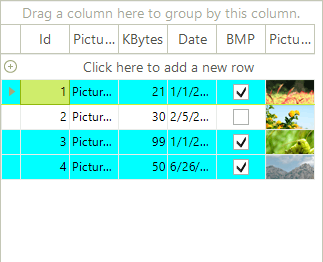
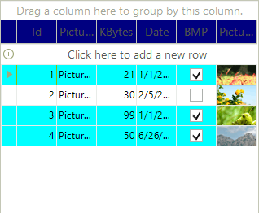

# Formatting Rows

## Customize the appearance of data rows

Use __RowFormatting__ event to apply custom formatting to __RadGridView's__ data rows.
        

The code snippets below demonstrates changing the background color of rows, which *"BMP"* cell value is true:
        

#### __[C#] Data row formatting in RadGridView__

{{source=..\SamplesCS\GridView\Rows\FormattingRows.cs region=rowFormatting}}
	
	        private void radGridView1_RowFormatting(object sender, RowFormattingEventArgs e)
	        {
	            if ((bool)e.RowElement.RowInfo.Cells["BMP"].Value == true)
	            {
	                e.RowElement.DrawFill = true;
	                e.RowElement.GradientStyle = GradientStyles.Solid;
	                e.RowElement.BackColor = Color.Aqua;
	            }
	            else
	            {
	                e.RowElement.ResetValue(LightVisualElement.BackColorProperty, ValueResetFlags.Local);
	                e.RowElement.ResetValue(LightVisualElement.GradientStyleProperty, ValueResetFlags.Local);
	                e.RowElement.ResetValue(LightVisualElement.DrawFillProperty, ValueResetFlags.Local);
	            }
	        }
	
	{{endregion}}

#### __[VB.NET] Data row formatting in RadGridView__

{{source=..\SamplesVB\GridView\Rows\FormattingRows.vb region=rowFormatting}}
	    Private Sub RadGridView1_RowFormatting(ByVal sender As Object, ByVal e As Telerik.WinControls.UI.RowFormattingEventArgs) Handles RadGridView1.RowFormatting
	        If e.RowElement.RowInfo.Cells("BMP").Value = True Then
	            e.RowElement.DrawFill = True
	            e.RowElement.GradientStyle = GradientStyles.Solid
	            e.RowElement.BackColor = Color.Aqua
	        Else
	            e.RowElement.ResetValue(LightVisualElement.BackColorProperty, ValueResetFlags.Local)
	            e.RowElement.ResetValue(LightVisualElement.GradientStyleProperty, ValueResetFlags.Local)
	            e.RowElement.ResetValue(LightVisualElement.DrawFillProperty, ValueResetFlags.Local)
	        End If
	    End Sub
	{{endregion}}

>An *if-else* statement is used to reset the value of __BackColorProperty__ if no drawing is required.
          

>You should set __DrawFill__ to *true* to turn on the fill for the row (depends on the used theme).
          

Please refer to the Fundamentals [topic]() for more information.
        

## Customize the non-data rows appearance

To customize the non-data rows (header row, new row, filtering row, etc) of RadGridView, you need to handle the __ViewRowFormatting__ event.

#### __[C#] Non-data row formatting in RadGridView__

{{source=..\SamplesCS\GridView\Rows\FormattingRows.cs region=viewRowFormatting}}
	        void radGridView1_ViewRowFormatting(object sender, RowFormattingEventArgs e)
	        {
	            Console.WriteLine(e.RowElement.GetType());
	            if (e.RowElement is GridTableHeaderRowElement)
	            {
	                e.RowElement.DrawFill = true;
	                e.RowElement.BackColor = Color.Navy;
	                e.RowElement.NumberOfColors = 1;
	                e.RowElement.ForeColor = Color.White;
	            }
	            else
	            {
	                e.RowElement.ResetValue(LightVisualElement.DrawFillProperty, ValueResetFlags.Local);
	                e.RowElement.ResetValue(LightVisualElement.BackColorProperty, ValueResetFlags.Local);
	                e.RowElement.ResetValue(LightVisualElement.NumberOfColorsProperty, ValueResetFlags.Local);
	                e.RowElement.ResetValue(LightVisualElement.ForeColorProperty, ValueResetFlags.Local);
	            }
	        }
	{{endregion}}

#### __[VB.NET] Non-data row formatting in RadGridView__

{{source=..\SamplesVB\GridView\Rows\FormattingRows.vb region=viewRowFormatting}}
	    Private Sub RadGridView1_ViewRowFormatting(ByVal sender As Object, ByVal e As Telerik.WinControls.UI.RowFormattingEventArgs) Handles RadGridView1.ViewRowFormatting
	        If TypeOf e.RowElement Is GridTableHeaderRowElement Then
	            e.RowElement.DrawFill = True
	            e.RowElement.BackColor = Color.Navy
	            e.RowElement.NumberOfColors = 1
	            e.RowElement.ForeColor = Color.White
	        Else
	            e.RowElement.ResetValue(LightVisualElement.DrawFillProperty, ValueResetFlags.Local)
	            e.RowElement.ResetValue(LightVisualElement.BackColorProperty, ValueResetFlags.Local)
	            e.RowElement.ResetValue(LightVisualElement.NumberOfColorsProperty, ValueResetFlags.Local)
	            e.RowElement.ResetValue(LightVisualElement.ForeColorProperty, ValueResetFlags.Local)
	        End If
	    End Sub
	{{endregion}}

