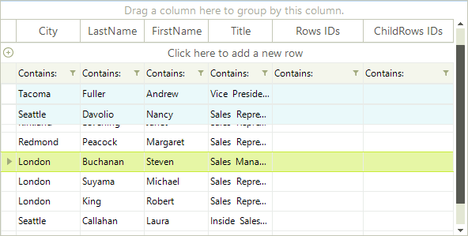

# Pinned Rows

RadGridView rows can be pinned so that the rows appear anchored to the top or bottom of 
    the grid. To pin a particular row, set the row
    PinPosition to one of the enumerated options -PinnedRowPosition.Bottom or PinnedRowPosition.Top:
    
    

#### __[C#]__

{{region pinnedRows}}
	            radGridView1.Rows[0].PinPosition = PinnedRowPosition.Bottom;
	            radGridView1.Rows[4].PinPosition = PinnedRowPosition.Top;
	{{endregion}}

#### __[VB.NET]__

{{region pinnedRows}}
	        RadGridView1.Rows(0).PinPosition = PinnedRowPosition.Bottom
	        RadGridView1.Rows(4).PinPosition = PinnedRowPosition.Top
	{{endregion}}

By using this code the IsPinned property automatically gets a value true for the desired row.
    

Another way of pinning a row is to set directly the IsPinned property of a Rows collection 
    item to True. Please note that doing so will pin the row to the top of RadGridView.
    

#### __[C#]__

{{region isPinned}}
	            radGridView1.Rows[3].IsPinned = true;
	{{endregion}}

#### __[VB.NET]__

{{region isPinned}}
	        RadGridView1.Rows(3).IsPinned = True
	{{endregion}}

The example below shows pinning all selected rows in the grid:
      

#### __[C#]__

{{region pinAllRows}}
	            foreach (GridViewRowInfo row in radGridView1.SelectedRows)
	            {
	                row.PinPosition = PinnedRowPosition.Bottom;
	            }
	{{endregion}}

#### __[VB.NET]__

{{region pinAllRows}}
	        For Each row In RadGridView1.SelectedRows
	            row.PinPosition = PinnedRowPosition.Bottom
	        Next
	{{endregion}}

## 

__RadGridView__ rows can be pinned so that the rows 
          appear anchored to the top of the grid. To pin a particular row, set the 
          __IsPinned__ property of a __Rows__
          collection item to __True__.

The example below shows pinning rows in the grid. 

