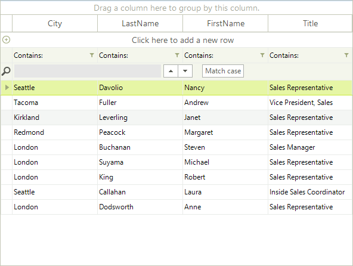
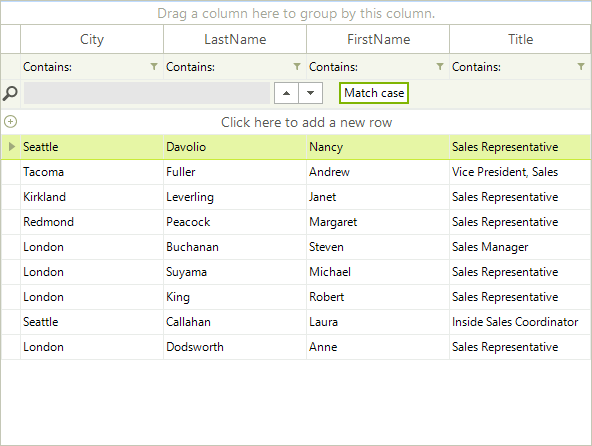

# Reordering System Rows

__RadGridView__ provides out of the box API for reordering its system rows: [GridFilterRowElement](), [GridSearchRowElement](), [GridNewRowElement](). The figures below illustrate __RadGridView__ before and after the reordering operation.

>caption Figure 1: Default Order



>caption Figure 2: Reordered Rows



In order to perform system rows reordering, you can use the RadGridView.MasterView.SystemRows.__Move__ method. Required parameters are two indices according to which the row will be reordered, the first one being the old index and second one being the new index. The default order (starting from the top) is:

* __GridViewTableHeaderRowInfo__: 0

* __GridViewNewRowInfo__: 1

* __GridViewFilteringRowInfo__: 2

* __GridViewSearchRowInfo__: 3

#### Reordering System Rows

{{source=..\SamplesCS\GridView\Rows\ReorderingSystemRows.cs region=ReorderingSystemRows}} 
{{source=..\SamplesVB\GridView\Rows\ReorderingSystemRows.vb region=ReorderingSystemRows}} 

````C#
this.radGridView1.MasterView.SystemRows.Move(1, 2);
this.radGridView1.MasterView.SystemRows.Move(2, 3);
this.radGridView1.GridViewElement.TableElement.InvalidateMeasure(true);
this.radGridView1.GridViewElement.TableElement.UpdateLayout();

````
````VB.NET
Me.RadGridView1.MasterView.SystemRows.Move(1, 2)
Me.RadGridView1.MasterView.SystemRows.Move(2, 3)
Me.RadGridView1.GridViewElement.TableElement.InvalidateMeasure(True)
Me.RadGridView1.GridViewElement.TableElement.UpdateLayout()

````

{{endregion}}

>tip The layout needs to be invalidated and updated in order to reflect the changes.
>


# See Also

* [Adding and Inserting Rows]()

* [Conditional Formatting Rows]()

* [Creating custom rows]()

* [Drag and Drop]()

* [Formatting Rows]()

* [GridViewRowInfo]()

* [Iterating Rows]()

* [New Row]()

