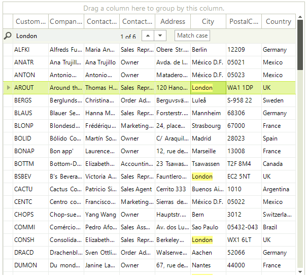

# Search Row


__RadGridView__ offers a build-in search functionality available for both end users and developers. The search mechanism executes in a separate thread which leaves the UI responsive at all times. To enable the search row for end users all you have to do is set the __AllowSearchRow__ property of __RadGridView__ to *true*:

{{source=..\SamplesCS\GridView\Rows\SearchRow.cs region=AllowSearchRow}} 
{{source=..\SamplesVB\GridView\Rows\SearchRow.vb region=AllowSearchRow}} 

````C#
this.radGridView1.AllowSearchRow = true;

````
````VB.NET
Me.RadGridView1.AllowSearchRow = True

````

{{endregion}} 




## 

The available properties to tweak the search experience and performance and how to access them are outlined below. The API is in the __GridViewSearchRowInfo__ object which can be accessed through the grid view __MasterView__:

* __CaseSensitive__ - This property defines whether searching will be case sensitive or case insensitive.

* __Culture__ - The culture which [CompareInfo](http://msdn.microsoft.com/en-us/library/System.Globalization.CompareInfo.IndexOf(v=vs.110).aspx) object will be used for searches when __CaseSensitive__ is set to *false*. 

* __CompareOptions__ – A __CompareOptions__ value that defines how search will be performed when __CaseSensitive__ is set to *false*.        

* __HighlightResults__ – Determines whether results will be highlighted with cells.

* __AutomaticallySelectFirstResult__ – Determines if the first result found by the search mechanism will be selected and brought into view.

To change the highlight color you should use the __HighlightColor__ property of the TableElement

{{source=..\SamplesCS\GridView\Rows\SearchRow.cs region=ChangeHighlightColor}} 
{{source=..\SamplesVB\GridView\Rows\SearchRow.vb region=ChangeHighlightColor}} 

````C#
radGridView1.TableElement.SearchHighlightColor = Color.LightBlue;

````
````VB.NET
RadGridView1.TableElement.SearchHighlightColor = Color.LightBlue

````

{{endregion}} 


You can also use the search functionality programmatically without showing the search row, just by using its API.

{{source=..\SamplesCS\GridView\Rows\SearchRow.cs region=GetSearchRow}} 
{{source=..\SamplesVB\GridView\Rows\SearchRow.vb region=GetSearchRow}} 

````C#
GridViewSearchRowInfo searchRow = this.radGridView1.MasterView.TableSearchRow;

````
````VB.NET
Dim searchRow As GridViewSearchRowInfo = Me.RadGridView1.MasterView.TableSearchRow

````

{{endregion}} 


To search you call the __Search__ method and pass the search criteria as a parameter. To get the search results you have to subscribe for the __SearchProgressChanged__ event. In the event handler you will have to handle three cases:

1. Initially the search results are returned one at a time. This is so you can quickly get the first results as they are discovered. In this case the __Cell__ property of the __SearchProgressChangedEventArgs__ will contain the cell that was found. You can control how many results are returned one by one through the __InitialSearchResultsTreshold__ property of the search row. If you set the property to 0 you will skip this case entirely.
            

1. After the threshold is reached results are returned in groups of cells. This improves performance as less calls are required from the search thread to the main thread. In this case the __Cells__ property of __SearchProgressChangedEventArgs__ will contain a collection of cells that matched the search criteria. To control the size of the __Cells__ collection you can use the __SearchResultsGroupSize__ property of the search row. If the __InitialSearchResultsTreshold__ is greater than the total search results you might not fall in this case. If the search cache already contains the results for a given search criteria this cache will be return as a collection right away.   

1. The search is complete. In this case the __SearchFinished__ property will return true.

In (Table 1.) you can see an overview of the values of the properties in the above cases.

__Table 1.__

|| __Cell__ | __Cells__ | __Search finished__ |
| ------ | ------ | ------ | ------ |
| __Until threshold is reached__ |GridSearchResultCellInfo|null|false|
| __After threshold is reached__ |null|GridSearchResultCellCollection|false|
| __Search end__ |null|null|true|

The search mechanism of __RadGridView__ searches in group rows as well as data rows. Since there are no cells respectively columns in group rows the __ColumnInfo__ property of the __GridSearchResultCellInfo__ will be null for group rows.

If you start a search operation before a previous one is complete the old one will be stopped and the new one will be started immediately. If a search operation successfully finishes the results from it are cached for subsequent searches.

## Suspend the search operation

You can suspend/resume the search temporarily by using the __SuspendSearch__ and __ResumeSearch__ methods. The __IsSearchSuspended__ indicates if the search is currently suspended.

Example 1 demonstrates how you can suspend the search.

{{source=..\SamplesCS\GridView\Rows\SearchRow.cs region=Suspend}} 
{{source=..\SamplesVB\GridView\Rows\SearchRow.vb region=Suspend}} 

````C#
radGridView1.MasterView.TableSearchRow.SuspendSearch();

radGridView1.MasterView.TableSearchRow.ResumeSearch();

````
````VB.NET
RadGridView1.MasterView.TableSearchRow.SuspendSearch()

RadGridView1.MasterView.TableSearchRow.ResumeSearch()

````

{{endregion}}