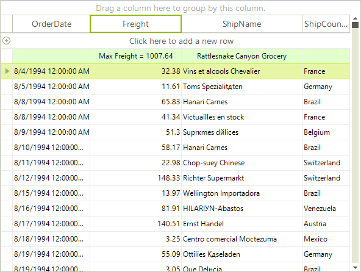
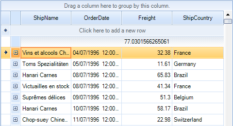
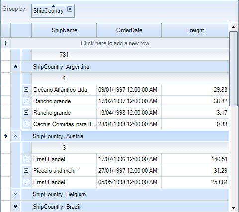
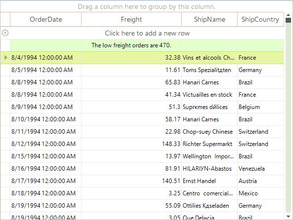

# Summary Rows

Summary rows are RadGridView rows which allow you to display
        information about the data in the control such as first item, last item,
        count of items, etc. The summary rows are top and bottom pinned rows.
        They can be used in a flat RadGridView or in groups and hierarchical views.
      

## Basic Example

The following example demonstrates how to create a top
          pinned summary row,
          showing the count of the RadGridView rows:
        

#### __[C#]__

{{source=..\SamplesCS\GridView\Rows\SummaryRows.cs region=addingSummaryRow}}
	            GridViewSummaryItem summaryItem = new GridViewSummaryItem();
	            summaryItem.Name = "ShipName";
	            summaryItem.Aggregate = GridAggregateFunction.Count;
	
	            GridViewSummaryRowItem summaryRowItem = new GridViewSummaryRowItem();
	            summaryRowItem.Add(summaryItem);
	
	            this.radGridView1.SummaryRowsTop.Add(summaryRowItem);
	            this.radGridView1.SummaryRowsBottom.Add(summaryRowItem);
	{{endregion}}

#### __[VB.NET]__

{{source=..\SamplesVB\GridView\Rows\SummaryRows.vb region=addingSummaryRow}}
	        Dim summaryItem As New GridViewSummaryItem()
	        summaryItem.Name = "ShipName"
	        summaryItem.Aggregate = GridAggregateFunction.Count
	
	        Dim summaryRowItem As New GridViewSummaryRowItem()
	        summaryRowItem.Add(summaryItem)
	
	        Me.RadGridView1.SummaryRowsTop.Add(summaryRowItem)
	        Me.RadGridView1.SummaryRowsBottom.Add(summaryRowItem)
	        '#End Region
	
	
	    End Sub
	
	    Private Sub FormatString()
	        '#Region "formatString"
	        Dim summaryItemShipName As New GridViewSummaryItem("ShipName", "{0}", GridAggregateFunction.Last)
	        Dim summaryItemFreight As New GridViewSummaryItem("Freight", "Max Freight = {0}", GridAggregateFunction.Max)
	
	        Dim summaryRowItem As New GridViewSummaryRowItem(New GridViewSummaryItem() {summaryItemShipName, summaryItemFreight})
	
	        Me.RadGridView1.SummaryRowsTop.Add(summaryRowItem)
	        '#End Region
	    End Sub
	
	    Private Sub AggregateExpression()
	        '#Region "aggregateExpression"
	        Dim summaryItem As New GridViewSummaryItem()
	        summaryItem.Name = "Freight"
	        summaryItem.AggregateExpression = "(Sum(Freight) - Max(Freight) - Min(Freight)) / Count(Freight)"
	
	        Dim summaryRowItem As New GridViewSummaryRowItem()
	        summaryRowItem.Add(summaryItem)
	        Me.RadGridView1.SummaryRowsTop.Add(summaryRowItem)
	        '#End Region
	    End Sub
	
	    Private Sub Grouping()
	        '#Region "grouping"
	        Me.RadGridView1.MasterTemplate.ShowTotals = True
	
	        Dim summaryItem As New GridViewSummaryItem("Freight", "{0}", GridAggregateFunction.Max)
	        Dim summaryRowItem As New GridViewSummaryRowItem()
	        summaryRowItem.Add(summaryItem)
	
	        Me.RadGridView1.SummaryRowsTop.Add(summaryRowItem)
	        '#End Region
	    End Sub
	
	    Private Sub Hierarchy()
	        '#Region "hierarchy"
	        Dim summaryItem As New GridViewSummaryItem("Quantity", "Max quantity = {0}", GridAggregateFunction.Max)
	        Dim summaryRowItem As New GridViewSummaryRowItem()
	        summaryRowItem.Add(summaryItem)
	
	        Me.RadGridView1.MasterTemplate.Templates(0).SummaryRowsTop.Add(summaryRowItem)
	        '#End Region
	    End Sub
	
	    Private Sub CustomFormatting()
	        '#Region "customFormatting"
	        AddHandler RadGridView1.GroupSummaryEvaluate, AddressOf radGridView1_GroupSummaryEvaluate
	
	        Dim summaryItem As New GridViewSummaryItem("Quantity", "Max quantity = {0}", GridAggregateFunction.Max)
	        Dim summaryRowItem As New GridViewSummaryRowItem()
	        summaryRowItem.Add(summaryItem)
	
	        Me.RadGridView1.MasterTemplate.Templates(0).SummaryRowsTop.Add(summaryRowItem)
	        '#End Region
	    End Sub
	
	    '#Region "handlingGroupSummaryEvaluate"
	    Private Sub radGridView1_GroupSummaryEvaluate(ByVal sender As Object, ByVal e As GroupSummaryEvaluationEventArgs)
	        If e.Parent Is Me.RadGridView1.MasterTemplate Then
	            e.FormatString = String.Format("There are {0} ships total.", e.Value)
	        End If
	    End Sub
	    '#End Region
	
	    Private Sub CustomSummaryItemMethod()
	        '#Region "customSummaryItemUsage"
	        Dim summaryItem As New CustomSummaryItem("Freight", "The low freight orders are {0}.", GridAggregateFunction.Count)
	        Dim summaryRowItem As New GridViewSummaryRowItem()
	        summaryRowItem.Add(summaryItem)
	        Me.RadGridView1.SummaryRowsTop.Add(summaryRowItem)
	        '#End Region
	    End Sub
	
	    '#Region "customSummaryItemImpl"
	    Public Class CustomSummaryItem
	        Inherits GridViewSummaryItem
	        Public Sub New(ByVal name As String, ByVal formatString As String, ByVal aggregate As GridAggregateFunction)
	            MyBase.New(name, formatString, aggregate)
	        End Sub
	
	        Public Overrides Function Evaluate(ByVal row As IHierarchicalRow) As Object
	            Dim lowFreightsCount As Integer = 0
	            For Each childRow As GridViewRowInfo In row.ChildRows
	                If CDec(childRow.Cells("Freight").Value) < 50D Then
	                    lowFreightsCount += 1
	                End If
	            Next childRow
	            Return lowFreightsCount
	        End Function
	    End Class
	    '#End Region
	End Class

## SummaryItem properties

Summary item major properties are:

* Name – The name of the column which the summary item refers to.

* Aggregate – The function which will be evaluated.

* AggregateExpression – The final expression to evaluate.

* FormatString – Formatting string which is applied to the calculated value of the summary item.

## Predefined aggregates

The predefined aggregates are:

* None – No expression is evaluated.

* Sum – Returns the sum of all values.

* Min – Returns the minimum value.

* Max – Returns the maximum value.

* Last – Returns the last value.

* First – Returns the first value.

* Count – Returns the count of all values.

* Avg – Returns the average of all values.

* StDev – Returns the standard deviation of all values.

* Var – Returns the sample variance of all values.

## Using the FormatString

The following example demonstrates how to add several summary
          items in a summary row and how the FormatString is used:
        

#### __[C#]__

{{source=..\SamplesCS\GridView\Rows\SummaryRows.cs region=formatString}}
	            GridViewSummaryItem summaryItemShipName = new GridViewSummaryItem("ShipName", "{0}", GridAggregateFunction.Last);
	            GridViewSummaryItem summaryItemFreight = new GridViewSummaryItem("Freight", "Max Freight = {0}", GridAggregateFunction.Max);
	
	            GridViewSummaryRowItem summaryRowItem = new GridViewSummaryRowItem(
	                new GridViewSummaryItem[] { summaryItemShipName, summaryItemFreight });
	
	            this.radGridView1.SummaryRowsTop.Add(summaryRowItem);
	{{endregion}}

#### __[VB.NET]__

{{source=..\SamplesVB\GridView\Rows\SummaryRows.vb region=formatString}}
	        Dim summaryItemShipName As New GridViewSummaryItem("ShipName", "{0}", GridAggregateFunction.Last)
	        Dim summaryItemFreight As New GridViewSummaryItem("Freight", "Max Freight = {0}", GridAggregateFunction.Max)
	
	        Dim summaryRowItem As New GridViewSummaryRowItem(New GridViewSummaryItem() {summaryItemShipName, summaryItemFreight})
	
	        Me.RadGridView1.SummaryRowsTop.Add(summaryRowItem)
	        '#End Region
	    End Sub
	
	    Private Sub AggregateExpression()
	        '#Region "aggregateExpression"
	        Dim summaryItem As New GridViewSummaryItem()
	        summaryItem.Name = "Freight"
	        summaryItem.AggregateExpression = "(Sum(Freight) - Max(Freight) - Min(Freight)) / Count(Freight)"
	
	        Dim summaryRowItem As New GridViewSummaryRowItem()
	        summaryRowItem.Add(summaryItem)
	        Me.RadGridView1.SummaryRowsTop.Add(summaryRowItem)
	        '#End Region
	    End Sub
	
	    Private Sub Grouping()
	        '#Region "grouping"
	        Me.RadGridView1.MasterTemplate.ShowTotals = True
	
	        Dim summaryItem As New GridViewSummaryItem("Freight", "{0}", GridAggregateFunction.Max)
	        Dim summaryRowItem As New GridViewSummaryRowItem()
	        summaryRowItem.Add(summaryItem)
	
	        Me.RadGridView1.SummaryRowsTop.Add(summaryRowItem)
	        '#End Region
	    End Sub
	
	    Private Sub Hierarchy()
	        '#Region "hierarchy"
	        Dim summaryItem As New GridViewSummaryItem("Quantity", "Max quantity = {0}", GridAggregateFunction.Max)
	        Dim summaryRowItem As New GridViewSummaryRowItem()
	        summaryRowItem.Add(summaryItem)
	
	        Me.RadGridView1.MasterTemplate.Templates(0).SummaryRowsTop.Add(summaryRowItem)
	        '#End Region
	    End Sub
	
	    Private Sub CustomFormatting()
	        '#Region "customFormatting"
	        AddHandler RadGridView1.GroupSummaryEvaluate, AddressOf radGridView1_GroupSummaryEvaluate
	
	        Dim summaryItem As New GridViewSummaryItem("Quantity", "Max quantity = {0}", GridAggregateFunction.Max)
	        Dim summaryRowItem As New GridViewSummaryRowItem()
	        summaryRowItem.Add(summaryItem)
	
	        Me.RadGridView1.MasterTemplate.Templates(0).SummaryRowsTop.Add(summaryRowItem)
	        '#End Region
	    End Sub
	
	    '#Region "handlingGroupSummaryEvaluate"
	    Private Sub radGridView1_GroupSummaryEvaluate(ByVal sender As Object, ByVal e As GroupSummaryEvaluationEventArgs)
	        If e.Parent Is Me.RadGridView1.MasterTemplate Then
	            e.FormatString = String.Format("There are {0} ships total.", e.Value)
	        End If
	    End Sub
	    '#End Region
	
	    Private Sub CustomSummaryItemMethod()
	        '#Region "customSummaryItemUsage"
	        Dim summaryItem As New CustomSummaryItem("Freight", "The low freight orders are {0}.", GridAggregateFunction.Count)
	        Dim summaryRowItem As New GridViewSummaryRowItem()
	        summaryRowItem.Add(summaryItem)
	        Me.RadGridView1.SummaryRowsTop.Add(summaryRowItem)
	        '#End Region
	    End Sub
	
	    '#Region "customSummaryItemImpl"
	    Public Class CustomSummaryItem
	        Inherits GridViewSummaryItem
	        Public Sub New(ByVal name As String, ByVal formatString As String, ByVal aggregate As GridAggregateFunction)
	            MyBase.New(name, formatString, aggregate)
	        End Sub
	
	        Public Overrides Function Evaluate(ByVal row As IHierarchicalRow) As Object
	            Dim lowFreightsCount As Integer = 0
	            For Each childRow As GridViewRowInfo In row.ChildRows
	                If CDec(childRow.Cells("Freight").Value) < 50D Then
	                    lowFreightsCount += 1
	                End If
	            Next childRow
	            Return lowFreightsCount
	        End Function
	    End Class
	    '#End Region
	End Class

## Using an AggregateExpression

The next example demonstrates how to use AggregateExpression to
          calculate an average value excluding the Max and Min value:
        

#### __[C#]__

{{source=..\SamplesCS\GridView\Rows\SummaryRows.cs region=aggregateExpression}}
	            GridViewSummaryItem summaryItem = new GridViewSummaryItem();
	            summaryItem.Name = "Freight";
	            summaryItem.AggregateExpression = "(Sum(Freight) - Max(Freight) - Min(Freight)) / Count(Freight)";
	
	            GridViewSummaryRowItem summaryRowItem = new GridViewSummaryRowItem();
	            summaryRowItem.Add(summaryItem);
	            this.radGridView1.SummaryRowsTop.Add(summaryRowItem);
	{{endregion}}

#### __[VB.NET]__

{{source=..\SamplesVB\GridView\Rows\SummaryRows.vb region=aggregateExpression}}
	        Dim summaryItem As New GridViewSummaryItem()
	        summaryItem.Name = "Freight"
	        summaryItem.AggregateExpression = "(Sum(Freight) - Max(Freight) - Min(Freight)) / Count(Freight)"
	
	        Dim summaryRowItem As New GridViewSummaryRowItem()
	        summaryRowItem.Add(summaryItem)
	        Me.RadGridView1.SummaryRowsTop.Add(summaryRowItem)
	        '#End Region
	    End Sub
	
	    Private Sub Grouping()
	        '#Region "grouping"
	        Me.RadGridView1.MasterTemplate.ShowTotals = True
	
	        Dim summaryItem As New GridViewSummaryItem("Freight", "{0}", GridAggregateFunction.Max)
	        Dim summaryRowItem As New GridViewSummaryRowItem()
	        summaryRowItem.Add(summaryItem)
	
	        Me.RadGridView1.SummaryRowsTop.Add(summaryRowItem)
	        '#End Region
	    End Sub
	
	    Private Sub Hierarchy()
	        '#Region "hierarchy"
	        Dim summaryItem As New GridViewSummaryItem("Quantity", "Max quantity = {0}", GridAggregateFunction.Max)
	        Dim summaryRowItem As New GridViewSummaryRowItem()
	        summaryRowItem.Add(summaryItem)
	
	        Me.RadGridView1.MasterTemplate.Templates(0).SummaryRowsTop.Add(summaryRowItem)
	        '#End Region
	    End Sub
	
	    Private Sub CustomFormatting()
	        '#Region "customFormatting"
	        AddHandler RadGridView1.GroupSummaryEvaluate, AddressOf radGridView1_GroupSummaryEvaluate
	
	        Dim summaryItem As New GridViewSummaryItem("Quantity", "Max quantity = {0}", GridAggregateFunction.Max)
	        Dim summaryRowItem As New GridViewSummaryRowItem()
	        summaryRowItem.Add(summaryItem)
	
	        Me.RadGridView1.MasterTemplate.Templates(0).SummaryRowsTop.Add(summaryRowItem)
	        '#End Region
	    End Sub
	
	    '#Region "handlingGroupSummaryEvaluate"
	    Private Sub radGridView1_GroupSummaryEvaluate(ByVal sender As Object, ByVal e As GroupSummaryEvaluationEventArgs)
	        If e.Parent Is Me.RadGridView1.MasterTemplate Then
	            e.FormatString = String.Format("There are {0} ships total.", e.Value)
	        End If
	    End Sub
	    '#End Region
	
	    Private Sub CustomSummaryItemMethod()
	        '#Region "customSummaryItemUsage"
	        Dim summaryItem As New CustomSummaryItem("Freight", "The low freight orders are {0}.", GridAggregateFunction.Count)
	        Dim summaryRowItem As New GridViewSummaryRowItem()
	        summaryRowItem.Add(summaryItem)
	        Me.RadGridView1.SummaryRowsTop.Add(summaryRowItem)
	        '#End Region
	    End Sub
	
	    '#Region "customSummaryItemImpl"
	    Public Class CustomSummaryItem
	        Inherits GridViewSummaryItem
	        Public Sub New(ByVal name As String, ByVal formatString As String, ByVal aggregate As GridAggregateFunction)
	            MyBase.New(name, formatString, aggregate)
	        End Sub
	
	        Public Overrides Function Evaluate(ByVal row As IHierarchicalRow) As Object
	            Dim lowFreightsCount As Integer = 0
	            For Each childRow As GridViewRowInfo In row.ChildRows
	                If CDec(childRow.Cells("Freight").Value) < 50D Then
	                    lowFreightsCount += 1
	                End If
	            Next childRow
	            Return lowFreightsCount
	        End Function
	    End Class
	    '#End Region
	End Class

## Summary rows in grouped RadGridView

When you use grouping, the summary rows are calculated for
          each group child rows and displayed as top or bottom pinned rows
          in each group. Using the template property ShowTotals you can
          define if total summary rows will be shown. They are calculated
          for the child rows of all groups and pinned at the top or bottom
          of all groups.
        

The next example demonstrates how to use summary rows in grouping:
        

#### __[C#]__

{{source=..\SamplesCS\GridView\Rows\SummaryRows.cs region=grouping}}
	            this.radGridView1.MasterTemplate.ShowTotals = true;
	
	            GridViewSummaryItem summaryItem = new GridViewSummaryItem("Freight", "{0}", GridAggregateFunction.Max);
	            GridViewSummaryRowItem summaryRowItem = new GridViewSummaryRowItem();
	            summaryRowItem.Add(summaryItem);
	
	            this.radGridView1.SummaryRowsTop.Add(summaryRowItem);
	{{endregion}}

#### __[VB.NET]__

{{source=..\SamplesVB\GridView\Rows\SummaryRows.vb region=grouping}}
	        Me.RadGridView1.MasterTemplate.ShowTotals = True
	
	        Dim summaryItem As New GridViewSummaryItem("Freight", "{0}", GridAggregateFunction.Max)
	        Dim summaryRowItem As New GridViewSummaryRowItem()
	        summaryRowItem.Add(summaryItem)
	
	        Me.RadGridView1.SummaryRowsTop.Add(summaryRowItem)
	        '#End Region
	    End Sub
	
	    Private Sub Hierarchy()
	        '#Region "hierarchy"
	        Dim summaryItem As New GridViewSummaryItem("Quantity", "Max quantity = {0}", GridAggregateFunction.Max)
	        Dim summaryRowItem As New GridViewSummaryRowItem()
	        summaryRowItem.Add(summaryItem)
	
	        Me.RadGridView1.MasterTemplate.Templates(0).SummaryRowsTop.Add(summaryRowItem)
	        '#End Region
	    End Sub
	
	    Private Sub CustomFormatting()
	        '#Region "customFormatting"
	        AddHandler RadGridView1.GroupSummaryEvaluate, AddressOf radGridView1_GroupSummaryEvaluate
	
	        Dim summaryItem As New GridViewSummaryItem("Quantity", "Max quantity = {0}", GridAggregateFunction.Max)
	        Dim summaryRowItem As New GridViewSummaryRowItem()
	        summaryRowItem.Add(summaryItem)
	
	        Me.RadGridView1.MasterTemplate.Templates(0).SummaryRowsTop.Add(summaryRowItem)
	        '#End Region
	    End Sub
	
	    '#Region "handlingGroupSummaryEvaluate"
	    Private Sub radGridView1_GroupSummaryEvaluate(ByVal sender As Object, ByVal e As GroupSummaryEvaluationEventArgs)
	        If e.Parent Is Me.RadGridView1.MasterTemplate Then
	            e.FormatString = String.Format("There are {0} ships total.", e.Value)
	        End If
	    End Sub
	    '#End Region
	
	    Private Sub CustomSummaryItemMethod()
	        '#Region "customSummaryItemUsage"
	        Dim summaryItem As New CustomSummaryItem("Freight", "The low freight orders are {0}.", GridAggregateFunction.Count)
	        Dim summaryRowItem As New GridViewSummaryRowItem()
	        summaryRowItem.Add(summaryItem)
	        Me.RadGridView1.SummaryRowsTop.Add(summaryRowItem)
	        '#End Region
	    End Sub
	
	    '#Region "customSummaryItemImpl"
	    Public Class CustomSummaryItem
	        Inherits GridViewSummaryItem
	        Public Sub New(ByVal name As String, ByVal formatString As String, ByVal aggregate As GridAggregateFunction)
	            MyBase.New(name, formatString, aggregate)
	        End Sub
	
	        Public Overrides Function Evaluate(ByVal row As IHierarchicalRow) As Object
	            Dim lowFreightsCount As Integer = 0
	            For Each childRow As GridViewRowInfo In row.ChildRows
	                If CDec(childRow.Cells("Freight").Value) < 50D Then
	                    lowFreightsCount += 1
	                End If
	            Next childRow
	            Return lowFreightsCount
	        End Function
	    End Class
	    '#End Region
	End Class

## Summary rows in hierarchical RadGridView

You can add summary rows in hierarchical views.
          They are calculated for the child rows in the current view.
        

The following example demonstrates how to add a summary row to the
          first level of RadGridView hierarchy:
        

#### __[C#]__

{{source=..\SamplesCS\GridView\Rows\SummaryRows.cs region=hierarchy}}
	            GridViewSummaryItem summaryItem = new GridViewSummaryItem("Quantity", "Max quantity = {0}", GridAggregateFunction.Max);
	            GridViewSummaryRowItem summaryRowItem = new GridViewSummaryRowItem();
	            summaryRowItem.Add(summaryItem);
	
	            this.radGridView1.MasterTemplate.Templates[0].SummaryRowsTop.Add(summaryRowItem);
	{{endregion}}

#### __[VB.NET]__

{{source=..\SamplesVB\GridView\Rows\SummaryRows.vb region=hierarchy}}
	        Dim summaryItem As New GridViewSummaryItem("Quantity", "Max quantity = {0}", GridAggregateFunction.Max)
	        Dim summaryRowItem As New GridViewSummaryRowItem()
	        summaryRowItem.Add(summaryItem)
	
	        Me.RadGridView1.MasterTemplate.Templates(0).SummaryRowsTop.Add(summaryRowItem)
	        '#End Region
	    End Sub
	
	    Private Sub CustomFormatting()
	        '#Region "customFormatting"
	        AddHandler RadGridView1.GroupSummaryEvaluate, AddressOf radGridView1_GroupSummaryEvaluate
	
	        Dim summaryItem As New GridViewSummaryItem("Quantity", "Max quantity = {0}", GridAggregateFunction.Max)
	        Dim summaryRowItem As New GridViewSummaryRowItem()
	        summaryRowItem.Add(summaryItem)
	
	        Me.RadGridView1.MasterTemplate.Templates(0).SummaryRowsTop.Add(summaryRowItem)
	        '#End Region
	    End Sub
	
	    '#Region "handlingGroupSummaryEvaluate"
	    Private Sub radGridView1_GroupSummaryEvaluate(ByVal sender As Object, ByVal e As GroupSummaryEvaluationEventArgs)
	        If e.Parent Is Me.RadGridView1.MasterTemplate Then
	            e.FormatString = String.Format("There are {0} ships total.", e.Value)
	        End If
	    End Sub
	    '#End Region
	
	    Private Sub CustomSummaryItemMethod()
	        '#Region "customSummaryItemUsage"
	        Dim summaryItem As New CustomSummaryItem("Freight", "The low freight orders are {0}.", GridAggregateFunction.Count)
	        Dim summaryRowItem As New GridViewSummaryRowItem()
	        summaryRowItem.Add(summaryItem)
	        Me.RadGridView1.SummaryRowsTop.Add(summaryRowItem)
	        '#End Region
	    End Sub
	
	    '#Region "customSummaryItemImpl"
	    Public Class CustomSummaryItem
	        Inherits GridViewSummaryItem
	        Public Sub New(ByVal name As String, ByVal formatString As String, ByVal aggregate As GridAggregateFunction)
	            MyBase.New(name, formatString, aggregate)
	        End Sub
	
	        Public Overrides Function Evaluate(ByVal row As IHierarchicalRow) As Object
	            Dim lowFreightsCount As Integer = 0
	            For Each childRow As GridViewRowInfo In row.ChildRows
	                If CDec(childRow.Cells("Freight").Value) < 50D Then
	                    lowFreightsCount += 1
	                End If
	            Next childRow
	            Return lowFreightsCount
	        End Function
	    End Class
	    '#End Region
	End Class

## Customizing the summary row

The GroupSummaryEvaluate event is fired after a summary item is
          calculated and before the summary row is displayed.
          You can use it to apply custom formatting to the summary row:
        #_[C#]_

	

#_[VB.NET]_

	

The same event is used to format the group header so it is important
          to check the Parent in the event arguments, as shown in the above example.
        

## Extending the GridViewSummaryItem

You can write your own logic for summary items evaluation
          by inheriting the GridViewSummaryItem class and overriding the
          Evaluate event.
        

The following example demonstrates how to create a custom summary
          item which calculates the count of orders with Freight is less than 50:
        #_[C#]_

	

#_[VB.NET]_

	

