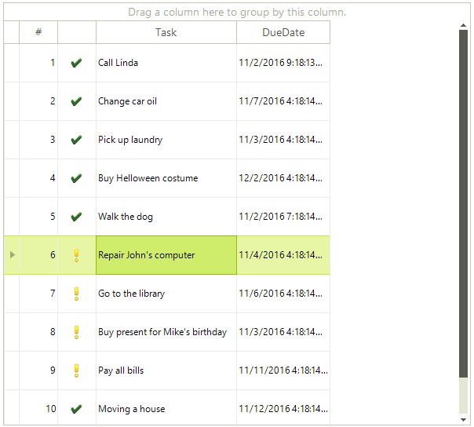
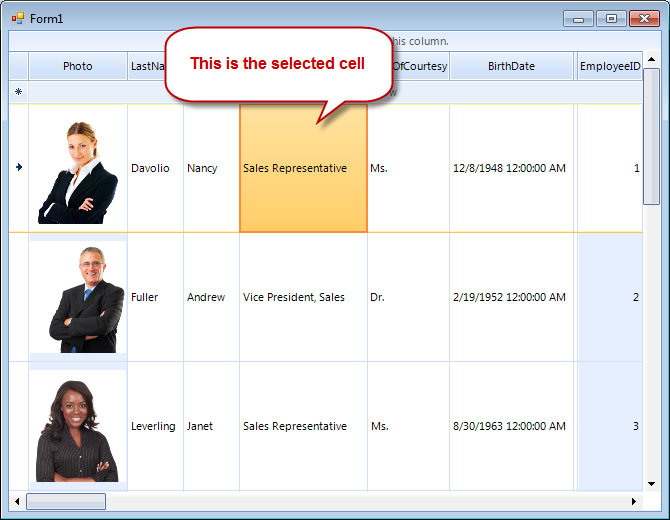

# Basic Selection

RadGridView provides you with a selection functionality, which allows the user to select one or more items (rows or cells) from the data displayed by the control.    

>tip The selection mechanism can be controlled programmatically as well. For more information, take a look at the topic [Selecting Rows and Cells Programmatically]().
>

## Basic row selection

By default RadGridView allows the user to select only one row. In this case the default property settings are:

{{source=..\SamplesCS\GridView\Selection\Selection1.cs region=basicRowSelection}} 
{{source=..\SamplesVB\GridView\Selection\Selection1.vb region=basicRowSelection}} 

````C#
radGridView1.MultiSelect = false;
radGridView1.SelectionMode = GridViewSelectionMode.FullRowSelect;

````
````VB.NET
RadGridView1.MultiSelect = False
RadGridView1.SelectionMode = GridViewSelectionMode.FullRowSelect

````

{{endregion}} 

To select an item in RadGridView click in the rectangle area of the desired row.



## Basic cell selection

You can modify RadGridView to select single cells instead of rows by setting its __SelectionMode__ property to *CellSelect* from the `GridViewSelectionMode` enumeration:

{{source=..\SamplesCS\GridView\Selection\Selection1.cs region=basicCellSelection}} 
{{source=..\SamplesVB\GridView\Selection\Selection1.vb region=basicCellSelection}} 

````C#
radGridView1.MultiSelect = false;
radGridView1.SelectionMode = GridViewSelectionMode.CellSelect;

````
````VB.NET
RadGridView1.MultiSelect = False
RadGridView1.SelectionMode = GridViewSelectionMode.CellSelect

````

{{endregion}} 

After setting these properties, to select a cell in RadGridView, click the desired cell.



## Selected items

Once an item is selected (row or cell), you can find this item in the __SelectedRows__ and __SelectedCells__ collections respectively. The following code describes how to access those collections:

{{source=..\SamplesCS\GridView\Selection\Selection1.cs region=collections}} 
{{source=..\SamplesVB\GridView\Selection\Selection1.vb region=collections}} 

````C#
GridViewSelectedRowsCollection selectedRows = radGridView1.SelectedRows;
GridViewSelectedCellsCollection selectedCells = radGridView1.SelectedCells;

````
````VB.NET
Dim selectedRows As GridViewSelectedRowsCollection = RadGridView1.SelectedRows
Dim selectedCells As GridViewSelectedCellsCollection = RadGridView1.SelectedCells

````

{{endregion}} 

## Events

There are two events relevant to the selection: __SelectionChanged__, __CurrentCellChanged__. The sequence of the is as follows – the __CurrentCellChanged__ is fired first and after that the __SelectionChangedEvent__ event fires.     
        

## CurrentRow/CurrentCell

Once an item is selected, it automatically becomes current (when basic selection is used). This means that if you select the first row (cell) of RadGridView, its __IsCurrent__ property will be automatically set to *true* and __CurrentRow__ (__CurrentCell__) property of RadGridView will hold an instance of this row (respectively cell). The following example demonstrates how to access the __CurrentRow__ and __CurrentCell__ properties and additionally the __IsCurrent__ property of a row or a cell:

{{source=..\SamplesCS\GridView\Selection\Selection1.cs region=currentRowCell}} 
{{source=..\SamplesVB\GridView\Selection\Selection1.vb region=currentRowCell}} 

````C#
//gets an instance of the current row
GridViewRowInfo row = radGridView1.CurrentRow;
//gets an instance of the current cell
GridDataCellElement cell = radGridView1.CurrentCell;
//gets or sets if the first row of radGridView1 is current or not
radGridView1.Rows[0].IsCurrent = true;

````
````VB.NET
'gets an instance of the current row
Dim row As GridViewRowInfo = RadGridView1.CurrentRow
'gets an instance of the current cell
Dim cell As GridDataCellElement = RadGridView1.CurrentCell
'gets or sets if the first row of radGridView1 is current or not
RadGridView1.Rows(0).IsCurrent = True

````

{{endregion}} 

When basic selection is used, the opposite is also valid – if you set the __CurrentRow__ or __CurrentCell__ (or the __IsCurrent__ property to true for a cell or row) in RadGridView and only if  basic selection is used (MultiSelect = false ), the selected row(cell) will be the same as the current row(cell).
      
# See Also
* [Multiple Selection]()

* [Selecting Rows and Cells Programmatically]()

