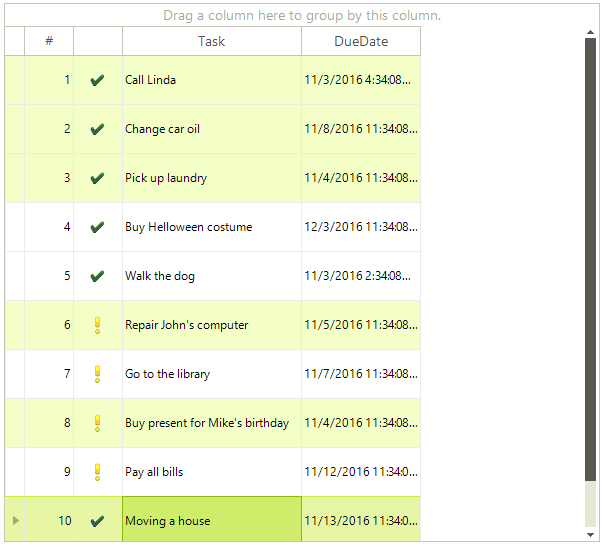

# Multiple Selection

RadGridView allows the user to select more than one item at a time from the displayed data. By default, this functionality is disabled and in order to turn it on, you have to set the __MultiSelect__ property to *true*. 

## Multiple row selection

In order to enable multiple row selection, after setting the MultiSelect property to true, you have to set the SelectionMode to GridViewSelectionMode.FullRowSelect:

{{source=..\SamplesCS\GridView\Selection\Selection1.cs region=multipleRowSelection}} 
{{source=..\SamplesVB\GridView\Selection\Selection1.vb region=multipleRowSelection}} 

````C#
radGridView1.MultiSelect = true;
radGridView1.SelectionMode = GridViewSelectionMode.FullRowSelect;

````
````VB.NET
RadGridView1.MultiSelect = True
RadGridView1.SelectionMode = GridViewSelectionMode.FullRowSelect

````

{{endregion}} 

When these settings are applied, you have several options to make a multiple selection:

* Press Ctrl + A to select all rows in RadGridView.

* Hold the Ctrl key and click the rows that you want to select.

* In order to mark a block selection, mark the first row of the desired selection, hold Shift and click on the last row of the desired selection.<br>

All the selected rows are available in the RadGridView.SelectedRows collection

## Multiple cell selection

In order to enable multiple cell selection, after setting the MultiSelect property to true, you have to set the SelectionMode to GridViewSelectionMode.CellSelect:

{{source=..\SamplesCS\GridView\Selection\Selection1.cs region=multipleCellSelection}} 
{{source=..\SamplesVB\GridView\Selection\Selection1.vb region=multipleCellSelection}} 

````C#
radGridView1.MultiSelect = true;
radGridView1.SelectionMode = GridViewSelectionMode.CellSelect;

````
````VB.NET
RadGridView1.MultiSelect = True
RadGridView1.SelectionMode = GridViewSelectionMode.CellSelect

````

{{endregion}} 

Once you have applied these setting, the options for selection are:

* Press `Ctrl + A` to select all cells in RadGridView.  

* Holding the `Ctrl` key and click the cells that you want to select.

* In order to mark a block selection, mark the first cell of the desired selection, hold `Shift` and click on the last cell of the desired selection. Please note that this will select all the cells in the rectangle between the first and the second selected cell.
 


All the selected cells are available in the RadGridView.SelectedCells collection

## Rectangle selection

If the __MultiSelect__ property is enabled, you can make a multiple selection by holding the left mouse button down and moving the mouse making a rectangle. This will select all rows (cells) in the created rectangle.


## CurrentRow and CurrentCell when multiple selection is used

When multiple row (cell) selection is used, the current row(cell) value will be equal to the last cell (row) clicked when a selection is made. 
