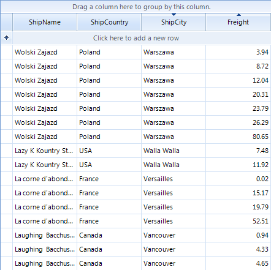

# Basic Sorting

## 

RadGridView supports data sorting. Set RadGridView.__EnableSorting__ or __GridViewTemplate.EnableSorting__ properties to __True__enable the *user sorting* feature:

#### __[C#] Enabling the user sorting__

{{source=..\SamplesCS\GridView\Sorting\Sorting.cs region=enableSorting}}
	            this.radGridView1.MasterTemplate.EnableSorting = true;
	{{endregion}}

#### __[VB.NET] Enabling the user sorting__

{{source=..\SamplesVB\GridView\Sorting\Sorting.vb region=enableSorting}}
	        Me.RadGridView1.MasterTemplate.EnableSorting = True
	{{endregion}}

When sorting is enabled, the user can click on the column headers to control the sorting order. RadGridView supports three orders: __Ascending__, __Descending__, and __None__ (no sort).

*ShipCity column is sorted in descending order while the Freight column is sorted in ascending order*

See [End-user Capabilities Sorting]() topic about more information on the sorting behavior of RadGridView from the users' perspective.
