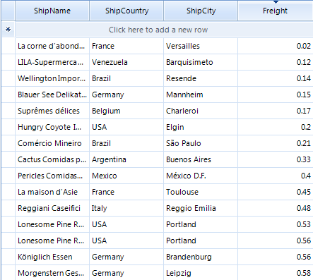
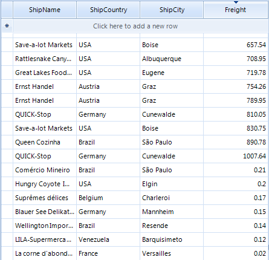

# Custom Sorting


Custom sorting is a flexible mechanism for sorting RadGridView rows using custom logic. It has a higher priority than the applied __SortDescriptors__ (added either by code or by clicking the header row).

Custom sorting is applied if user sorting is enabled by the __RadGridView.EnableSorting__ or  __GridViewTemplate.EnableSorting__properties. By default, sorting is enabled at all levels.
      

RadGridView provides two mechanisms for custom sorting:

* Handling the CustomSorting event

* Replacing the RadGridView sorting mechanism by providing a custom __SortComparer__

## Using the CustomSorting event

The CustomSorting event is fired if custom sorting is enabled. The arguments of the event provide the following properties:

* __Template__ – the template that holds the rows which are going to be sorted 

* __Row1, Row2__ – the rows to be compared

* __SortResult__ – returns negative value when Row1 is before Row2, positive value if Row1 is after Row2 and zero if the rows are have equal values in a specified column.

* __Handled__ – defines if the comparison of the two rows is processed by the custom algorithm or by the applied sort descriptors.

The following example demonstrates how to handle the __CustomSorting__ event sorting the RadGridView rows ascending by the values of the Freight column. The defined __SortOrder__ for the Freight column in this example assumes that rows sorting is not applied. All RadGridView rows are processed by the custom logic.

{{source=..\SamplesCS\GridView\Sorting\CustomSorting.cs region=usingCustomSorting}} 
{{source=..\SamplesVB\GridView\Sorting\CustomSorting.vb region=usingCustomSorting}} 
````C#
this.radGridView1.EnableCustomSorting = true;
this.radGridView1.CustomSorting += new GridViewCustomSortingEventHandler(radGridView1_CustomSorting);
this.radGridView1.Columns["Freight"].SortOrder = RadSortOrder.Ascending;

````
````VB.NET
Me.RadGridView1.EnableCustomSorting = True
Me.RadGridView1.Columns("Freight").SortOrder = RadSortOrder.Ascending

````

{{endregion}}

{{source=..\SamplesCS\GridView\Sorting\CustomSorting.cs region=usingCustomSorting1}} 
{{source=..\SamplesVB\GridView\Sorting\CustomSorting.vb region=usingCustomSorting1}} 

````C#
private void radGridView1_CustomSorting(object sender, GridViewCustomSortingEventArgs e)
{
    decimal row1Freight = (decimal)e.Row1.Cells["Freight"].Value;
    decimal row2Freight = (decimal)e.Row2.Cells["Freight"].Value;
    if (row1Freight > row2Freight)
    {
        e.SortResult = 1;
    }
    else if (row1Freight < row2Freight)
    {
        e.SortResult = -1;
    }
    else
    {
        e.SortResult = 0;
    }
}

````
````VB.NET
Private Sub RadGridView1_CustomSorting(ByVal sender As Object, ByVal e As Telerik.WinControls.UI.GridViewCustomSortingEventArgs) Handles RadGridView1.CustomSorting
    Dim row1Freight As Decimal = CDec(e.Row1.Cells("Freight").Value)
    Dim row2Freight As Decimal = CDec(e.Row2.Cells("Freight").Value)
    If row1Freight > row2Freight Then
        e.SortResult = 1
    ElseIf row1Freight < row2Freight Then
        e.SortResult = -1
    Else
        e.SortResult = 0
    End If
End Sub

````

{{endregion}} 




The following example demonstrates the usage of the __Handled__ property of the __CustomSorting__ event arguments. It uses custom sorting to sort the rows ascending by the values of the Freight column. This sorting is applied to the rows that have a value in the Freight column greater than "0.33". The rest are handled by the defined __SortDescriptor__ and sorted descending by the values of the Freight column.

{{source=..\SamplesCS\GridView\Sorting\CustomSorting1.cs region=usingCustomSortingPlusHandled}} 
{{source=..\SamplesVB\GridView\Sorting\CustomSorting1.vb region=usingCustomSortingPlusHandled}} 

````C#
this.radGridView1.Columns["ShipCity"].SortOrder = RadSortOrder.Ascending;
this.radGridView1.MasterTemplate.SortComparer = new CustomComparer();

````
````VB.NET
Me.RadGridView1.Columns("ShipCity").SortOrder = RadSortOrder.Ascending
Me.RadGridView1.MasterTemplate.SortComparer = New CustomComparer()

````

{{endregion}} 

{{source=..\SamplesCS\GridView\Sorting\CustomSorting1.cs region=usingCustomSortingPlusHandled1}} 
{{source=..\SamplesVB\GridView\Sorting\CustomSorting1.vb region=usingCustomSortingPlusHandled1}} 

````C#
private void radGridView1_CustomSorting(object sender, GridViewCustomSortingEventArgs e)
{
    decimal row1Freight = (decimal)e.Row1.Cells["Freight"].Value;
    decimal row2Freight = (decimal)e.Row2.Cells["Freight"].Value;
    if (row1Freight < 0.33m || row2Freight < 0.33m)
    {
        e.Handled = false;
        return;
    }
    if (row1Freight > row2Freight)
    {
        e.SortResult = 1;
    }
    else if (row1Freight < row2Freight)
    {
        e.SortResult = -1;
    }
    else
    {
        e.SortResult = 0;
    }
}

````
````VB.NET
Private Sub RadGridView1_CustomSorting(ByVal sender As Object, ByVal e As Telerik.WinControls.UI.GridViewCustomSortingEventArgs) Handles RadGridView1.CustomSorting
    Dim row1Freight As Decimal = CDec(e.Row1.Cells("Freight").Value)
    Dim row2Freight As Decimal = CDec(e.Row2.Cells("Freight").Value)
    If row1Freight < 0.33D OrElse row2Freight < 0.33D Then
        e.Handled = False
        Return
    End If
    If row1Freight > row2Freight Then
        e.SortResult = 1
    ElseIf row1Freight < row2Freight Then
        e.SortResult = -1
    Else
        e.SortResult = 0
    End If
End Sub

````

{{endregion}} 




## Implementing sorting mechanism by using SortComparer

You can replace the sorting mechanism in RadGridView with a custom one by setting the __SortComparer__ of the __GridViewTemplate__.

The following example demonstrates how to use a custom sorting mechanism in RadGridView to sort the RadGridView rows ascending by the length of the ShipCity column:

{{source=..\SamplesCS\GridView\Sorting\CustomSorting.cs region=usingSortComparer}} 
{{source=..\SamplesVB\GridView\Sorting\CustomSorting.vb region=usingSortComparer}} 

````C#
this.radGridView1.Columns["ShipCity"].SortOrder = RadSortOrder.Ascending;
this.radGridView1.MasterTemplate.SortComparer = new CustomComparer();

````
````VB.NET
Me.RadGridView1.Columns("ShipCity").SortOrder = RadSortOrder.Ascending
Me.RadGridView1.MasterTemplate.SortComparer = New CustomComparer()

````

{{endregion}} 


{{source=..\SamplesCS\GridView\Sorting\CustomSorting.cs region=usingSortComparer1}}
{{source=..\SamplesVB\GridView\Sorting\CustomSorting.vb region=usingSortComparer1}} 

````C#
this.radGridView1.Columns["ShipCity"].SortOrder = RadSortOrder.Ascending;
this.radGridView1.MasterTemplate.SortComparer = new CustomComparer();

````
````VB.NET
Me.RadGridView1.Columns("ShipCity").SortOrder = RadSortOrder.Ascending
Me.RadGridView1.MasterTemplate.SortComparer = New CustomComparer()

````

{{endregion}} 


## Create custom sort order criteria for a particular column.
      

You can use the custom sorting functionality to change the default sorting behavior for a particular column. This will leave the sorting functionality for the other columns intact and the user will be able to sort them in the usual way. However when the user presses the column header cell for the column that we have changed the sort criteria, it will be sorted by the custom criteria. To achieve this we can use the __SortDescriptors__ collection of __RadGridView__. For example you can order the rows by the text length in the *Customer* column with the following code:

{{source=..\SamplesCS\GridView\Sorting\CustomSorting2.cs region=SortByCustomCriteria}} 
{{source=..\SamplesVB\GridView\Sorting\CustomSorting2.vb region=SortByCustomCriteria}} 

````C#
void radGridView1_CustomSorting(object sender, Telerik.WinControls.UI.GridViewCustomSortingEventArgs e)
{   
    int descriptorIndex = -1;
    for (int i = 0; i < this.radGridView1.SortDescriptors.Count; i++)
    {
        if (radGridView1.SortDescriptors[i].PropertyName == "Customer")
        {                 
            descriptorIndex = i;
            break;
        }
    }
    if (descriptorIndex != -1)
    {
        string cellValue1 = e.Row1.Cells["Customer"].Value.ToString();
        string cellValue2 = e.Row2.Cells["Customer"].Value.ToString();
        int result = cellValue1.Length - cellValue2.Length;
        if (result != 0)
        {
            if (this.radGridView1.SortDescriptors[descriptorIndex].Direction == ListSortDirection.Descending)
            {
                result = -result;
            }
        }
        e.SortResult = result;
    }
    else
    {
        e.Handled = false;
    }
}

````
````VB.NET
  Private Sub radGridView1_CustomSorting(sender As Object, e As Telerik.WinControls.UI.GridViewCustomSortingEventArgs)
        Dim descriptorIndex As Integer = -1
        For i As Integer = 0 To Me.radGridView1.SortDescriptors.Count - 1
            If radGridView1.SortDescriptors(i).PropertyName = "Customer" Then
                descriptorIndex = i
                Exit For
            End If
        Next
        If descriptorIndex <> -1 Then
            Dim cellValue1 As String = e.Row1.Cells("Customer").Value.ToString()
            Dim cellValue2 As String = e.Row2.Cells("Customer").Value.ToString()
            Dim result As Integer = cellValue1.Length - cellValue2.Length
            If result <> 0 Then
                If Me.radGridView1.SortDescriptors(descriptorIndex).Direction = ListSortDirection.Descending Then
                    result = -result
                End If
            End If
            e.SortResult = result
        Else
            e.Handled = False
        End If
    End Sub

````

{{endregion}} 


