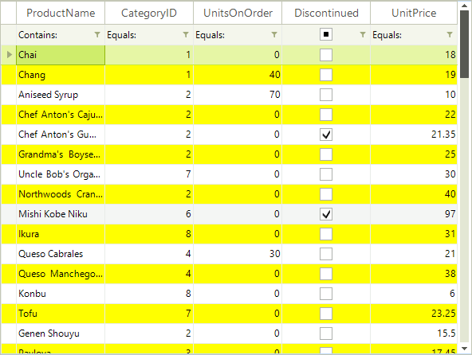

# Alternating Row Color


## 

RadGridView supports alternating row color mode which allows you to easily distinguish one row from another.

In order to enable the feature, you should set the EnableAlternatingRowColor property to true:

#### Enable alternating row color

{{source=..\SamplesCS\GridView\StylingAndAppearance\AlternatingRowColor1.cs region=alternatingColor}} 
{{source=..\SamplesVB\GridView\StylingAndAppearance\AlternatingRowColor1.vb region=alternatingColor}} 

````C#
this.radGridView1.EnableAlternatingRowColor = true;

````
````VB.NET
Me.RadGridView1.EnableAlternatingRowColor = True

````

{{endregion}} 

In order to change the default alternating row color, set the AlternatingRowColor property:

#### Changing the alternating row color

{{source=..\SamplesCS\GridView\StylingAndAppearance\AlternatingRowColor1.cs region=changeAlternatingRow}} 
{{source=..\SamplesVB\GridView\StylingAndAppearance\AlternatingRowColor1.vb region=changeAlternatingRow}} 

````C#
((GridTableElement)this.radGridView1.TableElement).AlternatingRowColor = Color.Yellow;

````
````VB.NET
CType(Me.RadGridView1.TableElement, GridTableElement).AlternatingRowColor = Color.Yellow

````

{{endregion}} 

The result is shown on the screenshot below:<br>
