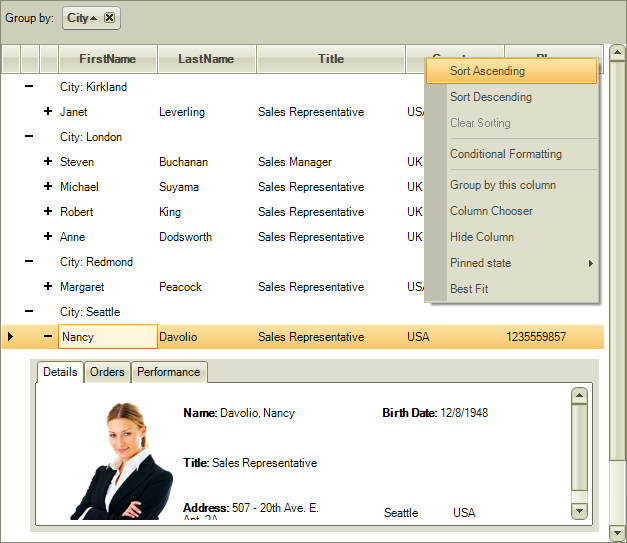

# Themes

RadGridView is built on top of the Telerik Presentation Framework and enables easy styling without
        writing any code. It ships with a set of predefined themes that you can easily use in your application
        as demonstrated
        [here]().
      

The built-in themes are:

*Control Default theme*

*Office 2010 Blue theme*

*Office 2010 Silver theme*

*Office 2010 Black theme*

*Office 2007 Silver theme*

*Office 2007 Black theme*

*Telerik Metro theme*

*Telerik Metro Blue theme*

*Windows7 theme*

*Desert theme*

*Breeze theme*

*High Contrast Black theme*

>You can preview the built-in themes using our
            [Theme Viewer]()
            application.
          

>You can edit the existing built-in themes or you can create brand new ones using
            [Visual Style Builder]().
          
