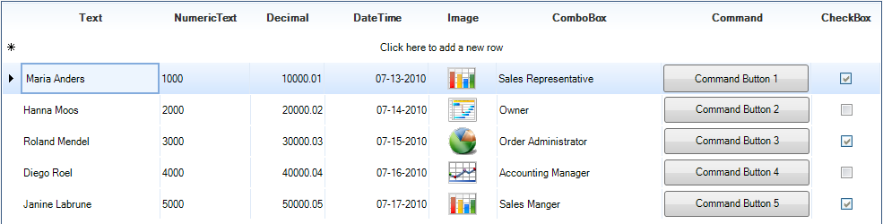
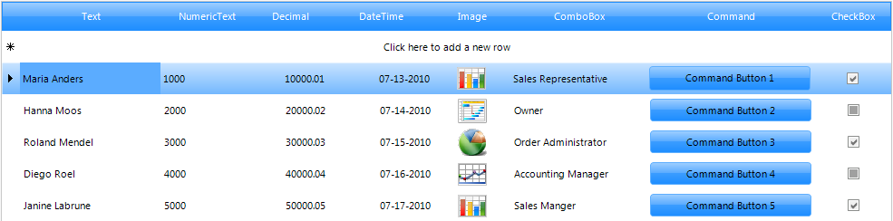
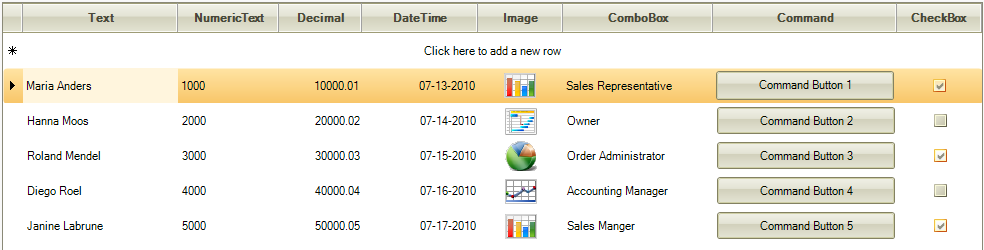
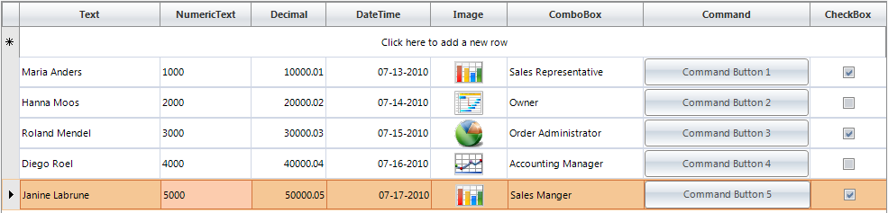

# Using Themes with RadGridView

## 

Use the __ThemeName__property to select a theme to alter the visual style for the entire grid. You can design your own themes using Visual Style Builder or select from one of the predefined themes: 

ControlDefault

Office2010

Breeze

Windows 7

Aqua

BreezeExtended

Desert

Telerik

Office2007Silver

Office2007Black
