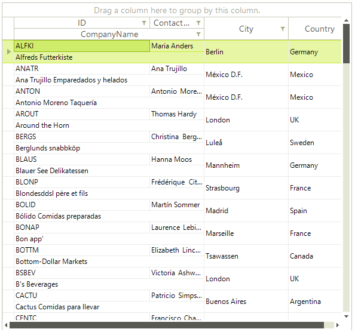

# View Definitions Overview

You can change __RadGridView__ visual appearance and behavior by using a view definition. To define the view definition you have to set the __ViewDefinition__.

#### Assign ViewDefinition

{{source=..\SamplesCS\GridView\ViewDefinitions\Overview.cs region=ViewDefinition}} 
{{source=..\SamplesVB\GridView\ViewDefinitions\Overview.vb region=ViewDefinition}} 

````C#
this.radGridView1.ViewDefinition = myDefinition;

````
````VB.NET
Me.RadGridView1.ViewDefinition = myDefinition

````

{{endregion}} 

All view definitions implement the __IViewDefinition__ interface and you could create your own definitions, if you wish. Three different view definitions are currently included: 

* [TableViewDefinition](): this is the default view definition.

* [ColumnGroupsViewDefinition](): enables grouping of columns and multiple rows in one row.

* [HtmlViewDefinition](): uses layout similar to the one existing in HTML tables.

>caption Figure 1: ColumnGroupsViewDefinition


>caption Figure 2: HtmlViewDefinition

